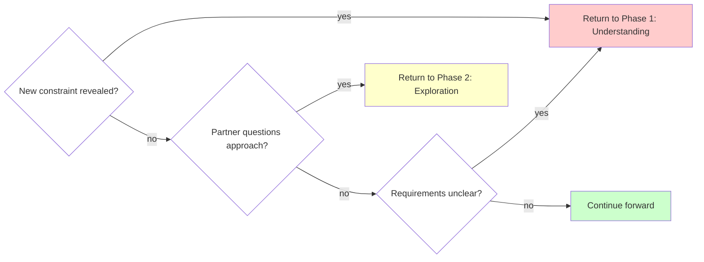

# Brainstorming Ideas Into Designs

## Overview

Transform rough ideas into fully-formed designs through structured questioning and alternative exploration.

**Core principle:** Ask questions to understand, explore alternatives, present design incrementally for validation.

**Announce at start:** "I'm using the brainstorming skill to refine your idea into a design."

## Quick Reference

| Phase                       | Key Activities                   | Tool Usage                                                                                                                                                 | Output                               |
| --------------------------- | -------------------------------- | ---------------------------------------------------------------------------------------------------------------------------------------------------------- | ------------------------------------ |
| **1. Understanding**        | Ask questions (one at a time)    | `AskUserQuestion` for choices                                                                                                                              | Purpose, constraints, criteria       |
| **2. Exploration**          | Propose 2-3 approaches           | `AskUserQuestion` for approach selection                                                                                                                   | Architecture options with trade-offs |
| **3. Design Presentation**  | Present in 200-300 word sections | Open-ended questions                                                                                                                                       | Complete design with validation      |
| **4. Design Documentation** | Write design document            | `writing-clearly-and-concisely` skill <mark class="user-highlight" data-user-name="Wesley" data-created="2025-10-22 13:41">Skill does not exist yet</mark> | Design doc in docs/plans/            |
| **5. Worktree Setup**       | Set up isolated workspace        | `using-git-worktrees` skill                                                                                                                                | Ready development environment        |
| **6. Planning Handoff**     | Create implementation plan       | `writing-plans` skill                                                                                                                                      | Detailed task breakdown              |

## The Process

Copy this checklist to track progress:

```markdown
Brainstorming Progress:
- [ ] Phase 1: Understanding (purpose, constraints, criteria gathered)
- [ ] Phase 2: Exploration (2-3 approaches proposed and evaluated)
- [ ] Phase 3: Design Presentation (design validated in sections)
- [ ] Phase 4: Design Documentation (design written to docs/plans/)
- [ ] Phase 5: Worktree Setup (if implementing)
- [ ] Phase 6: Planning Handoff (if implementing)
```

### Phase 1: Understanding
- Check current project state in working directory <mark class="user-highlight" data-user-name="Wesley" data-created="2025-10-22 14:07">Sometimes we will be passing a document that will act as an anchor, like an arch doc or a user story. How will this directive work in that situation?</mark>
- Ask ONE question at a time to refine the idea
- **Use AskUserQuestion tool** when you have multiple choice options
- Gather: Purpose, constraints, success criteria

**Example using AskUserQuestion:**

```yaml
Question: "Where should the authentication data be stored?"
Options:
  - "Session storage" (clears on tab close, more secure)
  - "Local storage" (persists across sessions, more convenient)
  - "Cookies" (works with SSR, compatible with older approach)
```

### Phase 2: Exploration
- Propose 2-3 different approaches
- For each: Core architecture, trade-offs, complexity assessment
- **Use AskUserQuestion tool** to present approaches as structured choices
- Ask your human partner which approach resonates

**Example using AskUserQuestion:**

```yaml
Question: "Which architectural approach should we use?"
Options:
  - "Event-driven with message queue" (scalable, complex setup, eventual consistency)
  - "Direct API calls with retry logic" (simple, synchronous, easier to debug)
  - "Hybrid with background jobs" (balanced, moderate complexity, best of both)
```

<mark class="user-highlight" data-user-name="Wesley" data-created="2025-10-22 14:08">I'm often going to use this with the application tech lead, and I don't want it to be asking me architectural questions. I want to rely on its expertise. So how will this phase two directive work with that? </mark>
### Phase 3: Design Presentation
- Present in 200-300 word sections
- Cover: Architecture, components, data flow, error handling, testing
- Ask after each section: "Does this look right so far?" (open-ended)
- Use open-ended questions here to allow freeform feedback

### Phase 4: Design Documentation
After design is validated, write it to a permanent document:
- **File location:**  [Directory and File Naming Conventions](../../../design-docs/Architecture%20-%20Baseline.md#Level%204%20-%20Code)  (use actual date and descriptive topic)
- **RECOMMENDED SUB-SKILL:** Use elements-of-style:writing-clearly-and-concisely (if available) for documentation quality
- **Content:** Capture the design as discussed and validated in Phase 3, organized into the sections that emerged from the conversation
- Commit the design document to git before proceeding

<mark class="user-highlight" data-user-name="Wesley" data-created="2025-10-22 14:09">The architecture baseline for the workspace already lays out where files should be located. And generally, I think with these skills, we don't want to be hard coding file locations in them. So how can we adopt phase four to be more responsive to project conventions like file paths and architectural principles and software patterns, etc.? </mark>

### Phase 5: Worktree Setup (for implementation)
When design is approved and implementation will follow:
- Announce: "I'm using the using-git-worktrees skill to set up an isolated workspace."
- **REQUIRED SUB-SKILL:** Use superpowers:using-git-worktrees
- Follow that skill's process for directory selection, safety verification, and setup
- Return here when worktree ready

<mark class="user-highlight" data-user-name="Wesley" data-created="2025-10-22 14:10">I think we want to do the work tree setup when we actually implement, not during the brainstorming phase. </mark>

### Phase 6: Planning Handoff
Ask: "Ready to create the implementation plan?"

When your human partner confirms (any affirmative response):
- Announce: "I'm using the writing-plans skill to create the implementation plan."
- **REQUIRED SUB-SKILL:** Use superpowers:writing-plans
- Create detailed plan in the worktree

## Question Patterns

### When to Use AskUserQuestion Tool

**Use AskUserQuestion for:**
- Phase 1: Clarifying questions with 2-4 clear options
- Phase 2: Architectural approach selection (2-3 alternatives)
- Any decision with distinct, mutually exclusive choices
- When options have clear trade-offs to explain

**Benefits:**
- Structured presentation of options with descriptions
- Clear trade-off visibility for partner
- Forces explicit choice (prevents vague "maybe both" responses)

### When to Use Open-Ended Questions

**Use open-ended questions for:**
- Phase 3: Design validation ("Does this look right so far?")
- When you need detailed feedback or explanation
- When partner should describe their own requirements
- When structured options would limit creative input

**Example decision flow:**
- "What authentication method?" → Use AskUserQuestion (2-4 options)
- "Does this design handle your use case?" → Open-ended (validation)

## When to Revisit Earlier Phases



**You can and should go backward when:**
- Partner reveals new constraint during Phase 2 or 3 → Return to Phase 1
- Validation shows fundamental gap in requirements → Return to Phase 1
- Partner questions approach during Phase 3 → Return to Phase 2
- Something doesn't make sense → Go back and clarify

**Don't force forward linearly** when going backward would give better results.

## Key Principles

| Principle | Application |
|-----------|-------------|
| **One question at a time** | Phase 1: Single question per message, use AskUserQuestion for choices |
| **Structured choices** | Use AskUserQuestion tool for 2-4 options with trade-offs |
| **YAGNI ruthlessly** | Remove unnecessary features from all designs |
| **Explore alternatives** | Always propose 2-3 approaches before settling |
| **Incremental validation** | Present design in sections, validate each |
| **Flexible progression** | Go backward when needed - flexibility > rigidity |
| **Announce usage** | State skill usage at start of session |
