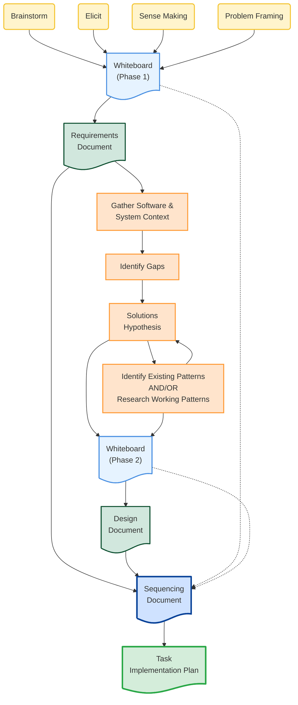

# Development Workflow

## Overview

A structured approach to feature development using **progressive disclosure** - starting high-level and adding detail at each stage. Four phases transform ideas into executable tasks: Discovery → Requirements → Research & Design (the bridge) → Sequencing → Implementation.

**Core principle:** Progressive disclosure from generic understanding to system-specific adaptation to execution detail. Each artifact layer reveals more specificity than the last.

## Progressive Disclosure Explained

Like Anthropic's Agent Skills architecture, this workflow uses progressive disclosure to manage complexity:

**Level 1: Requirements** (High-level, generic)
- What needs to be solved?
- Written generically, not tied to specific implementation

**Level 2: Design** (Medium detail, system-specific)
- **THE BRIDGE:** Adapts generic requirements to your system
- Your tools, people, process, existing architecture
- How the solution fits your specific context

**Level 3: Sequencing** (Higher detail, work decomposition)
- How to order and decompose the work
- Risk, resources, dependencies, proof-of-concept

**Level 4: Implementation** (Maximum detail, executable)
- Every action specified (2-5 min tasks)
- Exact file paths, complete code, test commands

**Why this matters:** You can't jump from generic requirements directly to code. You need the intermediate layers to bridge understanding to execution.

## When to Use

Use this workflow when:
- Starting new feature development from scratch
- You have generic requirements that need adaptation to your system
- Need the "bridge" from what to how in your specific context
- Working on features requiring architectural decisions

**Don't use for:**
- Bug fixes (may jump straight to implementation)
- Well-defined tasks with system-specific design already done
- Small refactorings where the bridge isn't needed

## The Flow (Progressive Disclosure)

### Development Flow Diagram



### Legend

- **Yellow** - Discovery & Ideation activities (Phase 1)
- **Orange** - Research & Design activities (Phase 2 - THE BRIDGE)
- **Light blue** - Whiteboards (informal)
- **Green** - Requirements & Design (Level 1 & 2)
- **Blue** - Sequencing (Level 3)
- **Dark green** - Implementation Plan (Level 4 - maximum detail)
- **Solid arrows** - Primary flow
- **Dotted arrows** - Optional/weak inputs

### Progressive Disclosure Levels

1. **Requirements** (Light green) - Generic, high-level
2. **Design** (Green) - System-specific, medium detail ← THE BRIDGE
3. **Sequencing** (Blue) - Work decomposition, higher detail
4. **Implementation** (Dark green) - Maximum detail, executable

### Requirements Artifacts Flow Across Phases

Requirements artifacts follow the JTBD → FR → AC layering framework and progressively disclose detail at each phase:

| Phase | JTBD (Why) | FR (What) | AC (How you'll know) |
|-------|------------|-----------|----------------------|
| **Phase 1: Requirements/PRD** | Formalized in Overview/Business Value section | Anchored as `^FR1`, `^FR2` in Requirements section | NOT in PRD — Success Criteria (outcome-level) only |
| **Phase 2: Design** | Referenced from PRD (informs design decisions) | Referenced from PRD using `[[#^FR1\|FR1]]` | Draft ACs may emerge as `^AC-draft-1` in whiteboard |
| **Phase 3: Sequencing** | Context for prioritization | Drive task ordering and dependencies | Formalized with `^AC1` + FR traceability `([[#^FR1\|FR1]])` |
| **Phase 4: Implementation** | Informs "why we're doing this" | Validates task coverage | Become literal test cases in implementation plan |

**Key insight:** ACs do NOT belong in PRDs. PRDs have Success Criteria (outcome-level). Detailed testable ACs emerge during Design/Sequencing when system context exists.

## The Four Phases (Progressive Disclosure)

### Phase 1: Discovery & Ideation → Requirements

**Goal:** Frame the problem at a high level

**Activities:**
1. **Brainstorm** - Generate ideas, explore possibilities
2. **Elicit** - Extract user needs, clarify requirements
3. **Sense Making** - Connect dots, identify patterns
4. **Problem Framing** - Define the actual problem to solve

**First Output:** **Whiteboard** document (informal, exploratory)
- May capture draft ACs as `^AC-draft-N` if they emerge during discovery
- These are exploratory, not formalized yet

**Whiteboard quality patterns:**
- **Decision rationale:** Use inline `> [!decision]` callouts where decisions appear, NOT separate "Decisions Made" sections
- **Linkable items:** Use bullet lists with bold headings + anchors when Obsidian links needed (`- **Item name:** details ^anchor`). Tables can't support `^anchor` on rows.
- **Redundancy check:** Before finalizing, check if sections add new information or just restate context. Merge unique content (rationale) into relevant sections, delete redundant sections.

**Second Output:** **Requirements Document** (formal, high-level, generic)
- **JTBD** in Overview/Business Value section (why we're building this)
- **FRs** anchored as `^FR1`, `^FR2` (what the system must do)
- **Success Criteria** in Overview section (outcome-level completion criteria)
- **NO detailed Acceptance Criteria** — those emerge in Phase 3

**Skills used:**
- `writing-requirements-documents` - Transform whiteboard into formal requirements
- Focus: Generic problem statement, not yet system-specific

**Progressive disclosure level:** High-level, generic understanding

---

### Phase 2: Research & Design (The Bridge)

**Goal:** Adapt generic requirements to your specific system context

**This is the bridge:** Requirements are written generically. Design adapts them to your tools, people, process, and existing system architecture.

**Activities (iterative loop):**
1. **Gather Software & System Context**
   - Read codebase architecture docs
   - Identify relevant modules/components
   - Understand constraints

2. **Identify Gaps**
   - What's missing?
   - What needs to change?
   - What patterns don't exist yet?

3. **Solutions Hypothesis**
   - Propose approach adapted to system
   - Consider alternatives
   - Evaluate trade-offs

4. **Identify Existing Patterns AND/OR Research Working Patterns**
   - Search codebase for similar implementations
   - Research best practices externally (Perplexity, web search)
   - Feed findings back to hypothesis

**Intermediate Output:** **Whiteboard (Phase 2)** - captures research findings interactively
- The whiteboard IS the gap analysis AND solutions hypothesis — do NOT create separate files
- Draft ACs may emerge here as design reveals testable conditions
- Format: `^AC-draft-N` in Phase 2 whiteboard
- FRs from PRD are **referenced** using `[[#^FR1|FR1]]`, not redefined
- Whiteboard stays in `2-design-phase/` folder

**Phase 2 links to Phase 1 — doesn't repeat content.**
- Component inventory already in Phase 1? Link to `whiteboard-phase1.md#Source%20System%20Analysis`
- Decisions already made? Reference them, don't re-document
- Only add NEW decisions and adaptations in Phase 2

**Use section-specific links between phases.**
Links should target specific sections for `citation-manager extract header`:

```markdown
> **Phase 1 Context:**
> - [Source System Analysis](../1-elicit-discover-sense-make-problem-frame/whiteboard-phase1.md#Source%20System%20Analysis)
> - [Decisions Made](../1-elicit-discover-sense-make-problem-frame/whiteboard-phase1.md#Decisions%20Made)
> - [Draft ACs](../1-elicit-discover-sense-make-problem-frame/whiteboard-phase1.md#Draft%20Acceptance%20Criteria)
```

NOT just `[Phase 1 Whiteboard](../whiteboard-phase1.md)` — section links enable targeted extraction.

**Final Output:** **Design Document** - system-specific technical design
- Design doc saved to **feature root** directory (not nested in `2-design-phase/`)

**REQUIRED SKILL:** `writing-design-documents`
- Interactive whiteboard workflow (research baseline → present options → user decides → capture)
- Structured design doc with component design, integration points, file inventory
- Architecture evaluation filtered through MVP lens

**Also used:**
- `evaluate-against-architecture-principles` - validate design choices, then filter findings through MVP lens and design risk assessment
- May use web_search, code search

**Progressive disclosure level:** Medium detail - adapted to system context

---

### Phase 3: Sequencing

**Goal:** Decompose design into ordered work units

**Inputs:**
- Requirements (strong input) - FRs drive task coverage
- Design (strong input) - Technical approach informs decomposition
- Whiteboards (weak input - may or may not be referenced)

**Activities:**
- Break design into logical phases
- Identify dependencies
- Order tasks for incremental delivery
- Consider risk, resources, proof-of-concept needs
- **Formalize Acceptance Criteria** with `^AC1` anchors and FR traceability `([[#^FR1|FR1]])`
- ACs inform risk analysis (which ACs are riskiest to satisfy?)

**Output:** **Sequencing Document** - work breakdown with ordering rationale
- Contains formalized ACs with block anchors: `^AC1`, `^AC2`
- Each AC traces to an FR: `([[#^FR1|FR1]])`
- ACs are atomic, testable, and drive implementation tasks

**Skills used:** None specific

**Progressive disclosure level:** Higher detail - work decomposition

---

### Phase 4: Implementation Plan

**Goal:** Maximum detail - every action specified

**Input:** Sequencing Document
- ACs from Sequencing become the test cases to implement

**Output:** **Task Implementation Plan** - bite-sized tasks (2-5 min each)
- ACs referenced from Sequencing doc drive test creation
- Implementation tasks prove ACs are satisfied

**REQUIRED SKILL:** `writing-plans`
- Each task is one action (TDD cycle)
- Exact file paths, complete code examples
- Test commands with expected output
- Commit after each task
- **ACs from Sequencing become literal test cases**

**Progressive disclosure level:** Maximum detail - executable instructions

## Execution After Planning

Once Task Implementation Plan exists, choose execution approach:

**Option 1: Subagent-Driven Development (same session)**
**REQUIRED SKILL:** `subagent-driven-development`
- Fresh subagent per task
- Code review between tasks
- Fast iteration with quality gates

**Option 2: Executing Plans (parallel session)**
**REQUIRED SKILL:** `executing-plans`
- Open new session in worktree
- Batch execution with checkpoints
- More autonomous execution

## Decision Points

### When to loop back during Research & Design?
- Research loop continues until solution hypothesis is solid
- Patterns research feeds back to hypothesis iteratively
- Design complete when system-specific approach is clear

### When to split into multiple workflows?
- Feature too large (>20 tasks in implementation plan)
- Multiple independent subsystems
- Parallel development needed

### When to skip phases?
- **Skip Discovery:** Problem already well-understood, requirements exist
- **Never skip:** Requirements → Research & Design → Sequencing → Implementation
- **The Bridge is mandatory:** Can't go straight from generic requirements to implementation

## Example Workflow

```plaintext
User: "We need better validation for our citation links"

Phase 1: Discovery & Ideation
- Brainstorm: What could go wrong with links?
- Elicit: What validation already exists?
- Sense Making: Links break = docs become unreliable
- Problem Framing: Need automated validation before commit
Output: Whiteboard with problem understanding
Output: Requirements Doc (FR1-FR5 with block anchors, Success Criteria)
Level: HIGH-LEVEL, GENERIC

Phase 2: Research & Design (The Bridge)
- Requirements exist, now adapt to our system
- Gather: Read citation-manager code, git hooks, existing validation
- Identify Gaps: No pre-commit validation, no link checker
- Solutions Hypothesis: Add git hook calling validation script
- Research Patterns: How do other tools do this? (remark-validate-links)
- Update Phase 2 Whiteboard with findings
Output: Design Document (hook architecture, validation script design)
Level: MEDIUM DETAIL, SYSTEM-SPECIFIC

Phase 3: Sequencing
- Input: Requirements + Design (+ optional whiteboard context)
- Break into phases: Phase 1 (validation script), Phase 2 (git hook), Phase 3 (tests)
- Sequence by risk: Prove validation logic first, then integrate
- Formalize ACs with FR traceability
Output: Sequencing Document with formalized ACs tracing to FRs
Level: HIGHER DETAIL, WORK DECOMPOSITION

Phase 4: Implementation Plan
- Input: Sequencing Document
- Break each phase into 2-5 min tasks
- Task 1: Write failing test for validation
- Task 2: Implement minimal validator
- ... (12 tasks total with exact code)
Output: Task Implementation Plan
Level: MAXIMUM DETAIL, EXECUTABLE

Execution:
- Choose subagent-driven-development (same session)
- Execute tasks with code review checkpoints
- Complete with finishing-a-development-branch
```

## Visual Reference

See [Development Flow Diagram](#Development%20Flow%20Diagram)  for complete flowchart showing:
- Discovery activities → Whiteboard → Requirements (yellow → light blue)
- Research & Design loop creating system-specific design (orange → green)
- Sequencing with strong inputs from Requirements/Design (blue)
- Implementation Plan with maximum detail (dark green)
- Progressive disclosure: each layer more specific than the last

## Red Flags

🚩 Starting Design without Requirements (skipping high-level understanding)
🚩 Starting Implementation without Sequencing (no work decomposition)
🚩 Skipping Research & Design phase (no bridge to system context)
🚩 Treating Requirements as system-specific (they should be generic)
🚩 Treating Design as generic (it should be adapted to your system)
🚩 Going straight from Requirements to Implementation (missing 2 layers of disclosure)
🚩 Detailed ACs in PRD instead of Sequencing
🚩 ACs without FR traceability links

## Integration with Other Skills

**Required in this workflow:**
- `writing-requirements-documents` - Phase 1 (Requirements)
- `writing-design-documents` - Phase 2 (Design — interactive whiteboard + formal design doc)
- `evaluate-against-architecture-principles` - Phase 2 (Design validation, MVP-filtered)
- `writing-plans` - Phase 4 (Implementation Plan)
- `subagent-driven-development` OR `executing-plans` - Execution

**May be used:**
- Web search tools - During Research & Design phase

**Leads to:**
- `finishing-a-development-branch` - After execution completes

---

**Remember:** Progressive disclosure means each layer adds specificity. Requirements are generic. Design adapts to system. Sequencing decomposes work. Implementation specifies every action. Don't skip the bridge (Research & Design) - it's where generic becomes executable.
