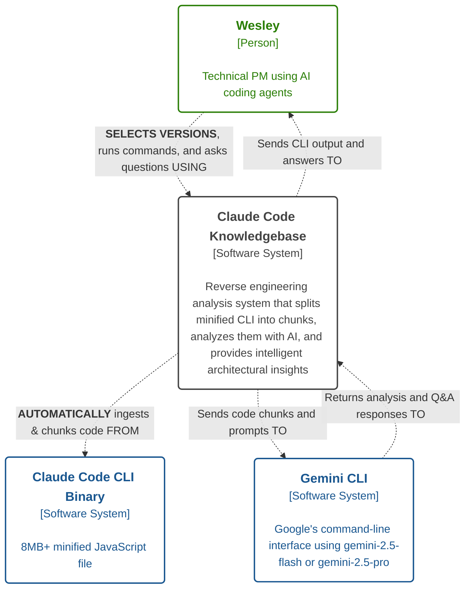
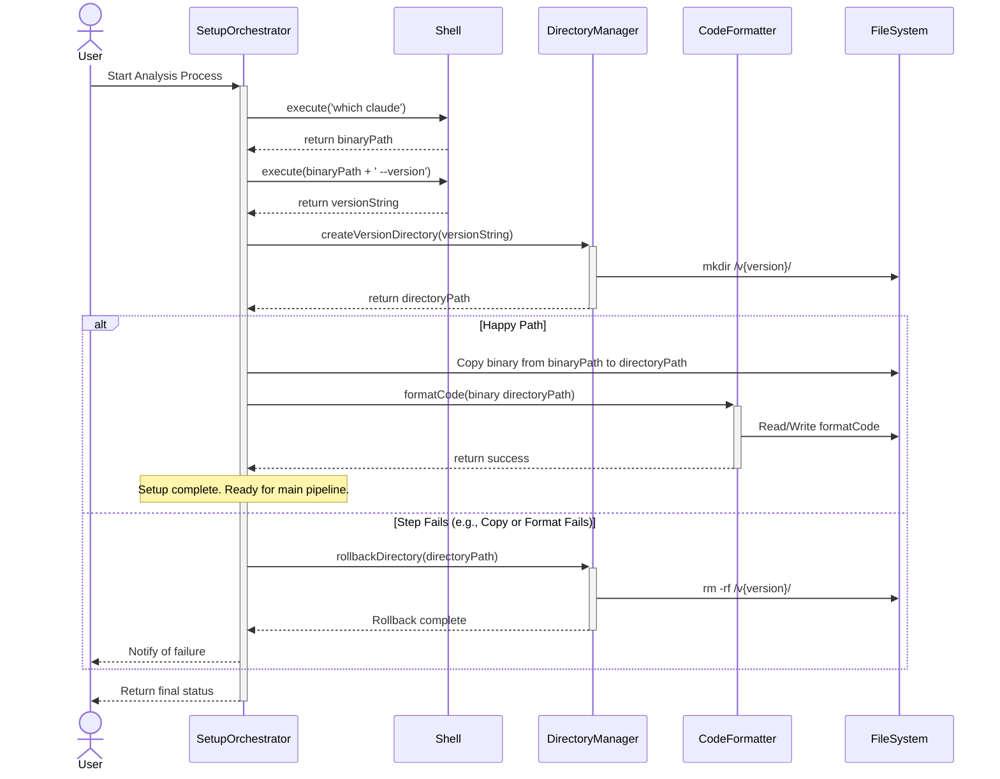

<!-- markdownlint-disable MD024 -->
# Claude Code Knowledgebase

Claude Code Knowledgebase is a reverse engineering static analysis system that enables product managers, developers, and AI-assisted development practitioners to understand how Claude Code CLI works internally. Rather than relying on incomplete documentation that can't keep up with daily releases, this tool provides direct access to architectural insights from the actual codebase. The system breaks down Claude Code's massive 8.6MB minified binary into manageable chunks for AI analysis, solving the fundamental problem that traditional tools like RepoMix can't handle such large minified codebases.

> **Note**: This document is intended to be a living document. Update the document immediately when code changes affect architecture.

## ==Feature Overview==
==This feature implements version-based analysis repository restructuring with automation to organize Claude Code analyses by version number while eliminating manual binary handling friction. The feature addresses the current flat directory structure that cannot accommodate multiple versions and automates the time-consuming manual steps of binary location, movement, and beautification that currently waste 15-20 minutes per analysis cycle.==

## Target Users

**Primary User**: Product Manager (Wesley) building portfolio for job applications and learning proven architectural patterns for AI-assisted development projects

**Secondary Users** (future GitHub community):
- **PMs without dev backgrounds**: Learning practical patterns from working systems
- **AI-assisted developers**: Understanding architecture that scales beyond simple projects
- **Reddit community members**: Getting answers to "how does Claude Code work?" questions

---
## Core Architectural Principles

The system's design is guided by a few core principles that prioritize simplicity, clarity, and a pragmatic separation of concerns.

### Modular and Simple Design
- **Single File Responsibility**: Each script in the `src/scripts/` directory is designed to handle one specific concern. For example, `split.js` is solely responsible for code splitting, while `merge-again.js` handles project-based merging.
- **Simplicity First**: The system favors simple, direct solutions over complex ones. It uses standard file system operations and shell commands instead of introducing databases or complex frameworks, which keeps the architecture lean and easy to maintain.

### Deterministic Offloading
- **Mechanical Separation**: The architecture strictly separates predictable, mechanical tasks from semantic interpretation. The Node.js scripts handle deterministic operations like file I/O, AST parsing, and data aggregation, while the external Gemini CLI is treated as a specialized tool for the non-deterministic task of code analysis.

### Data-First Approach
- **Data Model First**: The system's workflow is dictated by its data artifacts. The pipeline is a sequence of transformations, with each script designed to either produce or consume a specific data representation (e.g., `chunks/`, `merged-chunks/`, `chunks_unified_enhanced.json`).
- **One Source of Truth**: The system avoids duplicating data, instead favoring authoritative data sources plus projections. For instance, `chunks_unified_enhanced.json` is a projection generated from the individual `chunks/*.json` files, serving as the single source of truth for the Q&A application's semantic pre-filtering.

---
## Document Overview

This document captures the baseline architecture of the Claude Code reverse engineering system to enable precise impact analysis during feature development. When implementing improvements or new capabilities, this baseline serves as the reference point for identifying which containers, components, and code files require modification.

### C4 Methodology

The C4 model decomposes complex architecture by drilling down through four levels: Context (system boundaries), Containers (deployable units), Components (grouped functionality), and Code (implementation details). This structured approach enables understanding of the system at appropriate levels of detail, from high-level system interactions down to specific file and class implementations.

## System Overview

**System Purpose:**  Reverse engineering analysis system for understanding Claude Code CLI via AI-powered code decomposition and Q&A.
**User Value Statement:**  Enables PMs and developers to get direct, actionable insights using static analysis of implemented code.

### Core Architectural Style

**Architecture Pattern:**
Batch Processing Pipeline + CLI Query Interface

**Rationale:**  
- Chosen to efficiently process and analyze large, minified codebases that can't be handled in a single pass.
- CLI interface prioritizes developer speed of iteration, scripting, and local troubleshooting.

**Key Characteristics:**
- **Interaction Style:** CLI-based, streaming outputs for immediate feedback.
- **Runtime Model:** Local batch jobs plus user-driven interactive queries.
- **Deployment Model:** Fully self-contained; no cloud dependencies.
- **Scaling Approach:** Chunk-based parallel batch operations, recoverable from failures.

## Level 1: System Context Diagram
%%
### System Context: Impact Analysis
At this high level, the new feature **does not introduce any new systems or actors**. The user is still Wesley, and the system still interacts with the Claude Code CLI binary and the Gemini CLI.

The primary change is in the **nature of the interactions**, making them more intelligent and user-driven.

---

#### Key Interaction Changes

1. **User to System**: The user's interaction evolves beyond simply running the analysis pipeline. They now gain explicit control over which version to analyze or compare. The interaction changes from "Runs CLI commands" to **"Selects analysis versions and requests comparisons"**.

2. **System to Binary**: The system's relationship with the Claude Code binary becomes more proactive. Instead of passively ingesting a pre-placed file, the system will now **"Automatically locates and inspects binary for version info"**.
%%

### System Context Diagram
%%
This updated diagram reflects the more sophisticated interactions introduced by the new feature. **ENHANCEMENTS** indicated in _bold caps_.
%%



---
## Level 2: Containers
%%
### Container Level: Impact Analysis
At the container level, the new feature introduces a significant **automated pre-processing workflow** and makes the system **version-aware**. The impact is concentrated in the `Code Processing Application` and the `Q&A Application`, with a fundamental change to the `File System` container they both rely on. The `Analysis Application` remains largely unaffected, as its core responsibility of analyzing provided code chunks doesn't change.

---

#### Key Container Changes

- **`Code Processing Application`**: This container's responsibilities are significantly **expanded**. It now orchestrates an entirely new, automated setup phase that runs before its existing chunking and merging logic. This new phase includes version detection, binary searching, version-specific directory creation, and code formatting.

- **`Q&A Application`**: This container is **enhanced** to become version-aware. It must now provide a user interface for selecting from available analysis versions and use the context of the selected version to retrieve the correct artifacts for analysis.

- **`File System`**: The structure of this container is **fundamentally changed**. It moves from a single, flat workspace to a hierarchical model where all artifacts for a given analysis are stored in a version-specific directory (e.g., `/v1.0.80/`).
%%

### Container Diagram

```mermaid
graph LR
  subgraph claudeCodeKnowledgeBase ["Claude Code KnowledgeBase"]
    direction LR
    style claudeCodeKnowledgeBase fill:#fafafa, stroke:#555555

    subgraph analysisPipeline ["Analysis Pipeline"]
      direction TB
      style analysisPipeline fill:transparent, stroke:#555555

      codeProcessingApplication["<div style='font-weight: bold'>Code Processing Application</div><div style='font-size: 85%; margin-top: 0px'>[Node.js, Acorn]</div><div style='font-size: 85%; margin-top:10px'>Handles file decomposition and indexing.</div>"]
      style codeProcessingApplication fill:#438dd5,stroke:#2e6295,color:#ffffff

      analysisApplication["<div style='font-weight: bold'>Analysis Application</div><div style='font-size: 85%; margin-top: 0px'>[Node.js, Gemini AI]</div><div style='font-size: 85%; margin-top:10px'>AI-powered analysis of minified code chunks.</div>"]
      style analysisApplication fill:#438dd5,stroke:#2e6295,color:#ffffff
    end

    subgraph userFacingApplication["User-Facing Application"]
      direction TB
      style userFacingApplication fill:transparent, stroke:#555555

      qaApplication["<div style='font-weight: bold'>Q&A Application</div><div style='font-size: 85%; margin-top: 0px'>[Node.js, Marked]</div><div style='font-size: 85%; margin-top:10px'>Interactive question-answering system with semantic chunk pre-filtering.</div>"]
      style qaApplication fill:#438dd5,stroke:#2e6295,color:#ffffff
    end

    subgraph sharedServices ["Shared Services"]
      direction TB
      style sharedServices fill:transparent, stroke:#555555

      utilities["<div style='font-weight: bold'>Utilities</div><div style='font-size: 85%; margin-top: 0px'>[Node.js]</div><div style='font-size: 85%; margin-top:10px'>Cross-cutting services and external system adapters.</div>"]
      style utilities fill:#438dd5,stroke:#2e6295,color:#ffffff
    end

    subgraph storage ["Storage"]
      direction TB
      style storage fill:transparent, stroke:#555555

      fileSystem["<div style='font-weight: bold'>File System</div><div style='font-size: 85%; margin-top: 0px'>[JSON, JS]</div><div style='font-size: 85%; margin-top:10px'>Persistent storage for code chunks, analysis results, and semantic indexes.</div>"]
      style fileSystem fill:#438dd5,stroke:#2e6295,color:#ffffff
    end


    codeProcessingApplication-. "<div>Persists data TO<br />Chunks code FROM</div><div style='font-size: 85%'>[node.js]</div>" .->fileSystem
    qaApplication-. "<div>Calls</div><div style='font-size: 85%'>[Gemini CLI Wrapper]</div>" .->utilities

    analysisApplication-. "<div>Reads FROM<br />Persists TO</div><div style='font-size: 85%'>[node.js]</div>" .->fileSystem
    analysisApplication-. "<div>Calls</div><div style='font-size: 85%'>[Gemini CLI Wrapper]</div>" .->utilities
  end

  technicalPm["<div style='font-weight: bold'>Wesley</div><div style='font-size: 85%; margin-top: 0px'>[Person]</div><div style='font-size: 85%; margin-top:10px'>Technical PM using AI coding agents</div>"]@{ shape: circle }
  style technicalPm fill:#08427b,stroke:#052e56,color:#ffffff

  claudeCodeCLI["<div style='font-weight: bold'>Claude Code CLI Binary</div><div style='font-size: 85%; margin-top: 0px'>[Software System]</div><div style='font-size: 85%; margin-top:10px'>8MB+ minified JavaScript file</div>"]
    style claudeCodeCLI fill:#999999,stroke:#6b6b6b,color:#ffffff

  geminiCLI["<div style='font-weight: bold'>Gemini CLI</div><div style='font-size: 85%; margin-top: 0px'>[Software System]</div><div style='font-size: 85%; margin-top:10px'>Google's command-line interface using gemini-2.5-flash or gemini-2.5-pro</div>"]
    style geminiCLI fill:#999999,stroke:#6b6b6b,color:#ffffff

  technicalPm-. "<div>Starts code processing USING</div><div style='font-size: 85%'>[CLI]</div>" .->codeProcessingApplication
  technicalPm-. "<div>Starts analysis USING</div><div style='font-size: 85%'>[CLI]</div>" .->analysisApplication
  technicalPm-. "<div>Asks questions USING</div><div style='font-size: 85%'>[CLI]</div>" .->qaApplication


  fileSystem-. "<div>Ingests FROM</div><div style='font-size: 85%'>[node.js]</div>" .->claudeCodeCLI
  utilities-. "<div>Calls</div><div style='font-size: 85%'>[Gemini CLI]</div>" .->geminiCLI

  linkStyle default color:#555555

  classDef softwareSystemFocus stroke-width:2px, fill:transparent
  class codeProcessingApplication,fileSystem,utilities,analysisApplication,qaApplication softwareSystemFocus
```



### Code Processing Application
- **Name:** Code Processing Application
- **Technology:** `Node.js`, `Acorn`
- **Technology Status:** Prototype
- **Description:** Handles
  - ==Version detection, searching for the source binary, creating version-specific directories, and formatting the binary before the decomposition phase begins==
  - File decomposition, merging, enhancement, and indexing phases
  - Enables AI-powered insights by transforming minified codebases into manageable chunks
  - Future potential for change detection, hashing, and diff management.
- **User Value:** Automates code processing vs. manually processing code, saving time and reducing errors
- **Interactions:**
  - ==*_locates and reads from_ the source Claude Code binary `cli.js` (synchronous)==
  - _persists to_ ==version-specific== `File System.Chunk Repository` (synchronous)
  - _persists to_ ==version-specific== `File System.Semantic Index` (synchronous)

### Analysis Application
- **Name:** Analysis Application
- **Technology:** `Node.js`, `Gemini AI`
- **Technology Status:** Prototype
- **Description:** AI-powered code analysis of minified code using: orchestration with parallel processing, retry logic, and semantic insight generation
- **User Value:** AI insights are faster vs. slower, human generated insights
- **Interactions:**
  - _reads from_ `File System.Chunk Repository` (synchronous)
  - _calls_ `Infrastructure.Gemini Adapter` (asynchronous, with retries)
  - _persists to_ `File System.Chunk Repository` analysis results (synchronous)

### Q&A Application
- **Name:** Q&A Application
- **Technology:** `Node.js`, `Marked`
- **Technology Status:** Prototype
- **Description:**
  - Interactive question-answering system that uses semantic chunk pre-filtering to provide AI-powered insights about Claude Code architecture
  - ==UI for the user to select which claude code version to query==
- **User Value:** Intelligent code analysis is faster vs. manual code exploration.
- **Interactions:**
  - _serves_ User interface (synchronous).
  - ==_reads from_ `config.json` to determine the analysis base path (synchronous)==.
  - _reads from_ a ==version-specific== `File System.Semantic Index` (synchronous).
  - _calls_ `Utilities.Gemini Adapter` (asynchronous, with retries).

### Utilities
- **Name:** Utilities
- **Technology:** `Node.js`
- **Technology Status:** Prototype
- **Description:** Cross-cutting services and external system adapters used by all application containers
- **User Value:** Shared utilities reduce duplication vs. reimplementing common functionality in each container

### File System
- **Name:** File System
- **Technology:** `JSON`
- **Technology Status:** Prototype
- **Description:**
  - Persistent storage for code chunks, analysis results, merged artifacts, and semantic indexes; with ==all artifacts for a given analysis version stored in a dedicated subdirectory (e.g., `/claude-code-analysis/v1.0.80/`).==
- **User Value:** File system is faster to implement vs. setting up and maintaining other data storage.
- **Interactions:**
  - _serves data to_ `Code Processing Application` (synchronous reads/writes).
  - _serves data to_ `Analysis Application` (synchronous reads/writes).
  - _serves data to_ `Q&A Application` (synchronous reads).

---
## Level 3: Components
%%
For each Container.Component below, all ==enhancements and/or new functionality is highlighted==, unless otherwise noted.

### Component Level: Impact Analysis

#### Code Processing Application Components
The primary impact is the addition of a new, automated pre-processing workflow, managed by a new **`SetupOrchestrator` component** and its helpers. These components execute before the existing `Splitter`. The existing data processing components are then modified to operate within the version-specific context created by this new workflow.

##### New Components
- **`SetupOrchestrator`**
  - **Description**: Manages the entire automated pre-processing workflow. It orchestrates locating the binary, detecting the version via shell commands, and calling helper components to create the workspace and format the code.
- **`DirectoryManager`**
  - **Description**: A helper component responsible for the atomic creation and rollback of the versioned directory structure (e.g., `/claude-code-analysis/v{version}/`).
- **`CodeFormatter`**
  - **Description**: A helper component that runs a deterministic code formatter on the copied binary to produce a beautified source (`cli.js`) ready for analysis.

##### Modified Components
- **`Splitter`, `Merger`, `Enhancer/Annotator`, `Index Builder`, `JSON Repair`**
  - **Enhancement**: The core logic of these components remains unchanged. However, their interfaces and file system interactions must be modified. They will no longer operate on a fixed, root directory. Instead, they must be parameterized to read from and write to the specific versioned subdirectory created by the `DirectoryManager`.
%%
Based on analysis of the actual codebase (`src/scripts/`), here are the identified components within each container:

### Code Processing Application Components

#### ==Code Processing Application.SetupOrchestrator==
- ==**Path(s):** `src/scripts/setupOrchestrator.js` (_PROPOSED_)==
- ==**Technology:** `Node.js`==
- ==**Technology Status:** To Be Implemented==
- ==**Description:** Manages the entire automated pre-processing workflow. It orchestrates locating the binary, detecting the version, setting up the workspace, and formatting the code to prepare it for the main analysis pipeline.==
- ==**Interactions:**==
  - ==_executes shell commands_ to locate the binary (`which claude`) and get its version (`claude --version`).==
  - ==_calls_ the `DirectoryManager` to create the version-specific directory and handle rollbacks.==
  - ==_persists_ the located binary to the new version directory on the `File System`.==
  - ==_calls_ the `CodeFormatter` to beautify the copied binary.==

#### ==Code Processing Application.DirectoryManager==
- ==**Path(s):** `src/scripts/pre-process/directoryManager.js` (_PROPOSED_)==
- ==**Technology:** `Node.js`==
- ==**Technology Status:** To Be Implemented==
- ==**Description:** Creates the versioned directory structure atomically. Includes a rollback procedure to delete the new directory if any subsequent automation step fails.==
- ==**Interactions:**==
  - ==_persists directory structure to_ `File System` (synchronous).==

#### ==Code Processing Application.CodeFormatter==
- ==**Path(s):** `src/scripts/pre-process/codeFormatter.js` (_PROPOSED_)==
- ==**Technology:** `Node.js`, `biome.js`==
- ==**Technology Status:** To Be Implemented==
- ==**Description:** Runs a deterministic code formatter on the copied binary to produce a beautified source (`cli.js`) ready for analysis.==
- ==**Interactions:**==
  - ==_reads from and persists to_ the copied `cli.js` in the version-specific directory (synchronous).==

#### Code Processing Application.Splitter ^bee9b5
- **Path(s):** `split.js`
- **Technology:** `Node.js`, `Acorn`
- **Technology Status:** Prototype
- **Description:** Parse the large, beautified CLI file into smaller, manageable chunks based on a size threshold (~100KB).
- **Interactions:**
  - _reads from_ ==the beautified `cli.js` within the version-specific directory== (synchronous).
  - _persists to_ ==the version-specific== `File System.Chunk Repository` (synchronous).

#### Code Processing Application.Merger
- **Path(s):** `merge-again.js`
- **Technology:** `Node.js`
- **Technology Status:** Prototype
- **Description:** Group individual code chunks into larger project-specific files based on AI analysis results and manual naming fixes.
- **Interactions:**
  - _reads from_ ==the version-specific== `File System.Chunk Repository` (synchronous).
  - _uses_ existing AI analysis JSON files from ==the version-specific directory== (synchronous).
  - _persists to_ `File System.Chunk Repository` merged-chunks in ==the version-specific directory== (synchronous).

#### Code Processing Application.Enhancer/Annotator
- **Path(s):** `improve-merged-chunks.js`
- **Technology:** `Node.js`, `Acorn AST`
- **Technology Status:** Prototype
- **Description:** Statically analyze merged project files to identify dependencies and add helpful comment annotations about variable origins.
- **Interactions:**
  - _reads from_ `File System.Chunk Repository` merged-chunks in ==the version-specific directory== (synchronous).
  - _persists to_ `File System.Chunk Repository` improved files in ==the version-specific directory== (synchronous).

#### Code Processing Application.Index Builder
- **Path(s):** `generate-unified-json.js`
- **Technology:** `Node.js`
- **Technology Status:** Prototype
- **Description:** Create a single `chunks_unified_enhanced.json` metadata index that aggregates all analysis phases.
- **Interactions:**
  - _reads from_ `File System.Chunk Repository` individual JSON files in ==the version-specific directory== (synchronous).
  - _persists to_ `File System.Semantic Index` in ==the version-specific directory== (synchronous).

#### Code Processing Application.JSON Repair
- **Path(s):** `fix-malformed-json.js`
- **Technology:** `Node.js`
- **Technology Status:** Prototype
- **Description:** Repair malformed JSON analysis files that contain arrays instead of single objects.
- **Interactions:**
  - _reads from_ `File System.Chunk Repository` problematic JSON files in ==the version-specific directory== (synchronous).
  - _persists corrected JSON to_ `File System.Chunk Repository` in ==the version-specific directory== (synchronous).

### Analysis Application Components

#### Analysis Application.Batch Processor
- **Path(s):** `config-learn-chunks.js`
- **Technology:**
  - `Node.js`
  - `cli-progress`
- **Technology Status:** Prototype
- **Description:** Manages parallel batch execution, progress tracking, and performance metrics
- **Interactions:**
  - _delegates to_ `AI Analysis Engine` (asynchronous, parallel)
  - _uses_ `File System.Chunk Repository` (synchronous reads)

#### Analysis Application.AI Analysis Engine
- **Path(s):** `config-learn-chunks.js`
- **Technology:** `Gemini CLI`
- **Technology Status:** Prototype
- **Description:** Constructs prompts, executes AI analysis calls, handles retries and failures
- **Interactions:**
  - _calls_ `Infrastructure.Gemini Adapter` (asynchronous, with retries)
  - _delegates to_ `self.Response Parser` (synchronous)

#### Analysis Application.Response Parser
- **Path(s):** `config-learn-chunks.js`
- **Technology:** Regex + JSON parsing
- **Technology Status:** Prototype
- **Description:** Extracts and validates JSON from AI responses, handles multiple format variations
- **Interactions:**
  - _delegates to_ `self.Analysis Persister` (synchronous)

#### Analysis Application.Analysis Persister
- **Path(s):** `config-learn-chunks.js`
- **Technology:** `Node.js`
- **Technology Status:** Prototype
- **Description:** Writes analysis results to JSON files, manages file I/O operations
- **Interactions:**
  - _persists data to_ `File System.Chunk Repository` (synchronous writes)

#### Analysis Application.Interactive Controller
- **Path(s):** `interactive-analysis.js`
- **Technology:** `Node.js`
- **Technology Status:** Prototype
- **Description:** Provides user-guided workflow for pipeline execution
- **Interactions:**
  - _orchestrates_ `self.Batch Processor` (asynchronous, user-guided)
  - _monitors_ `File System.Chunk Repository` (synchronous polling)

### Q&A Application Components
%%
#### Q&A Application Components: Impact Analysis
The impact here is making the application version-aware, which involves adding new UI components and modifying existing data-access components.

##### New Components_
- **`Version Selector UI`**
  - **Description**: A new user-facing component, likely orchestrated by the `Interactive Session Manager`, that presents the user with a list of available analysis versions to query (e.g., latest, last-used, currently installed).
- **`Version Comparer`**
  - **Description**: Implements the text-based comparison feature. It will prompt the user to select two versions and an artifact name, then generate and display a `diff` of the two files.

##### Modified Components_
- **`Semantic Chunk Selector`**
  - **Enhancement**: This component is significantly impacted. Its logic for locating the `chunks_unified_enhanced.json` index must be changed from a static path to a dynamic path based on the version selected by the user in the `self.Version Selector UI`.
- **`Interactive Session Manager`**
  - **Enhancement**: Its responsibilities are expanded to orchestrate the new `Version Selector UI` at the start of a session and manage the currently selected version state for use by other components.
%%

#### ==Q&A Application.Version Selector UI==
- ==**Path(s):** `ask-enhanced.js` (_ENHANCEMENT_)==
- ==**Technology:** `Node.js`, `readline`==
- ==**Technology Status:** To Be Implemented==
- ==**Description:** Presents the user with a list of available analysis versions to query and captures their selection.==
- ==**Interactions:**==
  - ==_reads available versions from_ the `File System` directory structure (synchronous).==
  - ==_provides selected version to_ the `Interactive Session Manager` (synchronous).==

#### ==Q&A Application.Version Comparer==
- ==**Path(s):** `src/scripts/compareVersions.js` (_PROPOSED_)==
- ==**Technology:** `Node.js`==
- ==**Technology Status:** To Be Implemented==
- ==**Description:** Implements the text-based comparison feature. Prompts the user to select two versions and an artifact name, then generates and displays a `diff`.==
- ==**Interactions:**==
  - ==_reads two specified artifact files from_ the `File System` (synchronous).==
  - ==_displays diff output to_ the User Interface (synchronous).==

#### Q&A Application.Semantic Chunk Selector
- **Path(s):** `ask-enhanced.js`
- **Technology:** `Node.js`, JSON processing
- **Technology Status:** Prototype
- **Description:** Pre-filters chunks down to the most relevant ones using the semantic index and user question context.
- **Interactions:**
  - _reads from_ `File System.Semantic Index` ==from the user's currently selected version directory== (synchronous).
  - _delegates to_ `self.Question Processor` (synchronous).

#### Q&A Application.Question Processor
- **Path(s):** `ask-enhanced.js`
- **Technology:** `Node.js`, prompt construction
- **Technology Status:** Prototype
- **Description:** Constructs AI prompts from user questions and selected chunks, manages conversation context.
- **Interactions:**
  - _calls_ `Utilities.Gemini Adapter` (asynchronous, with retries).
  - _delegates to_ `self.Response Formatter` (synchronous).

#### Q&A Application.Response Formatter
- **Path(s):** `ask-enhanced.js`
- **Technology:** `marked`, `marked-terminal`
- **Technology Status:** Prototype
- **Description:** Converts AI markdown responses to formatted terminal output with syntax highlighting and structure.
- **Interactions:**
  - _delegates to_ `self.Interactive Session Manager` (synchronous).

#### Q&A Application.Interactive Session Manager
- **Path(s):** `ask-enhanced.js`
- **Technology:** `Node.js` `readline`
- **Technology Status:** Prototype
- **Description:**
  - Manages CLI interaction loop, user input processing, and session state across multiple questions.
  - ==Orchestrates the `Version Selector UI` at the start of a session and manages the currently selected version state for use by other components.==
- **Interactions:**
  - _serves_ User interface (synchronous).
  - _orchestrates_ `self.Semantic Chunk Selector` (synchronous).

### Utilities Container Components

#### Utilities.Gemini Adapter
- **Path(s):** `gemini-cli.js`
- **Technology:** `Node.js`, `child_process`
- **Technology Status:** Prototype
- **Description:** Robust wrapper for external Gemini CLI with temp file management, retry logic, and error handling
- **Interactions:**
  - _calls_ Google Gemini External System via HTTPS (asynchronous, with retries)

#### Utilities.Logger
- **Path(s):** `logger.js`
- **Technology:** `Node.js`
- **Technology Status:** Prototype
- **Description:** Cross-cutting logging service used across all containers
- **Interactions:**
  - _used by_ `Code Processing Application.All Components` (synchronous)
  - _used by_ `Analysis Application.All Components` (synchronous)
  - _used by_ `Q&A Application.All Components` (synchronous)

### File System Components (Data Containers)

#### File System.Chunk Repository
- **Path:**
  - `chunks/`
  - `merged-chunks/`
- **Technology:**
  - `JSON` files
  - `*.js` Javascript files
- **Technology Status:** Prototype
- **Description:** Persist raw code chunks, AI analysis results, and project-grouped artifacts across pipeline phases
- **Interactions:**
  - _serves data to_ `Code Processing Application` (synchronous reads/writes)
  - _serves data to_ `Analysis Application` (synchronous reads/writes)
  - _serves data to_ `Q&A Application` (synchronous reads/writes)

#### File System.Semantic Index
- **Path:** `chunks_unified_enhanced.json`
- **Technology:** `JSON`
- **Technology Status:** Prototype
- **Description:** Aggregates `chunks/*.json` metadata into one file that can be used to pre-filter `chunks/*.js` for `Q&A Application.Semantic Chunk Selector`
- **Interactions:**
  - _serves data to_ `Q&A Application.Semantic Chunk Selector` (synchronous reads)

### Component Interaction Diagram: Pre-Processing Workflow



---
## Component Interfaces and Data Contracts

### File System Data Contract
All processing and analysis scripts ==operate within a version-specific subdirectory located within `claude-code-analysis/`==. The key contracts are:
- ==**`/v{version}/`**: A top-level directory that encapsulates all artifacts for a single analysis run, identified by the detected binary version.==
- **`chunks/`**: Contains the raw, numbered code chunks (`chunks.{N}.js`) generated by the `Splitter` component. It also serves as the repository for the corresponding AI analysis metadata files (`chunks.{N}.json`). ==This directory resides within a version-specific parent directory.==
- **`merged-chunks/`**: Contains project-grouped code files (e.g., `react.js`) created by the `Merger` component. The `Enhancer` component then creates `improved-*.js` versions in this same directory. ==This directory resides within a version-specific parent directory.==
- **`chunks_unified_enhanced.json`**: This file serves as the primary **semantic index** for the Q&A application. Its schema consists of an array of objects, where each object contains a `chunkId`, `jsFilePath`, associated `ossProjects`, and the AI-generated `purpose` description. This index is the direct input for the `Q&A Application.Semantic Chunk Selector`. ==This file resides within a version-specific parent directory.==

---
## Cross-Cutting Concerns
These are system-wide responsibilities that affect multiple components.

### Configuration Management
System behavior is configured through a central `config.json` file, which defines parameters for AI model selection, processing batch sizes, retry logic, and ==a predefined list of common installation paths to search for the Claude Code CLI binary==. These settings can be overridden at runtime using environment variables (`GEMINI_MODEL`, `BATCH_SIZE`), which provides flexibility for different execution contexts without modifying versioned files. The `GeminiCLI` class is responsible for loading this configuration at startup.

==Key settings within the `analysis` object in `config.json` include:==

|Key|Type|Description|
|---|---|---|
|==`basePath`==|`string`|The root directory where versioned analysis folders will be created.|
|==`binarySearchPaths`==|`array(string)`|A list of additional paths to search for the `claude` binary if it's not found in the default system `PATH`.|

### Error Handling and Logging
- **Logging**: A centralized **Logger** is provided by `logger.js` and instantiated by each script to ensure consistent, structured log output. The logger supports multiple levels (DEBUG, INFO, WARN, ERROR) and writes all output to `logs/analysis.log`.
- **Error Handling**: Specific components implement tailored error handling.
  - The `gemini-cli.js` adapter includes a **retry loop** for network-related failures.
  - The AI response parser in `config-learn-chunks.js` includes **fallback logic** to handle malformed JSON, preventing the failure of a single chunk from halting the entire batch process.
  - The `ask-enhanced.js` script will fall back to using all available chunks if the semantic selection process fails for any reason.
  - ==The pre-processing workflow includes:
    - ==Atomic version directory creation and a **rollback procedure** that deletes the newly created directory and all its contents if any subsequent step (e.g., binary copy, formatting) fails, ensuring a clean state.==
    - ==The system provides guided error messages if the binary cannot be located.==

---
## Level 4: Code
This level details the internal organization, key implementation patterns, and file structure of the components identified in Level 3.

### Code Organization and Structure
%%
For each Container.Component below, all ==enhancements and/or new functionality is highlighted==, unless otherwise noted.

#### Directory Organization: Impact Analysis

```text
claude-code-knowledgebase/
├── claude-code-analysis/              # Analysis artifacts and pipeline outputs
│   ├── v{{version}}/                     # NEW: Version-specific artifact directory
│   │   ├── chunks/
│       ├── merged-chunks/
│       ├── cli.beautify.js
│       └── chunks_unified_enhanced.json
│       └── sdk.d.ts                  # TypeScript definitions extracted from CLI
├── src/
│   └── scripts/
│       ├── setupOrchestrator.js          # NEW: Main entry point for pre-processing
│       ├── pre-process/                  # NEW: Helper modules for the orchestrator
│       │   ├── directoryManager.js       # NEW: Manages directory creation/rollback
│       │   └── codeFormatter.js          # NEW: Runs the code beautifier
│       └── compareVersions.js            # NEW: Compares artifacts between versions
```

%%

#### Directory Organization

```text
claude-code-knowledgebase/
├── claude-code-analysis/              # Analysis artifacts and pipeline outputs
│   ├── v{{version}}/                     # NEW: Version-specific artifact directory
│       ├── chunks/
│       ├── merged-chunks/
│       ├── cli.beautify.js
│       └── chunks_unified_enhanced.json
│       └── sdk.d.ts                  # TypeScript definitions extracted from CLI
├── docs/                             # Architecture and design documentation
│   ├── Architecture Baseline.md      # C4 model system architecture (this document)
│   ├── Product Overview.md           # Business context, user needs, success metrics
│   └── architecture-whiteboard.md    # Technical debt assessment and design analysis
├── src/                              # Core application source code
│   └── scripts/                      # 5-phase analysis pipeline implementation
│       ├── setupOrchestrator.js        # NEW: Main entry point for pre-processing
│       ├── pre-process/                # NEW: Helper modules for the orchestrator
│       │   ├── directoryManager.js     # NEW: Manages directory creation/rollback
│       │   └── codeFormatter.js        # NEW: Runs the code beautifier
│       ├── split.js                  # Phase 1: AST-based code splitting into chunks
│       ├── config-learn-chunks.js    # Phase 2: AI dependency analysis with Gemini
│       ├── generate-unified-json.js  # Phase 2.5: Metadata aggregation and indexing
│       ├── merge-again.js            # Phase 3: Project-based code grouping
│       ├── improve-merged-chunks.js  # Phase 4: Code enhancement with annotations
│       ├── ask-enhanced.js           # Phase 5: Semantic Q&A with chunk pre-filtering
│       ├── compareVersions.js          # NEW: Compares artifacts between versions
│       ├── interactive-analysis.js   # Interactive pipeline controller and orchestrator
│       ├── fix-malformed-json.js     # JSON repair utilities for analysis artifacts
│       ├── gemini-cli.js            # Gemini CLI adapter with retry and error handling
│       └── logger.js                # Cross-cutting logging service for all components
├── biome.json                        # Code formatting, linting rules, and quality standards
├── config.json                       # Analysis pipeline configuration (models, batching, timeouts)
├── package.json                      # Node.js dependencies, scripts, and project metadata
└── README.md                        # Project overview, setup instructions, and usage guide
```

#### File Naming Patterns

- **Analysis Pipeline Artifacts:**
  - `chunks/*.js` - Code fragments: `chunk-001.js` through `chunk-145.js` (~100KB each).
  - `chunks/*.json` - AI metadata: `chunk-001.json` through `chunk-145.json` (dependency analysis).
  - `merged-chunks/*.js` - Project groups: descriptive names like `node.js (built-in modules).js`.
  - `chunks_unified_enhanced.json` - Aggregated metadata index for semantic pre-filtering.
  - ==**Note**: All of the above artifacts are located within a version-specific parent directory (e.g., `v1.0.112/`).==

- ==**Pre-Processing Scripts**==:
  - ==`setupOrchestrator.js` - The main entry point for the new automated setup workflow.==
  - ==`pre-process/*.js` - Helper modules that implement single-responsibility logic for the orchestrator.==
  - ==`compareVersions.js` - The entry point for the artifact comparison feature.==

- **Configuration Standards:**
  - `config.json` - Pipeline settings: model selection, batch processing, timeout handling.
  - `biome.json` - Code quality rules: formatting, linting, style enforcement.
  - `package.json` - Dependencies and npm scripts for pipeline execution.

- **Documentation Hierarchy:**
  - `README.md` - Project entry point with setup and usage instructions.
  - `docs/*.md` - Architecture documentation following C4 model methodology.
  - `src/scripts/*.js` - Implementation files with embedded JSDoc comments.

### Key Implementation Patterns

- **`setupOrchestrator.js` (Orchestrator Pattern)**: This script acts as an **orchestrator** for the complex pre-processing subsystem. It coordinates a sequence of operations—executing shell commands and calling helper modules like the `DirectoryManager` and `CodeFormatter`—to provide a simple, single entry point for the entire setup workflow.
- **`gemini-cli.js` (Adapter Pattern)**: This script acts as a robust **adapter** for the external Gemini CLI. It encapsulates complexity by managing temporary file creation for prompts, executing shell commands via `child_process`, and implementing a retry mechanism with configurable delay and attempts to handle transient failures.
- **`config-learn-chunks.js` (Parallel Batch Processor)**: This component processes a large number of code chunks by organizing them into **parallel batches**. It reads a batch size from the configuration and uses `Promise.all` to execute analysis on multiple chunks concurrently, significantly reducing the total processing time compared to a sequential approach. The script is idempotent, automatically skipping chunks that have already been processed.
- **`ask-enhanced.js` (Strategy Pattern)**: This script uses a **strategy pattern** to handle analysis based on the total token count of the selected code chunks. If the content fits within a predefined limit, it uses a single, unified analysis call (`analyzeUnifiedFragment`). If the content is too large, it automatically switches to a sequential, fragment-by-fragment analysis strategy (`analyzeSequentially`) to manage the context window effectively.
- **`split.js` (AST Visitor)**: The code splitter uses the `acorn` library to parse the source code into an **Abstract Syntax Tree (AST)**. It then traverses the top-level nodes of the AST, bundling them into chunk files until a character threshold (`CHUNK_THRESHOLD`) is met, ensuring that splits occur at logical code boundaries rather than arbitrary points.

---
## Coding Standards and Conventions

This section defines the standards for writing and organizing code to ensure consistency, clarity, and maintainability across the project.

### Guiding Principles
- **Consistency**: New code must follow the patterns and conventions already established in the existing codebase.
- **Clarity**: Code should be written to be easily understood. Favor descriptive names and simple structures over clever or complex alternatives.
- **Single Responsibility**: Each script or module should have one clear and distinct purpose.

### Formatting and Linting
- **Automated Formatting and Linting**: All code **must** be formatted and linted according to the rules defined in `biome.json` before being committed. This includes standards for indentation, quote style, and other recommended rules that ensure a consistent code style across the entire project.

### Naming Conventions

- **Files**: All JavaScript files in `src/scripts/` must use **`kebab-case`** (e.g., `ask-enhanced.js`, `setupOrchestrator.js`).
- **Functions & Variables**: All functions and variables must use **`camelCase`** (e.g., `executePrompt`, `binaryPath`).
- **Constants**: All constants must use **`UPPER_SNAKE_CASE`** (e.g., `CHUNK_THRESHOLD`).

### Code and File Structure

- **Module System**: The project uses the **`ES Modules`** module system (`import`/`export`) for all scripts.
- **File Organization**: Each script in `src/scripts/` must be self-contained and responsible for a single phase or major function of the application pipeline. Helper modules for a primary script should be placed in a subdirectory (e.g., `src/scripts/pre-process/`).
- **Internal Structure**: All `import` statements for dependencies must be placed at the top of the file.

### Critical Integration Rules

To ensure system-wide consistency and robustness, all components must adhere to the following integration rules:

- **Logging Consistency**: All console output, error reporting, and status messages **must** be routed through the shared `logger.js` component. Direct use of `console.log` is forbidden in application logic.
- **External Service Interaction**: All calls to the Gemini CLI **must** be made through the `gemini-cli.js` adapter. This ensures that all external API calls benefit from the same centralized retry logic, error handling, and configuration management.
- **Configuration Management**: All configurable values (e.g., batch sizes, file paths, model names) **must** be managed in `config.json` and read at runtime. Hardcoding configuration values within scripts is forbidden.

---
## Testing Strategy

### Philosophy and Principles

- **Integration-Driven Development**: Our development cycle is driven by tests. We start by writing a **failing integration test** that validates a user story's acceptance criteria, then we build the minimum code required to make that test pass.
- **MVP-Focused**: We adhere to a lean **target test-to-code ratio of 0.3:1 to 0.5:1** for story validation testing. The goal is to **prove functionality works**, not that it's bulletproof.
- **Real Systems, Fake Fixtures**: Tests run against the **real file system** and execute **real shell commands**. We have a zero-tolerance policy for mocking. To keep tests fast and self-contained, we use **lightweight, fake fixtures** (e.g., a mock binary script) instead of requiring real, large binaries.

### Testing Strategy Scope

**Infrastructure Setup**: Comprehensive testing investment for shared components that support multiple features across development phases. Infrastructure components like mock binaries, test utilities, and workspace management legitimately require thorough testing due to their foundational role and broad reuse.

**Feature Development**: Lean testing approach focused on story validation with 0.3:1 to 0.5:1 test-to-code ratio. Each user story validated by 3 focused tests covering acceptance criteria rather than comprehensive component testing.

### Testing Categories

#### Infrastructure Testing (Comprehensive)
- **Scope**: Shared components used across multiple features and development phases
- **Investment Level**: Comprehensive test coverage appropriate to scope and reuse
- **Examples**: Mock binary systems, test workspace utilities, configuration management, shared file operations
- **Rationale**: Infrastructure failures impact multiple features; comprehensive testing prevents expensive debugging across phases

#### Story Testing (Lean)
- **Scope**: User story acceptance criteria validation
- **Investment Level**: Minimal viable testing (3 tests per story typical)
- **Examples**: Primary integration test, failure case test, focused component test
- **Rationale**: Proves story functionality works without over-engineering test coverage

#### Mock Binary Testing Implementation

**For Claude Code binary testing**, we create fake `claude` executables with PATH manipulation:

**Binary Creation:**
- Create shell script (Unix) or batch file (Windows) named `claude`
- Script responds to `claude --version` command interface
- Returns configurable version strings for test scenarios

**PATH Integration:**
- Temporarily add script directory to system PATH during test execution
- Ensures `which claude` command resolution finds the fake binary
- Restore original PATH environment after test cleanup

**Test Scenarios:**
- **Success cases**: Script returns version like "1.2.3" to stdout
- **Failure cases**: Non-zero exit codes, empty output, permission errors

This approach enables testing of version detection logic without requiring the 8.6MB real Claude Code binary, while maintaining integration with actual shell command execution (`child_process.exec`, `which claude`).

_Implementation Details_: [Testing Strategy Example](enhancement-scope/Testing%20Strategy%20Example.md)

### Test Implementation

- **High-Priority (Integration Tests)**: These are the primary tests we write. Their purpose is to validate **end-to-end user story workflows** from the command line down to the file system. When these tests fail, they indicate a bug in the overall feature but may require further investigation to isolate.
- **Medium-Priority (Focused Tests)**: These are small, fast tests for **new, critical, or complex helper components** (like the `DirectoryManager`). Their purpose is to provide **precise failure isolation** for essential logic, making debugging easier.

### Application to User Stories

The test plan for a user story is considered complete when **all of its Acceptance Criteria** are verified by one or more of the tests described above.

#### Example: Test Plan for Story 1.1

![[../../../claude-code-knowledgebase/design-docs/features/version-based-analysis/version-based-analysis-prd#Story 1.1 Version Detection and Directory Scaffolding]]

This story is validated by a combination of tests designed to cover all of its Acceptance Criteria:

1. **Primary Integration Test (Happy Path)**: Verifies that a correctly detected version results in the creation of the corresponding versioned directory ([[../../../claude-code-knowledgebase/design-docs/features/version-based-analysis/version-based-analysis-prd#^US1-1AC1|AC1]], [[../../../claude-code-knowledgebase/design-docs/features/version-based-analysis/version-based-analysis-prd#^US1-1AC2|AC2]]) and that the process is logged ([[../../../claude-code-knowledgebase/design-docs/features/version-based-analysis/version-based-analysis-prd#^US1-1AC5|AC5]]).
2. **Failure Case Integration Test**: Verifies that a version detection failure results in the creation of a uniquely identified directory and is logged correctly ([[../../../claude-code-knowledgebase/design-docs/features/version-based-analysis/version-based-analysis-prd#^US1-1AC3|AC3]]).
3. **Focused Test (DirectoryManager)**: Verifies the atomicity of the directory creation and the rollback procedure in isolation ([[../../../claude-code-knowledgebase/design-docs/features/version-based-analysis/version-based-analysis-prd#^US1-1AC4|AC4]], [[../../../claude-code-knowledgebase/design-docs/features/version-based-analysis/version-based-analysis-prd#^NFR5|NFR5]]).

![[enhancement-scope/Testing Strategy Example#Testing Strategy for Story 1.1|Testing Strategy for Story 1.1]]

---
## Technology Stack

| Technology/Library | Category | Version | Module | Purpose in the System | Used By (Container.Component) |
| :--- | :--- | :--- | :--- | :--- | :--- |
| **Node.js** | **Runtime** | ≥18 | `node` | Provides the server-side/CLI JavaScript execution environment with built-in modules. | `Code Processing Application`, `Analysis Application`, `Q&A Application` |
| | | | `node:child_process` | Executes and manages the external Gemini CLI shell command. | `Utilities.Gemini Adapter` |
| | | | `node:fs` | Handles all file system operations (reading source code, writing chunks, analysis results, and indexes). | `Code Processing Application`, `Analysis Application`, `Q&A Application` |
| | | | `node:readline` | Creates an interactive command-line prompt for user Q&A. | `Q&A Application.Interactive Session Manager` |
| | | | `node:path` | Normalizes and resolves file paths to ensure cross-platform compatibility. | `Code Processing Application`, `Analysis Application`, `Q&A Application` |
| | | | `node:util` | Provides utilities, specifically `promisify` to modernize callback-based functions like `exec`. | `Utilities.Gemini Adapter`, `Analysis Application.Interactive Controller` |
| **JavaScript** | **Language** | ES2020+ | ES Modules | The primary language for all application logic. | `Code Processing Application`, `Analysis Application`, `Q&A Application` |
| **Acorn** | **Code Parsing** | 8.x | `acorn` | Provides the core, spec-compliant JavaScript parser for the initial code split. | `Code Processing Application.Splitter` |
| | | | `acorn-loose` | Provides a fault-tolerant parser for analyzing potentially malformed or incomplete code snippets. | `Code Processing Application.Enhancer/Annotator` |
| | | | `acorn-walk` | Provides utilities to traverse the Abstract Syntax Tree generated by Acorn parsers. | `Code Processing Application.Splitter`, `Code Processing Application.Enhancer/Annotator` |
| **Marked** | **CLI Enhancement** | 15.x/7.x | `marked` | Provides the core engine for parsing Markdown text into tokens for terminal display. | `Q&A Application.Response Formatter` |
| | | | `marked-terminal` | Provides a custom renderer to display parsed Markdown with formatting and colors in a terminal. | `Q&A Application.Response Formatter` |
| **cli-progress** | **CLI Enhancement** | 3.12.0 | `cli-progress` | Displays user-friendly progress bars during long-running analysis jobs. | `Analysis Application.Interactive Controller` |
| **YAML** | **Configuration** | 2.8.1 | `yaml` | Parses YAML template files for the agentic workflow system. Not used by the core analysis pipeline, which uses `config.json`. | `(Agentic Workflows)` |
| **Gemini CLI** | **External Service** | latest | `gemini` (CLI) | Provides the core AI analysis engine for code understanding and Q&A, invoked via the `Utilities.Gemini Adapter`. | `Analysis Application.AI Analysis Engine`, `Q&A Application.Question Processor` |
| **Vitest** | **Testing** | latest | `vitest` | Provides the modern, high-performance framework for running integration and focused tests, including a Jest-compatible API and test runner. | `(Development Environment)` |
| **Biome** | **Code Quality** | latest | `biome` (CLI) | Provides deterministic code formatting and linting to ensure a consistent style across the entire project. | `Code Processing Application.CodeFormatter`, (Dev Env) |

---
## Known Risks and Technical Debt

### Known Risks
- **External CLI Dependency**: The `SetupOrchestrator`'s version detection is tightly coupled to the specific behavior and output format of the `which claude` and `claude --version` shell commands. A future update to the Claude Code CLI could alter these commands, which would break our pre-processing workflow.
  - **Mitigation**: Implement robust error handling and logging around the execution of these commands to detect breakages. The system will fail gracefully with a clear error message if the commands do not behave as expected.

---

### Conscious Technical Debt

- **Limited Version Discovery**: The current implementation **only discovers the single, globally installed `claude` binary** found in the system's `PATH`. It does not support discovering or managing multiple, side-by-side versions that might exist in other locations.

  - **Rationale**: This was a conscious decision to simplify the design and accelerate delivery of the MVP, as it meets the immediate needs of the primary user.

  - **Repayment Plan**: If support for multiple, co-existing binary versions is required in the future, the `SetupOrchestrator`'s discovery logic will need to be refactored to search additional, configurable paths.

---
## Architecture Decision Records (ADRs)

This section documents key architectural decisions, the context in which they were made, and their consequences.

### ADR-001: File System-Based Workspace
- **Status**: Superseded by ADR-007
- **Date**: 2025-8-09
- **Context**: The system required a simple, zero-dependency persistence mechanism for a single-user prototype. The primary drivers were **development speed** and the ability to **directly inspect file artifacts**. A file system approach avoided the significant overhead of integrating and managing a database or external service, which would have been overly complex for a prototype.
- **Decision**: We will use the local file system as the primary data store for all analysis artifacts. The workspace is organized into directories (`chunks/`, `merged-chunks/`) and key index files (`chunks_unified_enhanced.json`).
- **Consequences**:
  - The system is lightweight, self-contained, and requires no external dependencies for setup.
  - Data artifacts are human-readable and can be easily manipulated with standard command-line tools.
  - The responsibility for data integrity is handled by the application logic (e.g., `fix-malformed-json.js`) rather than a database schema. This is an acceptable trade-off for a non-production prototype, as the system is not used heavily and the "quick and dirty" nature of file access is a benefit.

### ADR-002: CLI-Based User Interaction
- **Status**: Superseded by ADR-007
- **Date**: 2025-08-09
- **Context**: The primary goal was to build a functional tool in the shortest time possible. A command-line interface was significantly faster to implement than a graphical user interface. The interface was designed for the primary user—a technical PM—who is comfortable and efficient in a command-line environment.
- **Decision**: We will build the system as a collection of command-line scripts that form a multi-phase pipeline (`split.js`, `config-learn-chunks.js`, etc.) and an interactive Q&A prompt (`ask-enhanced.js`).
- **Consequences**:
  - The system is fast, scriptable, and easily integrated into automated workflows.
  - It avoids the development and maintenance overhead of a separate GUI application.
  - The potential steeper learning curve for a future, non-technical audience is an acceptable trade-off for the prototype phase.
  - The CLI serves as a stable, functional core engine. Any future graphical interface would be built as a separate layer **on top of this foundation**, not as a replacement for it.

### ADR-003: Version Detection Method
- **Status**: Superseded by ADR-007
- **Date**: 2025-09-12
- **Context**: The system requires a reliable method to determine the version of the installed Claude Code binary. Two approaches were considered: executing a shell command (`claude --version`) and parsing the binary file contents to find a version string.
- **Decision**: We will implement **only one method** for version detection: executing the shell command. We will explicitly **not** implement file parsing as a fallback method for the MVP. This aligns with our **Simplicity First** and **Implement When Needed** principles, as the shell command is a known, reliable solution that meets the current requirement.
- **Consequences**:
  - **Positive**: The implementation is simpler, faster to deliver, and avoids the complexity of writing and maintaining two different detection logics.
  - **Negative**: This creates a dependency on an external command's specific behavior. A future breaking change in the Claude Code CLI could disable our version detection. This is noted in our **Known Risks** section.

### ADR-004: Testing Framework Selection

- **Status**: Superseded by ADR-007
- **Date**: 2025-09-13
- **Context**: The project required a formal testing framework to implement our **Integration-Driven Testing** strategy. The primary candidates considered were Jest, the established industry standard, and Vitest, a modern, high-performance alternative. A key consideration was the potential future migration of the project to TypeScript and the Vite build system.
- **Decision**: We will adopt **Vitest** as the project's official testing framework. All new automated tests (integration and focused) will be written using Vitest's Jest-compatible API.
- **Consequences**:
  - **Positive**: Vitest's superior performance will provide a faster feedback loop during development. It is the native testing framework for the Vite ecosystem, which perfectly aligns with and de-risks a potential future technology migration. Its Jest-compatible API ensures the learning curve is minimal.
  - **Negative**: It requires a minimal `vitest.config.js` file for our current CommonJS project, a minor, one-time setup cost compared to Jest's potential zero-config start.

### ADR-005: Code Formatting Implementation Method

- **Status**: Superseded by ADR-007
- **Date**: 2025-09-16
- **Context**: The `CodeFormatter` component requires a method for invoking the project's standardized Biome tool to format a source file. Research identified two possible approaches: executing the stable Biome command-line interface (CLI) or using the new, official JavaScript bindings (`@biomejs/js-api`). The JS API is officially designated as being in an **alpha** stage and not yet recommended for production use.
- **Decision**: We will implement the `CodeFormatter` component to execute the **stable Biome CLI** using Node.js's `child_process` module. We will explicitly **not** use the `@biomejs/js-api` package due to its alpha status.
- **Consequences**:
  - **Positive**:
    - Our automated pre-processing workflow will depend on a **stable, production-recommended tool**, significantly reducing the risk of failures from an unstable API.
    - The implementation remains simple, avoiding the introduction of new dependencies (`@biomejs/js-api`, WASM bindings) that would add complexity to the project.
    - The CLI has a stable interface, making our component less susceptible to breaking changes that are common in an alpha-stage programmatic API.
  - **Negative**:
    - There is a minor performance overhead associated with spawning a shell process compared to a direct API call. This is an acceptable trade-off for the significant gain in stability, as this operation is not on a critical performance path.

### ADR-006: Module System Selection (CommonJS vs ES6)

- **Status**: Superseded by ADR-007
- **Date**: 2025-09-18
- **Context**: The project required a module system for organizing Node.js scripts and components. Two primary options were considered: CommonJS (`require`/`module.exports`) - Node.js's traditional default system, and ES6 modules (`import`/`export`) - the modern JavaScript standard. Key considerations included development velocity, ecosystem compatibility, tooling complexity, and prototype delivery timeline.
- **Decision**: We will use **CommonJS** as the module system for all application scripts. All components will use `require` for imports and `module.exports` for exports. We will explicitly **not** adopt ES6 modules for the MVP, aligning with our **Simplicity First** principle and prototype delivery goals.
- **Consequences**:
  - **Positive**:
    - **Zero configuration overhead** - Works natively in Node.js without `"type": "module"` or `.mjs` files
    - **Ecosystem compatibility** - Full compatibility with all existing Node.js packages and tools
    - **Faster delivery** - Eliminates configuration complexity that could delay prototype delivery
    - **Familiar patterns** - Straightforward `require`/`exports` mental model for development team
    - **Tool maturity** - Established testing and debugging workflows with minimal setup
  - **Negative**:
    - **Legacy status** - CommonJS is being phased out in favor of ES6 modules
    - **No tree shaking** - Bundlers cannot optimize unused code (not critical for CLI tools)
    - **Testing complexity** - Requires Vitest configuration for CommonJS/ES6 interop
    - **Future migration debt** - Will require refactoring if project evolves to ES6 modules
  - **Migration Path**: If project graduates from prototype to production system, ES6 modules should be reconsidered for better tooling, static analysis, and modern JavaScript ecosystem alignment.

### ADR-007: Migration to ES Modules

- **Status**: Decided
- **Date**: 2025-09-19
- **Context**: Following the completion of foundational development work, the project reached a point where migrating from CommonJS to ES Modules became strategically beneficial. The original CommonJS decision (ADR-006) successfully supported rapid prototype delivery, but with core architecture stabilized, the advantages of ES Modules — better tooling, static analysis, and ecosystem alignment — now outweigh the configuration complexity. The migration was completed before significant new feature development to minimize disruption.
- **Decision**: We migrated the entire codebase from CommonJS to ES Modules. All scripts use `import`/`export` syntax, `package.json` includes `"type": "module"`, and relative imports include `.js` extensions as required by ESM. ES Modules are the established standard for all development.
- **Consequences**:
  - **Positive**:
    - **Modern ecosystem alignment** - Full compatibility with contemporary JavaScript tooling and standards
    - **Better static analysis** - Enhanced IDE support, type checking, and development tooling
    - **Tree shaking support** - Enables bundlers to optimize unused code for better performance
    - **Future-proof architecture** - Aligns with JavaScript ecosystem direction and eliminates technical debt
    - **Improved tooling integration** - Better support for modern build tools and development workflows
  - **Negative**:
    - **Configuration overhead** - Requires `"type": "module"` in package.json and explicit `.js` extensions
    - **One-time migration cost** - Required systematic updates across all application scripts
    - **CommonJS interop complexity** - Mixed module systems require careful handling during transition
  - **Migration Completed**: The migration was completed systematically across all application components, maintaining API compatibility while updating module syntax. ES Modules are the established standard for all development.

---
## Appendices

### Glossary

**5-Phase Pipeline:** The systematic process of splitting, analyzing, merging, enhancing, and querying Claude Code CLI architecture (AST splitting → AI analysis → project grouping → code annotation → intelligent Q&A).

**Adapter Pattern:** A structural pattern that allows incompatible interfaces to work together. It acts as a wrapper or middleman, translating requests from one component into a format another component can understand. In this system, it's used by `gemini-cli.js` to wrap the external command-line `gemini` tool, presenting it as a simple, promise-based JavaScript function to the rest of the application.

**AST-Based Code Splitting:** Abstract Syntax Tree parsing that breaks the 8.6MB minified CLI into manageable ~100KB chunks for LLM processing.

**Controller:** Software component that orchestrates user interactions and coordinates between system components, managing request flow and response formatting.

**Interactive Q&A System:** Core feature enabling natural language questions about Claude Code functionality with comprehensive architectural insights.

**Orchestrator Pattern:** A behavioral pattern where a central object (the orchestrator) explicitly coordinates and manages a complex workflow or a sequence of interactions between multiple, independent components. This centralizes the workflow logic, making it easier to manage and modify, while allowing the individual components to remain simple and focused on their specific tasks. In this system, it's used by `setupOrchestrator.js` to manage the entire pre-processing workflow, including locating the binary, getting its version, and calling the `DirectoryManager` and `CodeFormatter` helpers in the correct sequence.

**Parallel Batch Processor:** An efficiency pattern that processes a large set of tasks by grouping them into smaller batches and executing those batches concurrently. This system uses it in `config-learn-chunks.js` to analyze multiple code chunks simultaneously, significantly reducing the total processing time.

**Persists to:** Data is committed in a way it will survive failures (durable and acknowledged).

**Semantic Pre-filtering:** AI-driven chunk selection that chooses 3-18 relevant code chunks from 102 total based on question context, optimizing LLM context usage.

**Strategy Pattern:** A behavioral pattern that defines a family of interchangeable algorithms and allows a client to select one at runtime. This system uses it in `ask-enhanced.js` to choose between two different analysis methods—a single unified call for small content or a sequential, fragment-by-fragment method for larger content—based on the estimated token count.

**Writes to:** Data has been handed off, but not guaranteed safe yet.

### References & Further Reading

**Related Architecture Documents:**
- [Product Overview](design-docs/Product%20Overview.md): Business context, user needs, and success metrics for the Claude Code Knowledgebase project
- [Version Based Analysis PRD](design-docs/features/version-based-analysis/version-based-analysis-prd.md): Product requirements document for the version-based analysis feature
- [Architecture Whiteboard](design-docs/whiteboards/architecture-whiteboard.md): Whiteboard to capture iterative work that will be used in this document
- [CLAUDE.md](CLAUDE.md): Technical project overview with development commands, architecture components, and troubleshooting guidance
- [README](README.md): Project overview, setup instructions, and usage guide
- [Pseudocode Style Guide](design-docs/Psuedocode%20Style%20Guide.md): Guidelines for writing clear and consistent pseudocode in design documents
- [Design Principles](design-docs/Design%20Principles.md): Core principles governing the design and architecture of the Claude Code Knowledgebase project

### Architecture Change Log

| Date | Version | Level | Change Description | Author |
|------|---------|-------|-------------------|---------|
| 2025-01-09 | 1.0 | Overview | Initial architecture baseline document created with references from Product Overview and CLAUDE.md | Application Tech Lead |
| 2025-01-09 | 1.1 | Level 2 | Functional domain decomposition completed with 4 core domains and interaction analysis | Application Tech Lead |
| 2025-09-16 | 2.0 | All Levels | Version-based analysis feature architecture with automated binary discovery, version-specific directories, and enhanced testing strategy | Application Tech Lead |
