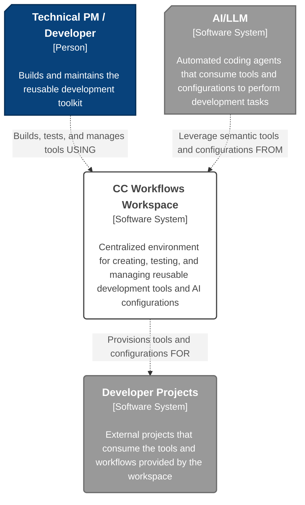

# CC Workflows Workspace - Architecture

> [!attention] **AI Master Instruction**
> **CRITICAL**: Instructions for the AI are in callouts using this format: > [!attention] **AI {{task instruction title}}**
> **CRITICAL**: Goals for a document section are in callouts using this format: > [!done] **AI {{section}} Goal**
> **CRITICAL**: Content the AI must populate are in [single brackets]. [Further instructions on how to populate, style, and length of the content are in between the brackets]
> **CRTICAL**: Examples of content are in callouts using this format: > [!example] **AI {{section}} Example**
> **CRTICAL**: All other callouts and text outside of [brackets] are content that should be populated in the final document
>
> **Prime Directive #1: C4 Model Adherence.** Always structure architectural thinking through the four levels: Context (system boundaries), Containers (deployable units), Components (grouped functionality), and Code (implementation details). Each level serves a specific purpose and audience.
>
> **Prime Directive #2: Living Document Approach.** Treat this as a baseline architecture that evolves with features. Use the enhancement markup system (`==new functionality==` and `%% impact analysis %%`) to track changes while maintaining document coherence.
>
> **Prime Directive #3: Evidence-Based Decisions.** Support all architectural choices with concrete rationale: performance requirements, team constraints, technology capabilities, or business needs. Avoid "architecture astronaut" solutions.
>
> **Prime Directive #4: Implementation Reality.** Balance architectural idealism with delivery constraints. Choose patterns teams can successfully implement and maintain within project scope and timeline.
>
> - All ==enhancements== to the `Architecture Baseline` and/or ==new functionality is highlighted==, unless otherwise noted.
> - - ==Enhancements== are written as if the functionality already exists and has been merged into production. Do not use future tense or phrases like "...now includes...", or "...now interacts with..."
> - Enhancement additions and modification overviews are often included in markdown %% comment tags so they do not display in the read mode%%. This allows the llm to easily identify the feature's impact, while still maintaining the format of the `Architecture Baseline`. When it comes time to merge the feature architecture into the `Architecture Baseline`, we will programmatically strip the %% comment %% tags from the document.
<!-- -->
> [!danger] **Critial LLM Initialization Instructions**
> When first reading this file, you MUST IMMEDIATELY run citation manager to extract base paths: `npm run citation:base-paths <this-file-path> -- --format json`. Read ALL discovered base path files to gather complete architectural context before proceeding.

**Purpose**: CC Workflows provides a **centralized** **workspace** that acts as a **single source of truth** for development tools by establishing shared infrastructure for testing and builds. It is designed to accelerate all future development by providing a refined and repeatable platform for building new tools and workflows.

**User Value Statement:** Eliminates the manual and repetitive effort of porting workflow improvements across different projects, significantly reducing time spent on "meta-work".

> **Note**: This document is intended to be a living document. Update the document immediately when code changes affect architecture.

## Target Users

**Primary User**s:
- **Technical Product Manager** (Wesley) - Eliminating fragmented workflow development and establishing a refined, repeatable framework for building AI-assisted development tools
- **AI Coding Assistants** - Leveraging centralized semantic tools, testing frameworks, and standardized configurations to deliver consistent, reliable automation across development workflows

**Secondary Users**:
- **Future Team Members**: Learning established patterns and contributing to the centralized toolkit
- **AI-Assisted Developers**: Understanding architecture that scales beyond simple projects and supports complex semantic tooling
- **Community Members**: Adapt patterns for their own workflows

---
## Core Architectural Principles

The system's design is guided by core principles that prioritize **simplicity, maintainability, and extensibility** through a **modular, CLI-first architecture.**

### [Minimum Viable Product (MVP) Principles](../../Architecture%20Principles.md#Minimum%20Viable%20Product%20(MVP)%20Principles)

- **Key Concept**: **Validate the core concept** of a centralized workspace by delivering value quickly. Every architectural decision is weighed against the goal of avoiding over-engineering to accelerate learning and iteration.
  
- **Implementation Approach**: We are implementing this by choosing **native, low-overhead tooling** like NPM Workspaces and focusing strictly on the functionality required to migrate and enhance a single tool, `citation-manager`, as defined in the PRD.

### [Modular Design Principles](../../Architecture%20Principles.md#Modular%20Design%20Principles)

- **Key Concept**: The system's architecture must support a collection of **independent, reusable, and replaceable tools**. This modularity is foundational to achieving the project's long-term goals of maintainability and extensibility as new tools are added to the workspace.
  
- **Implementation Approach**: We are enforcing modularity by structuring the workspace with **NPM Workspaces**, where each tool lives in an isolated package with its own explicit dependencies and API boundaries.

### [Foundation Reuse](../../Architecture%20Principles.md#^foundation-reuse)

- **Key Concept**: This principle directly addresses the core business problem of **eliminating duplicated effort and inconsistent quality**. The workspace must serve as the single, authoritative repository for all development tools and workflows.

- **Implementation Approach**: The **centralized mono-repository structure** is the direct implementation of this principle, ensuring that any improvements to a tool like `citation-manager` are immediately available to all consumers without manual porting.

### [Deterministic Offloading Principles](../../Architecture%20Principles.md#Deterministic%20Offloading%20Principles)

- **Key Concept**: The tools within this workspace are defined as **predictable, mechanical processors** that handle repeatable tasks. This clarifies their role and boundaries within a larger development workflow that may also involve non-deterministic AI agents.

- **Implementation Approach**: The `citation-manager` exemplifies this by performing verifiable, deterministic operations like **parsing markdown and validating file paths**, leaving semantic interpretation to other systems.

---
## Document Overview

This document captures the baseline architecture of the CC Workflows Workspace to enable centralized development, testing, and deployment of semantic and deterministic tooling. When implementing improvements or new capabilities, this baseline serves as the reference point for identifying which containers, components, and code files require modification.

### C4 Methodology

The C4 model decomposes complex architecture by drilling down through four levels: **Context** (system boundaries), **Containers** (deployable units), **Components** (grouped functionality), and **Code** (implementation details). This structured approach enables understanding of the system at appropriate levels of detail, from high-level system interactions down to specific file and class implementations.

---
## Core Architectural Style

### Architectural and System Design

- **Architecture Pattern:** Monorepo (multi-package workspace) — a single repo acting as a [centralized, single source of truth](../../Architecture%20Principles.md#^foundation-reuse) for multiple, distinct development utilities. The first tool is the `citation-manager`.

- **System Design:** tooling monorepo hosting a multi-command CLI with shared packages for test/build. This is a toolkit of independent tools that consume common services like [testing (FR2)](cc-workflows-workspace-prd.md#^FR2) and [builds (FR3)](cc-workflows-workspace-prd.md#^FR3)—not a single linear pipeline.

#### Architectural Pattern Implementations
- `Monorepo` implemented via `npm workspaces` ([NPM Workspaces vs Alternatives](research/content-aggregation-research.md#2%2E1%20NPM%20Workspaces%20vs%20Alternatives))
- `cli multi-command` implemented via `commander` (initial). Clear upgrade path to `oclif` if/when plugin-based extensibility is required.

### Key Software Design Patterns

- [**Modular Component Design**](../../Architecture%20Principles.md#Modular%20Design%20Principles): - each tool (e.g., citation-manager) is isolated for independent evolution and migration, while shared utilities live in shared packages.

### Key Characteristics
- **Interaction Style**: CLI-based, with commands executed via root-level NPM scripts.
- **Runtime Model**: Local, on-demand execution of individual Node.js tool scripts.
- **Deployment Model**: Fully self-contained within a version-controlled repository; no external deployment is required.
- **Scaling Approach**: Scales by adding new, isolated tool packages to the workspace, with a clear migration path to more advanced tooling if the package count grows significantly. Start with `npm workspaces`; if growth demands, adopt `Nx/Turborepo` for caching & task orchestration.

### Rationale
- [**Simplicity First:**](../../Architecture%20Principles.md#^simplicity-first) Native Node.js + npm integration minimizes tooling overhead.
- **Right-Sized Performance:** Optimized for ~5–10 tools/packages—fast installs/builds without premature complexity.
- **Less Meta-Work:** Shared dependencies and scripts reduce coordination cost while keeping each tool|package independently maintainable.
- [ADR-001: NPM Workspaces for Monorepo Management](#ADR-001%20NPM%20Workspaces%20for%20Monorepo%20Management)

---
## Level 1: System Context Diagram
This diagram shows the **CC Workflows Workspace** as a central system used by developers to create and manage a toolkit of reusable components. These components are then consumed by external **Developer Projects** and automated **AI Coding Assistants**. The workspace itself relies on Git for version control and NPM for managing its internal dependencies.

### System Context Diagram



---
## Level 2: Containers

### Container Diagram

```mermaid
graph LR
    subgraph systemBoundary ["CC Workflows Workspace"]
        direction LR
        style systemBoundary fill:#fafafa, stroke:#555555

        subgraph infrastructure ["Infrastructure"]
            direction TB
            style infrastructure fill:transparent, stroke:#555555

            workspace["<div style='font-weight: bold'>Workspace</div><div style='font-size: 85%; margin-top: 0px'>[Node.js, NPM Workspaces, Vitest, Biome]</div><div style='font-size: 85%; margin-top:10px'>Infrastructure platform managing dependencies, orchestrating execution, and enforcing quality</div>"]
            style workspace fill:#438dd5,stroke:#2e6295,color:#ffffff
        end

        subgraph tools ["Tools"]
            direction TB
            style tools fill:transparent, stroke:#555555

            toolPackages["<div style='font-weight: bold'>Tool Packages</div><div style='font-size: 85%; margin-top: 0px'>[Node.js, Commander]</div><div style='font-size: 85%; margin-top:10px'>CLI tools for workflow automation (citation-manager, etc.)</div>"]
            style toolPackages fill:#438dd5,stroke:#2e6295,color:#ffffff
        end

        
    end

    developer["<div style='font-weight: bold'>Developer</div><div style='font-size: 85%; margin-top: 0px'>[Person]</div><div style='font-size: 85%; margin-top:10px'>Builds and maintains the reusable development toolkit</div>"]@{ shape: circle }
    style developer fill:#08427b,stroke:#052e56,color:#ffffff

    aiAssistants["<div style='font-weight: bold'>AI Coding Assistants</div><div style='font-size: 85%; margin-top: 0px'>[Software System]</div><div style='font-size: 85%; margin-top:10px'>Automated agents that consume tools and configurations</div>"]@{ shape: notch-rect }
    style aiAssistants fill:#999999,stroke:#6b6b6b,color:#ffffff

    devProjects["<div style='font-weight: bold'>Developer Projects</div><div style='font-size: 85%; margin-top: 0px'>[Software System]</div><div style='font-size: 85%; margin-top:10px'>External projects that consume the tools and workflows</div>"]
    style devProjects fill:#999999,stroke:#6b6b6b,color:#ffffff
 
    developer-. "<div>Builds, tests, and manages tools USING</div><div style='font-size: 85%'>[CLI commands]</div>" .->workspace
    aiAssistants-. "<div>Builds, tests, and manages tools USING</div><div style='font-size: 85%'>[CLI commands]</div>" .->workspace
    
    workspace-. "<div>Manages (orchestration, testing, quality, build)</div><div style='font-size: 85%'>[npm]</div>" .->toolPackages
    
    tools<-. "<div>IS USED BY</div><div style='font-size: 85%'>[CLI commands]</div>" .->devProjects

    linkStyle default color:#555555

    classDef softwareSystemFocus stroke-width:2px, fill:transparent
    class workspace,toolPackages softwareSystemFocus
```



### CC Workflows Workspace
- **Name:** CC Workflows Workspace
- **Technology:** `Node.js`, `NPM Workspaces`, `Vitest`, `Biome`
- **Technology Status:** Prototype
- **Description:** Development infrastructure platform that:
  - Manages dependencies and workspace configuration via NPM Workspaces
  - Orchestrates tool execution through centralized npm scripts
  - Runs automated tests for all tools via shared Vitest framework
  - Enforces code quality standards via Biome linting and formatting
  - Provides monorepo directory structure (`tools/`, `packages/`) for tool isolation
- **User Value:** Centralized workspace with shared infrastructure vs. scattered tools across projects, eliminating duplicated effort and reducing "meta-work" tax
- **Interactions:**
  - _is used by_ Developer (synchronous)
  - _manages_ Tool Packages (orchestration, testing, quality, build) (synchronous)
  - _provides tools and configurations for_ Developer Projects and AI Assistants

### Tool Packages
- **Name:** Tool Packages
- **Technology:** `Node.js`, `Commander` (varies by tool)
- **Technology Status:** Prototype
- **Description:** Individual CLI tools for development workflow automation:
  - Markdown validation and processing
  - Content transformation and extraction
  - Code analysis and formatting
  - _Citation Manager is the first MVP tool in this container_
- **User Value:** Reusable, tested tools vs. scattered, inconsistent scripts across projects
- **Interactions:**
  - _is used by_ Developer and AI Assistants

---

## Level 3: Components

_[Component-level architecture details will be documented following container definition]_

---
## Component Interfaces and Data Contracts

_[Interface and data contract specifications will be defined after component architecture is established]_

---
## Level 4: Code

This level details the initial organization of the workspace, its file structure, and the naming conventions that will ensure consistency as the project grows.

### Code Organization and Structure

#### Directory Organization

The workspace is organized as a monorepo using NPM Workspaces. The structure separates documentation, shared packages, and individual tools into distinct top-level directories.

```plaintext
cc-workflows/
├── design-docs/                      # Project documentation (architecture, PRDs, etc.)
├── packages/                         # Shared, reusable libraries (e.g., common utilities)
│   └── shared-utils/               # (Future) For code shared between multiple tools
├── tools/                            # Houses the individual, isolated CLI tools
│   └── citation-manager/             # The first tool being migrated into the workspace
│       ├── src/                      # Source code for the tool
│       ├── test/                     # Tests specific to the tool
│       └── package.json              # Tool-specific dependencies and scripts
├── biome.json                        # Root configuration for code formatting and linting
├── package.json                      # Workspace root: shared dependencies and top-level scripts
└── vitest.config.js                  # Root configuration for the shared test framework
```

#### Tool/Package Documentation Organization

Each tool or package maintains its own `design-docs/` folder structure following the same pattern as the project root, enabling self-contained documentation and feature management:

```plaintext
tools/citation-manager/
├── design-docs/                      # Tool-level design documentation
│   ├── Overview.md                   # Tool baseline overview
│   ├── Principles.md                 # Tool-specific principles
│   ├── Architecture.md               # Tool baseline architecture
│   └── features/                     # Tool-specific features
│       └── {{YYYYMMDD}}-{{feature-name}}/
│           ├── {{feature-name}}-prd.md              # Feature PRD
│           ├── {{feature-name}}-architecture.md     # Feature architecture
│           ├── research/                            # Feature research
│           └── user-stories/                        # User stories
│               └── us{{X.Y}}-{{story-name}}/
│                   ├── us{{X.Y}}-{{story-name}}.md
│                   └── tasks/                       # Task implementation details
├── src/                              # Source code
├── test/                             # Tests
├── README.md                         # Quick start and tool summary
└── package.json                      # Package configuration
```

**Rationale**: This structure ensures each tool is self-contained with its own documentation hierarchy, enabling independent evolution while maintaining consistent organizational patterns across all workspace packages.

#### File Naming Patterns

- **Tool Scripts**: Executable entry points for tools must use **`kebab-case.js`** (e.g., `citation-manager.js`).
- **Source Modules/Classes**: Internal source files, particularly those defining classes, should use **`PascalCase.js`** (e.g., `CitationValidator.js`) to distinguish them from executable scripts.
- **Test Files**: Test files must mirror the name of the module they are testing, using the suffix **`.test.js`** (e.g., `CitationValidator.test.js`).
- **Configuration Files**: Workspace-level configuration files will use their standard names (`package.json`, `biome.json`, `vitest.config.js`).

---
## Development Workflow

To ensure a consistent, traceable, and agent-friendly development process, all feature work will adhere to the following workflow and organizational structure. This process creates a **single source of truth** for each user story, from its definition to its implementation details.

### Development Lifecycle

The implementation of a user story follows four distinct phases:
1. **Elicitation**: The process begins with the high-level **Architecture Document** and the **Product Requirements Document (PRD)**, which together define the strategic context and goals.
2. **Decomposition**: A specific **User Story** is created as a markdown file. This file acts as the central orchestration document for all work related to the story.
3. **Tasking**: Within the User Story file, the work is broken down into a checklist of discrete **Tasks**, each representing a verifiable step toward completing the story's acceptance criteria.
4. **Specification**: Each task in the story file links to a self-contained **Implementation Details** markdown file, which provides the specific, detailed instructions for a development agent to execute that task.

### Directory Structure Convention
All artifacts for a given user story must be organized within the `design-docs/features/` directory using the following hierarchical structure, which prioritizes discoverability and temporal context.
- **Pattern**:

 ```Plaintext
 design-docs/features/{{YYYYMMDD}}-{{feature-short-name}}/user-stories/us{{story-number}}-{{story-full-name}}/
 ```

- **Example**:

 ```Plaintext
 design-docs/features/20250926-version-based-analysis/user-stories/us1.1-version-detection-and-directory-scaffolding/
 ```

### Feature Documentation Structure

Complete feature documentation follows this hierarchical organization:

```plaintext
design-docs/features/{{YYYYMMDD}}-{{feature-short-name}}/
├── {{feature-short-name}}-prd.md              # Product Requirements Document
├── {{feature-short-name}}-architecture.md     # Architecture (impact to baseline)
├── research/                                   # Feature research and analysis
│   └── {{research-topic}}.md
└── user-stories/                              # User story implementations
    └── us{{story-number}}-{{story-full-name}}/
        ├── us{{story-number}}-{{story-full-name}}.md
        └── tasks/                             # Task implementation details (optional)
            └── us{{story-number}}-t{{task-number}}-{{task-name}}.md
```

**Example**:

```plaintext
design-docs/features/20250928-cc-workflows-workspace-scaffolding/
├── cc-workflows-workspace-prd.md
├── cc-workflows-workspace-architecture.md
├── research/
│   └── content-aggregation-research.md
└── user-stories/
    └── us1.1-establish-workspace-directory-structure-and-basic-config/
        └── us1.1-establish-workspace-directory-structure-and-basic-config.md
```

### File Naming Conventions

- **Feature PRD**: Product requirements document for the feature
  - **Pattern**: `{{feature-short-name}}-prd.md`
  - **Example**: `cc-workflows-workspace-prd.md`

- **Feature Architecture**: Architecture document showing impact to baseline
  - **Pattern**: `{{feature-short-name}}-architecture.md`
  - **Example**: `cc-workflows-workspace-architecture.md`

- **Research Documents**: Analysis and research supporting feature decisions
  - **Pattern**: `{{research-topic}}.md`
  - **Example**: `content-aggregation-research.md`

- **User Story File**: The central orchestration document for the story
  - **Pattern**: `us{{story-number}}-{{story-full-name}}.md`
  - **Example**: `us1.1-establish-workspace-directory-structure-and-basic-config.md`

- **Task Implementation Details File**: Self-contained specification for a single task (optional)
  - **Pattern**: `tasks/us{{story-number}}-t{{task-number}}-{{full-task-name}}.md`
  - **Example**: `tasks/us1.1-t2.1.1-directory-manager-interface-test.md`

---
## Coding Standards and Conventions

This project follows JavaScript/TypeScript naming conventions with one strategic exception for test methods, aligned with our [Self-Contained Naming Principles](../../Architecture%20Principles.md#^self-contained-naming-principles-definition).

### JavaScript Naming Conventions

- **Files**: Use **kebab-case** for all JavaScript files (e.g., `ask-enhanced.js`, `citation-manager.js`)
- **Functions & Variables**: Use **camelCase** for all functions and variables (e.g., `executePrompt`, `binaryPath`, `userAccount`)
- **Constants**: Use **UPPER_SNAKE_CASE** for constants (e.g., `CHUNK_THRESHOLD`, `MAX_RETRY_COUNT`)
- **Classes**: Use **TitleCase** for class names (e.g., `PaymentProcessor`, `TestWorkspaceManager`)
- **Test Methods**: Use **snake_case** for test method names (e.g., `test_user_authentication_with_valid_credentials`)
  - **Exception Rationale**: Test methods serve as executable specifications requiring maximum clarity per our **"Names as Contracts"** philosophy. Research shows snake_case provides superior readability and AI comprehension for long descriptive test names.

### Formatting Conventions

- **Indentation**: Use **tabs** for indentation (configured via Biome)
  - **Rationale**: Tabs allow developers to configure visual width to their preference while maintaining smaller file sizes. The existing codebase uses tabs consistently, and Biome is configured to enforce this standard.

### Code Organization

- **Modular Structure**: Each module should have a single, clear responsibility ([Single Responsibility](../../Architecture%20Principles.md#^single-responsibility))
- **Interface Boundaries**: Define clear APIs between components ([Black Box Interfaces](../../Architecture%20Principles.md#^black-box-interfaces))
- **Error Handling**: Implement fail-fast principles with clear error messages ([Fail Fast](../../Architecture%20Principles.md#^fail-fast))

### Documentation Requirements

- **Self-Documenting Code**: Names should provide immediate understanding without lookup ([Immediate Understanding](../../Architecture%20Principles.md#immediate-understanding))
- **Inline Comments**: Include contextual comments for complex logic ([Contextual Comments](../../Architecture%20Principles.md#contextual-comments))
- **Function Documentation**: Use docstrings to document public APIs and their contracts

---

## Testing Strategy

This testing strategy is adapted from the successful approach used in the `Claude Code Knowledgebase` project to ensure a lean, delivery-focused process that validates functionality without adding unnecessary overhead. It directly fulfills the requirement for a shared, centralized testing framework \[[FR2](cc-workflows-workspace-prd.md#^FR2)\]

### Philosophy and Principles

- **MVP-Focused Testing**: We will maintain a lean **target test-to-code ratio of 0.3:1 to 0.5:1**. The primary goal is to **prove that functionality works** as specified in the user story's acceptance criteria, not to achieve 100% test coverage.
- **Integration-Driven Development**: We start by writing a **failing integration test** that validates a user story, then build the minimum code required to make it pass.
- **Real Systems, Fake Fixtures**: Tests will run against the **real file system** and execute **real shell commands**. We have a zero-tolerance policy for mocking.

### Testing Categories

Our strategy distinguishes between foundational infrastructure and feature-specific functionality, allowing us to invest testing effort where it provides the most value: trustworthiness for infrastructure and outcome validation for features.

#### Infrastructure Testing (Validating the Public Contract)
- **Scope**: Shared components that other tests depend on, such as test utilities and workspace management.
- **Goal**: To prove the utility is **rock-solid and trustworthy**. The focus is on testing the tool itself—its public API, success paths, and expected failure modes.
**Investment Level**: To be explicit, we write tests for an infrastructure component's **primary success path, its known and expected failure modes, and any critical edge cases**. The investment is bounded by this rule: we test **every public method or function** against its defined behavior. This provides a clear scope, focusing our effort on the component's API rather than aiming for an arbitrary code coverage percentage.
**Implementation Example (Pseudocode)**: The following illustrates testing the `TestWorkspaceManager`. The goal is to ensure its public contract (`createWorkspace`, `cleanup`) is reliable.

```tsx
// Test pattern: Behavioral validation of a testing infrastructure component
// Focus: Proving the trustworthiness of the component's public contract
class TestWorkspaceManagerTests is
 private field workspaceManager: TestWorkspaceBoundary

 method beforeEach() is
  this.workspaceManager = new TestWorkspaceManager()

 method afterEach() is
  this.workspaceManager.cleanupAll()

 // Test pattern: Idempotent operation and isolation verification
 method test_createTestWorkspace_createsUniqueDirectory(): TestResult is
  // Given: The workspace manager is initialized
  // When: Two workspaces are created with the same name
  field workspace1 = this.workspaceManager.createWorkspace("test-a")
  field workspace2 = this.workspaceManager.createWorkspace("test-a")

  // Then: The created directories must be unique and exist
  // Validation: Directory path is unique to prevent test collision
  assert(workspace1.path != workspace2.path)
  // Boundary: File system existence check
  assert(this.fileSystem.directoryExists(workspace1.path))
  assert(this.fileSystem.directoryExists(workspace2.path))

 // Test pattern: Transaction integrity verification for cleanup
 method test_workspaceCleanup_removesAllArtifacts(): TestResult is
  // Given: A workspace with nested files and directories
  field workspace = this.workspaceManager.createWorkspace("cleanup-test")
  this.fileSystem.createFile(workspace.path + "/file.txt")
  this.fileSystem.createDirectory(workspace.path + "/subdir/nested")

  // When: The cleanup function is called
  workspace.cleanup()

  // Then: The entire directory structure is removed
  // Validation: Ensures no artifacts are left behind
  assert(!this.fileSystem.directoryExists(workspace.path))
```

#### Story Testing (Lean Outcome Validation)
- **Scope**: Validation of a specific user story's acceptance criteria.
- **Goal**: To **prove the story's outcome was achieved**. We treat the implementation as a "black box" and verify that it produced the results defined in the acceptance criteria.
- **Investment**: Minimal and focused, adhering to the lean **0.3:1 to 0.5:1 test-to-code ratio.**

**Implementation Example (Pseudocode)**: _The following illustrates testing_ [Story 1.4: Migrate and Validate citation-manager Test Suite](cc-workflows-workspace-prd.md#Story%201.4%20Migrate%20and%20Validate%20`citation-manager`%20Test%20Suite), _which requires migrating the `citation-manager` test suite and ensuring it runs correctly under the new shared framework._

```tsx
// Test pattern: User story acceptance criteria validation
// Focus: Verifying the end-to-end outcome of the story, not component internals
class Story1_4_MigrationValidationTests is
 private field workspaceManager: TestWorkspaceBoundary
 private field shell: ShellCommandBoundary

 // Test pattern: Primary integration test for a user story
 method test_story_1_4_rootTestCommand_runsMigratedSuite(): TestResult is
  // Given: A test workspace mimicking the monorepo structure,
  // with the citation-manager's tests in their new location.
  // Integration: Uses the trusted TestWorkspaceManager infrastructure.
  field workspace = this.workspaceManager.createWorkspace("story-1-4-test")
  this.workspaceManager.createStructure({
   "tools": {
    "citation-manager": {
     "test": {
      "validation.test.js": "// A passing test...",
      "another.test.js": "// Another passing test..."
     }
    }
   },
   "vitest.config.js": "// The workspace config...",
   "package.json": "{ \"scripts\": { \"test\": \"vitest run\" } }"
  }, workspace.path)

  // When: The root npm test command is executed from the workspace.
  // Boundary: Real shell command execution.
  field result = this.shell.execute("npm test", { cwd: workspace.path })

  // Then: The shared test runner (Vitest) discovers and passes all migrated tests.
  // Validation: Directly checks acceptance criteria from the PRD.
  assert(result.exitCode == 0, "Test command should succeed")
  assert(result.stdout.contains("2 passed"), "Should report that both tests passed")
  assert(result.stdout.contains("validation.test.js"), "Should discover the first test")
  assert(result.stdout.contains("another.test.js"), "Should discover the second test")
```

### Test Implementation and Conventions

#### Testing Naming Conventions

Test method names follow our [Self-Contained Naming Principles](../../Architecture%20Principles.md#^self-contained-naming-principles-definition) with a specific exception to optimize for readability and clarity:

##### Test Method Naming: snake_case Exception
- **Convention**: Use **snake_case** for test method names instead of the standard JavaScript camelCase
- **Examples**:
  - `test_user_authentication_with_valid_credentials_should_grant_access()`
  - `test_payment_processing_with_insufficient_funds_should_reject_transaction()`
  - `test_story_1_4_rootTestCommand_runsMigratedSuite()`

**Rationale for Exception:**
- **Research-Backed**: Studies show 13% faster reading speed with snake_case for long descriptive names
- **AI Comprehension**: Superior LLM understanding due to explicit word boundaries
- **Immediate Understanding**: Test names serve as executable specifications requiring maximum clarity
- **Confusion Prevention**: Long compound words in camelCase become difficult to parse quickly

**Implementation Examples:**

```javascript
// Preferred: snake_case for clear test intent
describe('PaymentProcessor', () => {
  it('test_payment_processing_with_valid_card_should_succeed', () => {
    // Given: Valid payment data and authenticated user
    // When: Payment is processed through gateway
    // Then: Transaction succeeds and receipt is generated
  });

  it('test_timeout_handling_during_gateway_communication_should_retry', () => {
    // Given: Network timeout simulation
    // When: Payment gateway times out
    // Then: System retries with exponential backoff
  });
});
```

This naming exception aligns with our **"Names as Contracts"** philosophy ([Descriptive Labels](../../Architecture%20Principles.md#^descriptive-labels), [Immediate Understanding](../../Architecture%20Principles.md#^immediate-understanding)) by prioritizing communication clarity over syntactic consistency.

#### BDD-Style Test Structure (Given-When-Then)

All tests **must** be structured with comments that follow the Behavior-Driven Development (BDD) style of **Given-When-Then**. This practice makes the intent of each test unambiguous and serves as clear documentation.
- **Given**: This block describes the initial context or preconditions. It sets up the state of the system before the action under test occurs.
- **When**: This block describes the specific action, event, or operation being tested. It should ideally be a single, focused action.
- **Then**: This block contains the assertions that verify the expected outcome, result, or state change.

**Code Example:** _This is how the convention should be applied within a Vitest test file_

```javascript
describe('MyUtility', () => {
  it('should return true when conditions are met', () => {
    // Given: A specific setup or initial state.
    const utility = new MyUtility({ config: 'enabled' });
    const input = 'valid_input';

    // When: The method under test is called.
    const result = utility.checkConditions(input);

    // Then: The outcome is asserted.
    expect(result).toBe(true);
  });
});
```

---

## Technology Stack

|Technology/Library|Category|Version|Module|Purpose in the System|Used By (Container.Component)|
|---|---|---|---|---|---|
|**Node.js**|**Runtime**|>=18.0.0|`node`|Provides the JavaScript execution environment for all tools and scripts.|TBD|
|**NPM Workspaces**|**Build & Dependency Management**|npm 7+|`npm` (CLI)|The core mechanism for managing the monorepo, handling dependency hoisting, and enabling script execution across packages.|TBD|
|**Vitest**|**Testing Framework**|latest|`vitest`|Provides the shared testing framework for running unit and integration tests across all packages in the workspace.|TBD|
|**Biome**|**Code Quality**|latest|`@biomejs/biome`|Enforces consistent code formatting and linting standards across the entire monorepo from a single, root configuration.|TBD|

---
## Cross-Cutting Concerns

These are system-wide responsibilities that affect multiple components and tools within the workspace.

### Configuration Management

Workspace behavior is configured through three root-level configuration files that define shared infrastructure for all tools. These configurations are centralized at the repository root and automatically apply to all workspace packages without requiring duplication.

- **Workspace Structure**: The `package.json` file defines the monorepo structure using the `workspaces` array, which specifies glob patterns (`tools/*`, `packages/*`) for package discovery. NPM automatically hoists shared dependencies to the root `node_modules/` directory, ensuring version consistency and reducing installation overhead.
- **Code Quality**: The `biome.json` file centralizes all linting and formatting rules. Any tool in the workspace inherits these standards automatically, ensuring consistent code style across all packages.
- **Testing Framework**: The `vitest.config.js` file defines test discovery patterns, execution environment, and coverage settings. The configuration uses glob patterns to discover tests across multiple locations (legacy `src/tests/**`, `test/**`, and workspace `tools/**/test/**`), enabling incremental migration of existing code.

**Key settings within `biome.json`:**

| Key | Type | Description |
|-----|------|-------------|
| `formatter.indentStyle` | `string` | Indentation standard (tabs). Allows developer preference configuration while maintaining smaller file sizes. |
| `javascript.formatter.quoteStyle` | `string` | String quote convention (double quotes). Ensures consistency across all JavaScript files. |
| `linter.rules.recommended` | `boolean` | Enables Biome's recommended ruleset for code quality enforcement. |
| `organizeImports.enabled` | `boolean` | Automatic import sorting and organization on format operations. |
| `files.include` | `array(string)` | Glob patterns defining which files Biome processes (default: all files). |
| `files.ignore` | `array(string)` | Directories excluded from linting (node_modules, dist, build artifacts). |

**Key settings within `vitest.config.js`:**

| Key | Type | Description |
|-----|------|-------------|
| `test.environment` | `string` | Execution environment (node). Optimized for file system and CLI testing. |
| `test.include` | `array(string)` | Test discovery patterns supporting both legacy locations and workspace packages. |
| `test.pool` | `string` | Process isolation strategy (forks). Ensures proper CommonJS module isolation. |
| `test.globals` | `boolean` | Disables global test functions (false). Requires explicit imports for clarity. |
| `coverage.provider` | `string` | Coverage collection tool (c8). Native Node.js coverage without instrumentation overhead. |

### Code Quality and Consistency

All code quality enforcement is centralized through Biome, which provides both linting and formatting from a single tool. The workspace enforces quality through root-level commands that apply to all packages.

- **Formatting Standards**: The workspace enforces tab indentation and double-quote strings. These standards reduce file size (tabs) while maintaining readability and allowing developers to configure visual width preferences.
- **Linting Enforcement**: Biome's recommended ruleset applies automatically to all workspace packages. The linter detects common errors, enforces consistent patterns, and prevents problematic code constructs.
- **Validation Pattern**: Quality checks run via `npx biome check .` from the repository root. The command discovers all JavaScript files across workspace packages and validates them against the centralized configuration. Validation results from Story 1.1 confirmed that workspace packages (`tools/mock-tool/src/`) are correctly discovered and validated.
- **Auto-Fix Capability**: The `--write` flag enables automatic fixing of formatting violations and safe linting issues, reducing manual correction overhead.

### Testing Infrastructure

The workspace provides a shared Vitest testing framework that discovers and executes tests across all packages from a single root command. This centralized approach ensures consistent test execution regardless of where code lives in the monorepo.

- **Test Discovery**: Vitest uses glob patterns to discover tests in multiple locations: legacy locations (`src/tests/**/*.test.js`, `test/**/*.test.js`) for existing code and workspace packages (`tools/**/test/**/*.test.js`). This multi-pattern approach supports incremental migration without breaking existing test suites.
- **Execution Model**: The root `npm test` command executes all discovered tests using the fork pool strategy for proper CommonJS isolation. Individual workspace packages can define local `test` scripts that leverage the shared framework.
- **Test Structure Convention**: All tests must follow the BDD Given-When-Then comment structure to ensure clarity and serve as executable specifications. This convention is documented in the Testing Strategy section and validated through Story 1.1's mock-tool implementation.
- **Naming Convention Exception**: Test method names use `snake_case` instead of JavaScript's standard `camelCase` (e.g., `test_greet_returns_formatted_greeting`). This exception is based on research showing 13% faster reading comprehension for long descriptive names and superior AI/LLM understanding.
- **Real Systems Approach**: The workspace enforces a zero-tolerance policy for mocking. Tests execute against the real file system, run actual shell commands, and use genuine Node.js APIs. This approach is validated through the mock-tool integration tests in Story 1.1.

### Dependency Management

NPM Workspaces manages all dependencies through a centralized installation process that hoists shared packages to the root level while supporting package-specific requirements.

- **Hoisting Strategy**: Dependencies shared across multiple packages (vitest, @biomejs/biome) are installed once at the root `node_modules/` directory. NPM automatically determines which dependencies can be hoisted based on version compatibility.
- **Package Isolation**: Individual workspace packages declare their specific dependencies in package-level `package.json` files. These dependencies are either hoisted to root (if compatible) or installed locally (if version conflicts exist).
- **Installation Process**: A single `npm install` command executed from the repository root installs dependencies for all workspace packages. The process creates symlinks between workspace packages, enabling local package references without publishing to NPM.
- **Version Consistency**: The root `package-lock.json` file ensures deterministic dependency resolution across all workspace packages. Changes to any package's dependencies update the shared lock file, maintaining version consistency.

### CLI Execution Pattern

The workspace establishes a consistent pattern for executing tool CLIs through root-level npm scripts, providing centralized command discovery and parameter passing.

- **Root Script Orchestration**: The root `package.json` defines npm scripts that execute workspace package CLIs directly via `node` commands (e.g., `"mock:run": "node tools/mock-tool/src/mock-tool.js"`). This pattern makes all available commands discoverable through `npm run` without additional documentation.
- **Parameter Passing**: CLI arguments are passed using the `--` separator convention (e.g., `npm run mock:run -- Alice`). This standard NPM pattern ensures arguments reach the target script rather than being interpreted by npm itself.
- **Exit Codes**: All CLI tools follow standard Unix exit code conventions (0 for success, non-zero for failure). This enables reliable script composition and CI/CD integration.
- **Output Conventions**: CLI tools write results to stdout and errors to stderr, enabling standard stream redirection and pipeline composition. Validation in Story 1.1 confirmed this pattern works correctly for the mock-tool implementation.

### Error Handling and Logging

The current workspace establishes foundational error handling patterns at the infrastructure level, with individual tools responsible for their own error management.

- **Configuration Validation**: Schema validation for configuration files occurs at tool startup. The workspace discovered schema issues in `biome.json` during Story 1.1 implementation (deprecated `includes` key, incorrect `assist` naming), demonstrating the importance of configuration validation. These issues were corrected to comply with Biome v1.9.4 schema.
- **Test Execution Errors**: Vitest reports test failures with detailed stack traces, file locations, and assertion messages. The verbose reporter configuration provides comprehensive failure diagnostics during development.
- **CLI Error Reporting**: Individual tools handle and report errors through stderr with appropriate exit codes. The workspace does not yet provide centralized error logging infrastructure.
- **Future Enhancement**: A centralized logging utility (similar to the example's `logger.js`) could provide structured log output with multiple levels (DEBUG, INFO, WARN, ERROR) and persistent log file storage. This enhancement would improve debugging capabilities and operational visibility across all workspace tools.

---
## Known Risks and Technical Debt

_[Risk assessment will be conducted during detailed design phase]_

---

## Architecture Decision Records (ADRs)

### ADR-001: NPM Workspaces for Monorepo Management

- **Status**: Accepted
- **Date**: 2025-09-25
- **Context**: The project requires a monorepo structure to centralize multiple development tools and eliminate code duplication, starting with the `citation-manager`. The solution needed to have low initial overhead and strong performance for a small number of packages (5-10) while integrating natively with the Node.js ecosystem.
- **Decision**: We will use **NPM Workspaces** as the foundational technology for managing the `cc-workflows` monorepo. It will be the primary mechanism for handling shared dependencies, running scripts across packages, and linking local packages together.
- **Consequences**:
  - **Positive**: The approach has **low overhead**, as it requires no third-party dependencies and aligns with our **Simplicity First** principle.
  - **Positive**: The performance is **well-suited for our scale**, with research confirming excellent installation and build times for repositories with 5-10 packages.
  - **Positive**: It provides a **streamlined developer experience** with a unified installation process (`npm install`) and simple script execution (`npm run <script> --workspaces`).
  - **Negative**: The solution has **known scaling limitations**, with research indicating potential performance degradation if the workspace grows beyond 70+ packages. ^cc-workflows-workspace-adr-001
  - **Negative**: It **lacks advanced features** like built-in task dependency graphing and computation caching, which may require supplemental tooling (e.g., Nx, Turborepo) if future complexity increases.

---

## Appendices

### Glossary

**Semantic Tools:** AI agent definitions and configurations that require evaluation frameworks rather than traditional unit testing

**Deterministic Tools:** Standard code-based utilities that can be tested with conventional testing frameworks

**Meta-Work Tax:** The 2-4 day overhead of planning, impact analysis, and manual file management required before any actual feature development can begin

**Centralized Workspace:** Single repository containing all reusable development tools, shared testing infrastructure, and common build processes

### References & Further Reading

**Related Architecture Documents:**
- [CC Workflows PRD](cc-workflows-workspace-prd.md): Product requirements and epic breakdown for MVP implementation
- [Content Aggregation Research](research/content-aggregation-research.md): Industry patterns and technical recommendations for workspace management
- [C4 Model Framework Overview](/Users/wesleyfrederick/Documents/ObsidianVaultNew/Technical KnowledgeBase/AI Coding Assistants/Concepts/C4 Framework Overview.md): Architectural documentation methodology used in this document

**External References:**
- [NPM Workspaces Documentation](https://docs.npmjs.com/cli/v7/using-npm/workspaces): Foundation pattern for package management
- [C4 Model Documentation](https://c4model.com/): Architectural documentation methodology used in this document

### Architecture Change Log

| Date | Version | Level | Change Description | Author |
|------|---------|-------|-------------------|--------|
| 2025-09-23 | 1.0 | System Context | Initial baseline architecture through Level 1 context diagram | Wesley |
| | | | | |

---

## Whiteboard

Here’s a logical sequence for tackling the elicitation, sense-making, and solution-framing needed to populate the minimum required sections of the architecture document for User Story 1.1.

The process is broken into three phases, starting with high-level alignment and progressively moving to concrete implementation details.

Phase 1: Foundational Alignment and High-Level Decisions

First, we must align on the project's core identity and make the most critical technical decision. This ensures all subsequent structural choices are based on a shared understanding of our goals and the primary architectural pattern.

~~1. System Purpose & Principles: We'll start by eliciting the core goals from the PRD to write the System Purpose Statement. We'll then select the most relevant guidelines from the Core Architectural Principles document to frame our design philosophy.~~

~~2. System Overview & ADR: Next, we'll make sense of the provided research to frame our primary solution. We will formally decide to use NPM Workspaces as our core pattern in the System Overview and immediately document this choice and its rationale in our first Architecture Decision Record (ADR).~~

~~Phase 2: Defining the Physical Structure

~~With the high-level pattern chosen, we'll define the concrete file and configuration structure that a developer will interact with.~~

~~1. Directory Organization (Level 4): We'll frame the solution for the physical layout by designing the exact folder structure (packages/, tools/, etc.) that supports an NPM Workspace. This directly addresses the core requirement of the user story.~~

~~2. Technology Stack & Configuration: Based on that structure, we will elicit the required dev dependencies from the PRD (Vitest, a linter) and define them in the Technology Stack. We'll then specify where the configuration files for these tools will live in the Configuration Management section.~~

Phase 3: Defining the Operational Strategy

Finally, with the physical structure in place, we'll define how key development operations will function within it.

~~1. Testing Strategy: We'll frame the solution for our testing approach by designing the root Vitest configuration. This will specify how the npm test command discovers and executes tests for tools located in separate sub-packages, a critical detail for ensuring the shared framework is truly functional.~~

1. Container Definition (Level 2): With all other decisions made, we can now easily complete the C4 documentation. We will formally describe the "CC Workflows Workspace" container, summarizing its technology (Node.js) and its contents (the directory structure and configurations designed in the previous steps).
