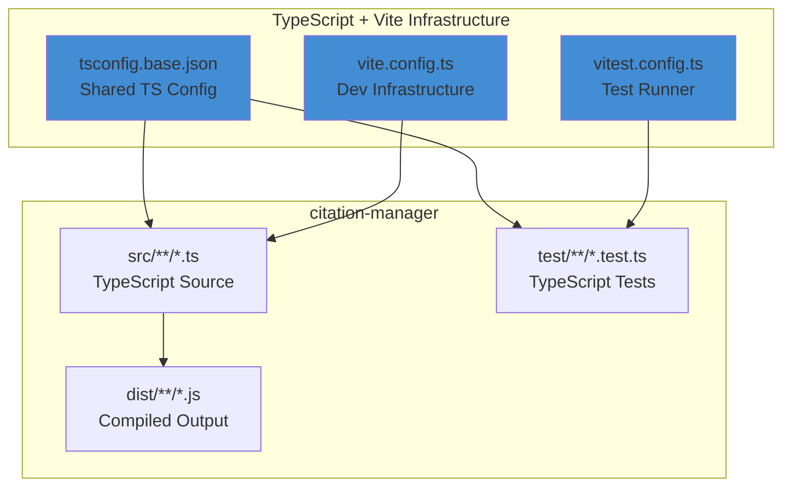

# TypeScript + Vite Migration - Product Requirements Document

**Feature ID:** 20251112-typescript-vite-migration
**Status:** Draft
**Created:** 2024-11-12
**Author:** Application Tech Lead
**Target Tool:** citation-manager (pilot)

---

## Executive Summary

Migrate the cc-workflows workspace from JavaScript to TypeScript with Vite as shared development infrastructure. This migration establishes TypeScript + Vite as the standard build and development environment for all workspace tools, starting with citation-manager as the pilot implementation.

**Business Value:**
- **Type Safety:** Catch errors at compile-time rather than runtime, reducing bugs in production tools
- **Developer Experience:** IDE autocomplete, refactoring support, and inline documentation via types
- **Shared Infrastructure:** Vite provides HMR and unified dev experience across all workspace tools
- **Maintainability:** Explicit type contracts serve as living documentation and reduce cognitive load
- **Foundation for Growth:** Establishes scalable patterns for future tools in the workspace

**Success Criteria:**
- citation-manager fully converted to TypeScript with zero test failures
- All existing functionality preserved (no breaking changes)
- Architecture documentation updated to reflect TypeScript + Vite as standard
- Build and development infrastructure validated and documented

---

## Problem Statement

### Current State

The cc-workflows workspace currently operates with:
- Pure JavaScript codebase (no static type checking)
- Vitest for testing (working well)
- Biome for linting/formatting (working well)
- No unified development server infrastructure
- No type-driven development patterns

### Pain Points

1. **Runtime Errors:** Type-related bugs only discovered during test execution or production use
2. **Refactoring Risk:** Large refactors (like DI implementation) carry high risk without type safety
3. **Documentation Decay:** Function signatures and data structures documented only in comments
4. **IDE Support:** Limited autocomplete and inline documentation without type definitions
5. **Development Friction:** No HMR or dev server for rapid iteration

### Why Now?

The workspace has successfully established its foundation (architecture, testing patterns, first tool operational). Now is the optimal time to add type safety BEFORE the codebase grows significantly and BEFORE additional tools are migrated into the workspace.

---

## Target Users

**Primary User:**
- **Application Tech Lead / Developer** - Establishes type-safe development patterns and shared infrastructure before workspace scales

**Secondary Users:**
- **AI Coding Assistants** - Leverage type information for more accurate code generation and refactoring
- **Future Contributors** - Inherit explicit type contracts and modern development infrastructure

---

## Goals and Non-Goals

### Goals

1. Migrate citation-manager to TypeScript as pilot (validates pattern)
2. Establish TypeScript + Vite as workspace standard infrastructure
3. Update architecture documentation to reflect TypeScript + Vite baseline
4. Maintain all existing functionality (zero breaking changes)
5. Validate RED-GREEN-REFACTOR workflow with TypeScript conversion

### Non-Goals

1. Convert other tools beyond citation-manager in this initiative
2. Implement Playwright for browser testing (deferred; use superpowers-chrome when needed)
3. Add new features during migration (focus on conversion only)
4. Optimize bundle sizes or build performance (future optimization)
5. Create web-based UIs for tools (future consideration)

---

## Proposed Solution

### Approach: Infrastructure-First Migration

**Strategy:** Establish and validate TypeScript + Vite infrastructure independently, then systematically convert citation-manager source and tests following TDD principles.

**Key Decisions:**
- **Pilot Tool:** citation-manager (58 files: 10 source, 48 tests)
- **Build System:** TypeScript compiler (tsc) + Vite for development
- **Migration Order:** Infrastructure → POC validation → Systematic TDD-paired conversion
- **Test Strategy:** Maintain continuous GREEN throughout (no "broken until complete" state)

### High-Level Architecture

**Architecture Alignment:**
- **MVP Principles:** Validates infrastructure before converting code (risky part first)
- **Modular Design:** Each tool has independent tsconfig extending shared base
- **Foundation Reuse:** tsconfig.base.json and vite.config.ts are single source of truth
- **Safety-First:** Existing code untouched during infrastructure setup

---

## Epic Breakdown

### Epic 0: Architecture Documentation (North Star)

**Goal:** Document the complete ideal TypeScript + Vite state across ALL architecture sections to serve as implementation north star.

**Deliverable:** Comprehensive updates to ARCHITECTURE.md reflecting TypeScript + Vite as established standard.

**Sections Requiring Updates:**

1. **Core Architectural Principles** - How TypeScript strengthens adherence to principles
2. **Core Architectural Style** - TypeScript as primary language, Vite as shared dev infrastructure
3. **Level 2 - Containers** - Updated technology stack for Tool Packages and Workspace containers
4. **Level 4 - Code Organization** - TypeScript file naming (`.ts`), type definition patterns
5. **Coding Standards and Conventions** - TypeScript naming conventions, type annotation guidelines
6. **Testing Strategy** - Test file patterns (`.test.ts`), type checking as validation step
7. **Technology Stack** - Add TypeScript >=5.3.0, Vite >=5.0.0, update Vitest to 4.x
8. **Cross-Cutting Concerns**
   - Configuration Management: tsconfig.base.json, vite.config.ts
   - Build Pipeline: TypeScript compilation, Vite bundling
   - Dev Infrastructure: HMR via Vite
   - CLI Execution Pattern: Execution from compiled `dist/`
   - Tool Distribution: npm link with compiled output and `.d.ts` files
9. **Development Workflow** - Add type checking step, update build process
10. **Known Risks and Technical Debt** - Document migration risks and trade-offs
11. **Architecture Decision Records (ADRs)**
    - ADR-00X: TypeScript as Primary Language
    - ADR-00X: Vite for Development Infrastructure
12. **References & Further Reading** - Add TypeScript and Vite documentation links
13. **Architecture Change Log** - New entry documenting this baseline change

**Validation:**
- Architecture document comprehensively represents TypeScript + Vite as established standard
- All cross-references between sections remain valid
- Document passes citation-manager validation

**Required Skills:**
- `evaluate-against-architecture-principles` - Validate architecture updates against all 9 principle categories
- `writing-requirements-documents` - Ensure proper block anchors and wiki links

**User Stories:** TBD (to be decomposed during implementation planning)

*Status*: ✅ Completed 11-12-25

---

### Epic 1: TypeScript Infrastructure Setup

**Goal:** Establish TypeScript build system without touching existing code, validating configuration works independently.

**Deliverable:** Complete TypeScript configuration hierarchy with validation passing on zero source files.

**Components:**
- Root `tsconfig.json` (workspace coordination)
- `tsconfig.base.json` (shared settings for all tools)
- Tool-specific `tools/citation-manager/tsconfig.json` (extends base)
- Updated Biome configuration for TypeScript support
- Build scripts in package.json

**Validation:**
- `tsc --noEmit` passes successfully
- All existing JavaScript tests pass (zero functionality broken)
- Biome checks TypeScript files without errors

**Required Skills:**
- `using-git-worktrees` - Set up isolated workspace for infrastructure changes
- `requesting-code-review` - Review infrastructure setup before proceeding

**User Stories:**

#### Story 1.1: Set Up Isolated Worktree for TypeScript Infrastructure

Create isolated git worktree on feature branch for safe TypeScript infrastructure experimentation.

**Deliverable:** Isolated worktree with dependencies installed and tests passing.

**Acceptance Criteria:**
- Worktree created in isolated directory on `feature/typescript-infrastructure-setup` branch
- Dependencies installed via `npm install`
- Existing test suite passes (clean starting state)
- Worktree isolation verified (changes don't affect main directory)

_Details: [user-stories/us1.1-set-up-isolated-worktree/us1.1-set-up-isolated-worktree.md](user-stories/us1.1-set-up-isolated-worktree/us1.1-set-up-isolated-worktree.md)_

---

#### Story 1.2: Create TypeScript Configuration Hierarchy

Establish hierarchical TypeScript configuration with shared base settings and tool-specific overrides.

**Deliverable:** Complete TypeScript configuration hierarchy validated by compiler.

**Acceptance Criteria:**
- Root `tsconfig.json` for workspace coordination
- `tsconfig.base.json` with strict type checking enforced
- Tool-specific `tools/citation-manager/tsconfig.json` extending base
- `tsc --noEmit` validates successfully (zero errors)
- ES modules configured with Vite-compatible resolution
- All existing JavaScript tests pass unchanged

_Details: [user-stories/us1.2-create-typescript-configuration-hierarchy/us1.2-create-typescript-configuration-hierarchy.md](user-stories/us1.2-create-typescript-configuration-hierarchy/us1.2-create-typescript-configuration-hierarchy.md)_

---

#### Story 1.3: Update Biome Configuration for TypeScript Support

Extend Biome linter/formatter to support TypeScript files with same standards as JavaScript.

**Deliverable:** Biome configuration updated to lint and format TypeScript files.

**Acceptance Criteria:**
- `biome.json` includes TypeScript file patterns (`*.ts`, `*.tsx`)
- Biome successfully lints TypeScript configuration files (zero errors)
- Biome formats TypeScript without modifying JavaScript formatting
- `npx biome check .` completes successfully
- All existing JavaScript files pass Biome checks unchanged

_Details: [user-stories/us1.3-update-biome-configuration/us1.3-update-biome-configuration.md](user-stories/us1.3-update-biome-configuration/us1.3-update-biome-configuration.md)_

---

#### Story 1.4: Add Build Scripts and Validate Infrastructure

Create npm scripts for TypeScript build, type checking, and comprehensive infrastructure validation.

**Deliverable:** Build scripts operational with full infrastructure validation passing.

**Acceptance Criteria:**
- `build:ts` script compiles TypeScript to JavaScript
- `type-check` script validates types without emitting files
- `check:all` script runs comprehensive validation (types + lint + tests)
- All scripts execute successfully with zero errors
- All existing JavaScript tests pass during validation
- Documentation added to CLAUDE.md explaining TypeScript workflow

_Details: [user-stories/us1.4-add-build-scripts/us1.4-add-build-scripts.md](user-stories/us1.4-add-build-scripts/us1.4-add-build-scripts.md)_

---

### Epic 2: Vite Development Infrastructure

**Goal:** Add Vite for dev server and HMR capabilities without impacting existing functionality.

**Deliverable:** Working Vite configuration for Node.js library development with dev server operational.

**Components:**
- Root `vite.config.ts` (shared infrastructure)
- Dev server configuration for Node.js library mode
- Integration with existing npm scripts
- HMR configuration for development iteration

**Validation:**
- `npm run dev` starts dev server successfully
- All existing tests still pass
- Vite builds produce valid output

**Required Skills:**
- `requesting-code-review` - Review Vite integration before proceeding

**User Stories:** TBD

---

### Epic 3: Proof of Concept (RED-GREEN-REFACTOR Validation)

**Goal:** Validate end-to-end TypeScript conversion works with TDD cycle using minimal surface area.

**Deliverable:** One test file + one source file converted to TypeScript with full validation passing.

**Approach:**
1. Select simple, leaf-node component (e.g., `normalize-anchor`)
2. Convert test file to `.test.ts` (REFACTOR - should stay GREEN)
3. Convert source file to `.ts` (REFACTOR - should stay GREEN)
4. Validate types, tests, and compilation all pass

**Validation:**
- Converted test passes with TypeScript
- TypeScript compiler validates types without errors
- All other JavaScript tests still pass
- No `any` type escapes required

**Required Skills:**
- `test-driven-development` - Follow RED-GREEN-REFACTOR for conversion (REFACTOR phase - stay GREEN)
- `requesting-code-review` - Validate POC pattern before full conversion

**User Stories:** TBD

---

### Epic 4: Systematic Conversion (TDD Pairs)

**Goal:** Convert all citation-manager source and test files to TypeScript following RED-GREEN-REFACTOR discipline.

**Deliverable:** All 58 files (10 source + 48 tests) converted to TypeScript in dependency order (leaf → root).

**Approach:** For each component:
1. Convert test file to `.test.ts` (REFACTOR - stay GREEN)
2. Convert source file to `.ts` (REFACTOR - stay GREEN)
3. Validate types and tests both pass
4. Move to next component

**Conversion Order (Dependency Graph):**
1. Leaf utilities (no internal dependencies)
2. Core components (MarkdownParser, FileCache)
3. Integration components (CitationValidator, ParsedDocument)
4. Factories
5. CLI entry point (citation-manager.ts)

**Validation:**
- Continuous GREEN throughout (all tests passing after each pair)
- Full test suite passes with zero failures
- `tsc --build` produces valid compiled output
- CLI executes successfully from compiled `dist/`
- No `.js` source files remaining in `src/`

**Required Skills:**
- `test-driven-development` - Mandatory for all conversions (REFACTOR with continuous GREEN)
- `requesting-code-review` - Review after each major component conversion batch
- `finishing-a-development-branch` - Complete epic and integrate to main

**User Stories:** TBD

---

## Requirements

### Functional Requirements

- FR1: The workspace SHALL support TypeScript as the primary development language. ^FR1
- FR2: The workspace SHALL provide shared TypeScript configuration via `tsconfig.base.json`. ^FR2
- FR3: Each tool SHALL extend the shared TypeScript configuration with tool-specific overrides. ^FR3
- FR4: The workspace SHALL provide Vite as shared development infrastructure for HMR and dev server capabilities. ^FR4
- FR5: The build system SHALL compile TypeScript to JavaScript in tool-specific `dist/` directories. ^FR5
- FR6: The build system SHALL generate `.d.ts` type definition files alongside compiled JavaScript. ^FR6
- FR7: All existing citation-manager functionality SHALL be preserved during migration (zero breaking changes). ^FR7
- FR8: The test suite SHALL run against TypeScript source without requiring compilation during test execution. ^FR8
- FR9: The CLI entry point SHALL execute from compiled JavaScript in `dist/` directory. ^FR9
- FR10: The workspace SHALL document browser testing strategy using superpowers-chrome (not Playwright). ^FR10

### Non-Functional Requirements

#### Architecture Principles Alignment

- NFR1: The migration SHALL follow MVP Principles by validating infrastructure before converting code. ^NFR1
- NFR2: The migration SHALL maintain Modular Design with independent tool configurations extending shared base. ^NFR2
- NFR3: The migration SHALL implement Foundation Reuse via shared TypeScript and Vite configurations. ^NFR3
- NFR4: The migration SHALL follow Safety-First Design by keeping existing code untouched during infrastructure setup. ^NFR4

#### Quality Attributes

- NFR5: All TypeScript code SHOULD use strict type checking (no `any` escapes unless absolutely necessary). ^NFR5
- NFR6: The migration SHALL maintain test coverage ratio (current 0.3:1 to 0.5:1 test-to-code ratio). ^NFR6
- NFR7: The build system SHOULD complete compilation in under 10 seconds for incremental builds. ^NFR7
- NFR8: Type definitions SHALL serve as primary API documentation for all public interfaces. ^NFR8

#### Development Experience

- NFR9: The development server SHALL provide hot module reloading (HMR) for rapid iteration. ^NFR9
- NFR10: IDE autocomplete and inline documentation SHALL be available via TypeScript type information. ^NFR10
- NFR11: Type errors SHALL be surfaced at compile-time, not runtime. ^NFR11

#### Testing & Validation

- NFR12: The migration SHALL follow RED-GREEN-REFACTOR discipline (continuous GREEN throughout). ^NFR12
- NFR13: All tests SHALL pass after each conversion batch (no "broken until complete" state). ^NFR13
- NFR14: The architecture documentation SHALL be updated BEFORE implementation begins (north star). ^NFR14

---

## Success Metrics

**Primary Metrics:**
- ✅ citation-manager fully operational in TypeScript (all 58 files converted)
- ✅ Zero test failures in converted codebase
- ✅ Zero breaking changes to existing CLI functionality
- ✅ Architecture documentation comprehensively updated

**Quality Metrics:**
- `tsc --noEmit` passes with zero errors
- Test suite passes with 100% previous functionality preserved
- No `any` type escapes (or minimal with documented justification)
- Build completes successfully in clean environment

**Adoption Metrics:**
- Pattern validated and documented for future tool migrations
- TypeScript + Vite established as workspace standard
- Development workflow updated and validated

---

## Dependencies and Constraints

### Dependencies

- Node.js >=18.0.0 (existing requirement)
- NPM Workspaces (existing infrastructure)
- Vitest (existing, will update to 4.x)
- Biome (existing, will extend for TypeScript)

### Constraints

- **Zero Breaking Changes:** All existing citation-manager functionality must work identically
- **TDD Discipline:** Must follow RED-GREEN-REFACTOR (continuous GREEN throughout)
- **Architecture-First:** Architecture documentation must be complete before implementation
- **Pilot Scope:** Only citation-manager in this initiative (other tools deferred)

---

## Risks and Mitigation

| Risk | Impact | Probability | Mitigation |
|------|--------|-------------|------------|
| TypeScript config errors break build | High | Medium | Validate with zero files first (Epic 1) |
| Test failures during conversion | High | Medium | Convert in small batches, validate after each pair |
| Import path issues (ESM vs CommonJS) | Medium | High | Use explicit `.js` extensions in imports (ESM standard) |
| Type errors in legacy code | Medium | Medium | Start strict, document any `@ts-expect-error` usage |
| npm link breaks with compiled output | Medium | Low | Test symlink execution early in POC (Epic 3) |
| Build pipeline complexity | Low | Low | Keep existing JS working until full conversion complete |

---

## Out of Scope

**Explicitly NOT included in this initiative:**

1. Converting tools beyond citation-manager (workspace-level decision required)
2. Implementing Playwright for E2E testing (use superpowers-chrome instead)
3. Adding new features to citation-manager during migration
4. Optimizing bundle sizes or build performance (future work)
5. Creating web-based UIs for tools (future consideration)
6. Migrating from Biome to different linter/formatter
7. Changing test framework from Vitest

---

## Timeline and Phases

**Phase 1:** Epic 0 (Architecture Documentation) - **Prerequisites complete before coding starts**
**Phase 2:** Epic 1 (TypeScript Infrastructure) - **Foundation validated independently**
**Phase 3:** Epic 2 (Vite Development Infrastructure) - **Dev infrastructure operational**
**Phase 4:** Epic 3 (POC Validation) - **End-to-end pattern proven**
**Phase 5:** Epic 4 (Systematic Conversion) - **Full migration with TDD discipline**

**Estimated Duration:** TBD (dependent on decomposition into user stories and tasks)

---

## Approval and Sign-off

- [ ] Product Owner / CEO Approval
- [ ] Application Tech Lead Sign-off
- [ ] Architecture Documentation Review Complete
- [ ] Ready for User Story Decomposition

---

## Appendix

### References

- **Project Architecture:** [ARCHITECTURE.md](../../../ARCHITECTURE.md)
- **Architecture Principles:** [ARCHITECTURE-PRINCIPLES.md](../../../ARCHITECTURE-PRINCIPLES.md)
- **Reference Implementation:** cc-workflows-site project (`/Users/wesleyfrederick/Documents/ObsidianVault/0_SoftwareDevelopment/cc-workflows-site`)

### Required Skills by Phase

#### Epic 0: Architecture Documentation

- `evaluate-against-architecture-principles` - Validate architecture updates against all 9 principle categories
- `writing-requirements-documents` - Ensure proper block anchors, wiki links, and citation validation

#### Epic 1: TypeScript Infrastructure

- `using-git-worktrees` - Set up isolated workspace for infrastructure changes
- `requesting-code-review` - Review infrastructure setup before proceeding to conversion

#### Epic 2: Vite Infrastructure

- `requesting-code-review` - Review Vite integration before proceeding to conversion

#### Epic 3: POC Validation

- `test-driven-development` - Follow RED-GREEN-REFACTOR discipline (REFACTOR phase - stay GREEN)
- `requesting-code-review` - Validate POC pattern before full conversion

#### Epic 4: Systematic Conversion

- `test-driven-development` - Mandatory for all file conversions (continuous GREEN throughout)
- `requesting-code-review` - Review after each major component batch
- `finishing-a-development-branch` - Complete epic and integrate to main

#### Cross-Cutting Skills

- `writing-plans` - Implementation planning for each epic's user stories
- `brainstorming` - Design refinement process (used to create this PRD)

### Related Documentation Skills

- `creating-links` - Obsidian wiki links and markdown link syntax
- `writing-clearly-and-concisely` - Apply Strunk's elements of style to all documentation

### Document History

| Date | Version | Changes | Author |
|------|---------|---------|--------|
| 2024-11-12 | 1.0 | Initial PRD with epic breakdown | Application Tech Lead |
