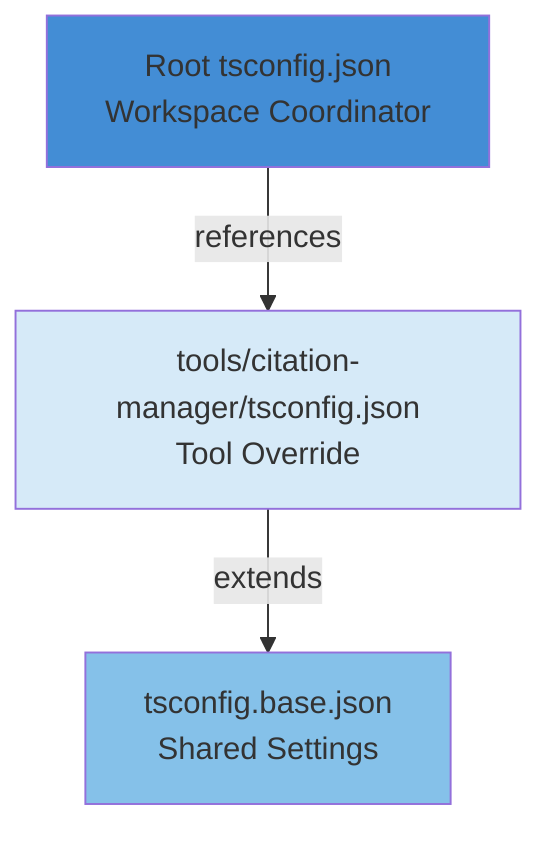

# Epic 1: TypeScript Infrastructure Setup - Design Document

**Epic:** Epic 1 - TypeScript Infrastructure Setup
**Feature:** 20251112-typescript-vite-migration
**Status:** Design Approved
**Created:** 2024-11-18
**Author:** Application Tech Lead

---

## Executive Summary

Epic 1 establishes TypeScript build infrastructure without touching existing JavaScript code. This design implements a three-tier configuration hierarchy (root → base → tool) with strict type checking enabled, validating the infrastructure works on zero source files before Epic 4 conversion begins.

**Key Design Decisions:**
- `module: "NodeNext"` for modern Node.js ESM support (2025 best practice)
- 13 strict type checking flags enabled (catch errors at compile-time)
- `composite: true` for fast incremental builds via project references
- Minimal Biome changes (already supports TypeScript)
- Zero existing code changes (infrastructure validation only)

---

## Design Goals

1. **Validate Independently:** Prove TypeScript infrastructure works on empty state before code conversion
2. **Strict by Default:** Enable all strict type checking to prevent technical debt accumulation
3. **Monorepo Ready:** Use project references for fast builds as workspace scales
4. **Zero Breakage:** No changes to existing JavaScript functionality

---

## Architecture

### Configuration Hierarchy



**Three-Tier Structure:**

1. **Root `tsconfig.json`** - Workspace coordination via project references
2. **`tsconfig.base.json`** - Single source of truth for compiler settings
3. **Tool-Specific** - Extends base with tool-specific overrides

---

## Detailed Design

### 1. Root tsconfig.json (Workspace Coordinator)

**Purpose:** Coordinate workspace builds using TypeScript project references

**File:** `/tsconfig.json`

```json
{
  "files": [],
  "references": [
    { "path": "./tools/citation-manager" }
  ]
}
```

**Key Decisions:**
- `"files": []` - No compilation at root level
- `references` - Lists all tool packages for coordinated builds
- Enables incremental builds across workspace

---

### 2. tsconfig.base.json (Shared Settings)

**Purpose:** Define strict compiler settings shared by all tools

**File:** `/tsconfig.base.json`

```json
{
  "compilerOptions": {
    // Target & Module (Node.js 18+ ESM focus)
    "target": "ES2022",
    "module": "NodeNext",
    "moduleResolution": "NodeNext",
    "lib": ["ES2022"],

    // Strict Type Checking (13 flags)
    "strict": true,
    "noUncheckedIndexedAccess": true,
    "exactOptionalPropertyTypes": true,
    "noImplicitOverride": true,
    "noImplicitReturns": true,
    "noFallthroughCasesInSwitch": true,
    "noPropertyAccessFromIndexSignature": true,

    // Output & Build
    "declaration": true,
    "declarationMap": true,
    "sourceMap": true,
    "outDir": "./dist",
    "composite": true,

    // Module & Import Behavior
    "esModuleInterop": true,
    "resolveJsonModule": true,
    "forceConsistentCasingInFileNames": true,

    // Performance
    "skipLibCheck": true,

    // Code Quality
    "noEmit": false
  }
}
```

**Key Decisions:**

**`module: "NodeNext"` instead of `ES2022`**
- **Rationale:** 2025 best practice for Node.js projects (see [research](../../research/typescript-tsconfig-best-practices-2025.md))
- Properly handles both ESM and CommonJS in same project
- More future-proof as Node.js module system evolves
- Industry recommendation from Perplexity research

#### 13 Strict Type Checking Flags

- `strict: true` - Master switch (enables 8 sub-flags automatically)
- Additional 6 flags for maximum safety:
  - `noUncheckedIndexedAccess` - Forces null checks on array access (prevents runtime crashes)
  - `exactOptionalPropertyTypes` - Distinguishes `undefined` vs missing properties
  - `noImplicitOverride` - Requires explicit `override` keyword
  - `noImplicitReturns` - Catches missing return statements
  - `noFallthroughCasesInSwitch` - Prevents switch fallthrough bugs
  - `noPropertyAccessFromIndexSignature` - Forces bracket notation for index signatures

**`composite: true`**
- Enables TypeScript project references for monorepo
- Fast incremental builds (only rebuild changed packages)
- Small upfront cost, huge payoff as workspace scales

**`declaration: true`**
- Satisfies FR6 requirement: "SHALL generate `.d.ts` type definition files"
- Enables type-safe consumption by other tools/projects

**Architecture Principles Alignment:**
- **Safety-First Design (Fail Fast)** - Catch errors at compile-time, not runtime
- **Data-First Design (Illegal States Unrepresentable)** - Strict types prevent invalid states
- **Modular Design (Black Box Interfaces)** - `.d.ts` files = explicit API contracts

---

### 3. Tool-Specific tsconfig.json

**Purpose:** Extend base config with tool-specific paths

**File:** `/tools/citation-manager/tsconfig.json`

```json
{
  "extends": "../../tsconfig.base.json",
  "compilerOptions": {
    "outDir": "./dist",
    "rootDir": "./src"
  },
  "include": ["src/**/*"],
  "exclude": ["**/*.test.ts", "**/*.spec.ts", "dist/**", "node_modules/**"]
}
```

**Key Decisions:**
- Minimal overrides (only paths)
- All strict settings inherited from base
- Excludes test files from compilation (tests run via Vitest, not tsc)

**Epic 1 Scope:**
- Zero `.ts` files in `src/` directory (infrastructure only)
- Validates config works before Epic 4 conversion

---

### 4. Biome Configuration Updates

**Current State:** `biome.json` already supports TypeScript via `"include": ["**"]`

**Changes Required:** **None** (Biome natively handles `.ts` files)

**Validation:** `npx biome check .` will validate TypeScript files when they exist (Epic 4)

**Rationale:**
- Biome's recommended rules work for both JavaScript and TypeScript
- Existing `indentStyle: "tab"` and `quoteStyle: "double"` apply to TypeScript
- Minimal configuration aligns with Simplicity First principle

---

### 5. Build Scripts (package.json)

**Scripts to Add:**

```json
{
  "scripts": {
    "type-check": "tsc --noEmit",
    "build": "tsc --build",
    "build:clean": "tsc --build --clean"
  }
}
```

**Script Purposes:**

| Script | Purpose | Epic 1 Usage |
|--------|---------|--------------|
| `type-check` | Validates types without emitting files | Validation Phase 2 |
| `build` | Compiles all workspace projects | Validation Phase 3 |
| `build:clean` | Removes compiled output | Clean slate for troubleshooting |

**Validation Commands:**

```bash
npm run type-check  # Expected: "Found 0 errors" (zero .ts files)
npm run build       # Expected: Success with no output
```

---

## Validation Strategy

Epic 1 succeeds when TypeScript infrastructure validates independently on zero source files.

### Validation Phases

#### Phase 1: Config Syntax

```bash
tsc --showConfig
```

- **Purpose:** Validate merged config is syntactically correct
- **Expected:** Clean output showing merged configuration
- **Catches:** Invalid JSON, unknown compiler options

#### Phase 2: Type Checking (Zero Files)

```bash
npm run type-check
```

- **Purpose:** Validate type checker runs successfully
- **Expected:** "Found 0 errors" (zero `.ts` files exist)
- **PRD Criterion:** "`tsc --noEmit` passes successfully" (line 300)

#### Phase 3: Build (Zero Output)

```bash
npm run build
```

- **Purpose:** Validate compilation pipeline works
- **Expected:** Success with no output (no files to compile)
- **Validates:** Project references and `composite: true` configuration

#### Phase 4: Biome Integration

```bash
npx biome check .
```

- **Purpose:** Validate Biome runs without errors
- **Expected:** Passes (only checks existing `.js` files)
- **PRD Criterion:** "Biome checks TypeScript files without errors" (line 302)

#### Phase 5: Existing Tests (Zero Breakage)

```bash
npm test
```

- **Purpose:** Validate JavaScript functionality untouched
- **Expected:** Same results as before Epic 1
- **PRD Criterion:** "All existing JavaScript tests pass (zero functionality broken)" (line 301)

### Success Criteria

✅ All 5 validation phases pass
✅ Zero TypeScript files exist (infrastructure only)
✅ Zero existing functionality broken
✅ Ready for Epic 3 POC conversion

---

## Architecture Documentation Updates

Epic 1 requires updating ARCHITECTURE.md to reflect refined compiler options discovered during design.

**Section:** Cross-Cutting Concerns > Configuration Management > Key settings within `tsconfig.base.json`

**Current State (line 922):**

```markdown
| `compilerOptions.module` | `string` | Module system (ES2022). Native ESM support. |
```

**Updated State:**

```markdown
| `compilerOptions.module` | `string` | Module system (NodeNext). Best for modern Node.js - handles both ESM and CommonJS correctly. |
```

**Additional Rows to Add:**

```markdown
| `compilerOptions.moduleResolution` | `string` | Module resolution (NodeNext). Matches module setting for proper resolution. |
| `compilerOptions.composite` | `boolean` | Enables project references for fast incremental builds in monorepo. |
| `compilerOptions.noUncheckedIndexedAccess` | `boolean` | Array access returns T | undefined, forcing null checks to prevent runtime crashes. |
```

**Rationale:** ARCHITECTURE.md represents the future state. Update before implementation begins (NFR14 requirement).

---

## Dependencies

### Required Packages

**Already Installed:**
- TypeScript (via Vitest dependency) - Need explicit installation at root

**To Install:**

```bash
npm install --save-dev typescript@^5.3.0
```

**Version Rationale:**
- `^5.3.0` - Latest stable with NodeNext support
- Aligns with Tech Stack requirement: "TypeScript >=5.3.0"

---

## Risks and Mitigations

| Risk | Impact | Mitigation |
|------|--------|------------|
| TypeScript config errors break build | High | Validate with `tsc --showConfig` (Phase 1) before proceeding |
| Biome doesn't recognize TypeScript | Medium | Already works - Biome natively supports `.ts` files |
| Project references misconfigured | Medium | Validate with `npm run build` on zero files (Phase 3) |
| Existing tests break | High | Run `npm test` as Phase 5 validation |

---

## References

**Research:**
- [TypeScript tsconfig Best Practices 2025](../../research/typescript-tsconfig-best-practices-2025.md) - Perplexity research on 2025 industry standards

**Architecture:**
- [ARCHITECTURE.md](../../../../../ARCHITECTURE.md) - Workspace architecture baseline
- [ARCHITECTURE-PRINCIPLES.md](../../../../../ARCHITECTURE-PRINCIPLES.md) - Core principles

**Requirements:**
- [TypeScript + Vite Migration PRD](../../typescript-vite-migration-prd.md) - Feature requirements and epic breakdown

---

## Next Steps

1. **Update ARCHITECTURE.md** - Document refined compiler options (NodeNext, composite, additional strict flags)
2. **Implement Epic 1** - Create config files per this design
3. **Validate Infrastructure** - Run all 5 validation phases
4. **Epic 3 POC** - Validate end-to-end conversion with minimal files

---

## Approval

- [ ] CEO Approval
- [ ] Application Tech Lead Sign-off
- [ ] Ready for Implementation
