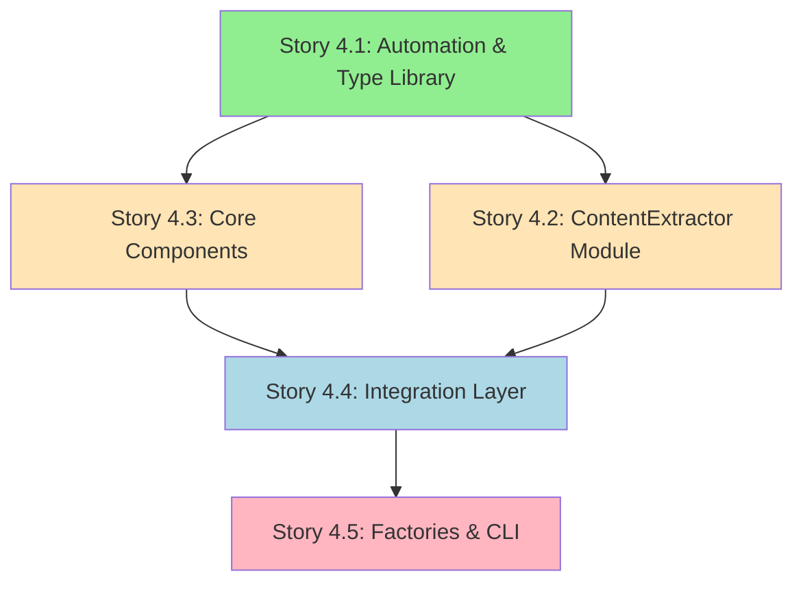

# Epic 4: Systematic Conversion - Design Document

<critical-instruction>
**Critial LLM Initialization Instructions**: When first reading this file, you MUST IMMEDIATELY run citation manager to extract base paths: `npm run citation:extract:content {{this-file-path}}`
</critical-instruction>

**Date:** 2024-11-18
**Status:** Draft
**Requirements:** 
- [Epic 4 - Systematic Conversion (TDD Pairs)](../../typescript-vite-migration-prd.md#Epic%204%20-%20Systematic%20Conversion%20(TDD%20Pairs)) - Epic 4
- [Requirements](../../typescript-vite-migration-prd.md#Requirements)

## Overview

Systematically convert all 58 citation-manager files (17 source + 48 tests) to TypeScript using the test-first pattern validated in Epic 3. Establishes automation infrastructure and type library upfront, then converts files in dependency order following module boundaries to maintain tight cohesion.

**Primary Use Case:** Convert citation-manager to TypeScript by building automation tools first (validation scripts, type library), then converting modules incrementally (ContentExtractor → Core Components → Integration Layer → Factories/CLI) while maintaining continuous GREEN throughout.

## Architecture Decision

**Selected Approach:** Automation-First Module Conversion

**Rationale:**

| Principle Category | Compliance |
|-------------------|------------|
| MVP Principles | ✅ Build automation foundation first (proves tooling works before scaling) |
| Action-Based File Organization | ✅ Respect existing module boundaries (Component-Level Folders, Co-located Helpers) |
| Modular Design | ✅ Convert modules as cohesive units (Tight Cohesion, Component-Level Folders) |
| Safety-First Design | ✅ Continuous GREEN validation after each module (Fail Fast, Clear Contracts) |
| Data-First Design | ✅ Type library established upfront (Illegal States Unrepresentable, Data Model First) |

**Rejected Alternatives:**
- File-by-file conversion: Violates Component-Level Folders principle, splits tightly coupled code
- All-at-once conversion: Violates Safety-First Design, no incremental validation
- Alphabetical order: Ignores dependency graph, breaks continuous GREEN requirement

## Conversion Strategy

### Module Conversion Order

**Dependency-Driven Sequence:**



**Module Groups:**

1. **Automation Infrastructure** (Story 4.1)
   - Validation checkpoint scripts
   - Type library (citationTypes.ts, validationTypes.ts)
   - Type pattern documentation

2. **ContentExtractor Module** (Story 4.2)
   - 11 files: helpers + 5 strategies + component
   - Lines: ~347 total
   - Dependencies: None (true leaf module after normalizeAnchor converted)

3. **Core Components** (Story 4.3)
   - 3 files: MarkdownParser, FileCache, ParsedDocument
   - Lines: ~1,254 total
   - Dependencies: External libraries only (marked, Node.js fs/path)

4. **Integration Layer** (Story 4.4)
   - 2 files: ParsedFileCache, CitationValidator
   - Lines: ~957 total
   - Dependencies: Core Components

5. **Factories & CLI** (Story 4.5)
   - 3 files: LinkObjectFactory, componentFactory, citation-manager
   - Lines: ~1,266 total
   - Dependencies: All other modules

### Story 4.1: Automation Infrastructure Design

#### Validation Checkpoint Script

**Purpose:** Automate the 7 validation checkpoints from Epic 3 POC for any converted file.

**Script Design:**

```typescript
// tools/citation-manager/scripts/validate-typescript-conversion.ts

interface ValidationResult {
  checkpoint: string;
  passed: boolean;
  message: string;
}

interface ConversionValidation {
  file: string;
  results: ValidationResult[];
  allPassed: boolean;
}

/**
 * Validate TypeScript conversion quality for a file
 * Implements 7 checkpoints from Epic 3 POC
 */
function validateConversion(filePath: string): ConversionValidation {
  const results: ValidationResult[] = [];

  // Checkpoint 1: TypeScript compilation
  results.push(validateCompilation(filePath));

  // Checkpoint 2: No `any` escapes
  results.push(validateNoAnyEscapes(filePath));

  // Checkpoint 3: Explicit return types
  results.push(validateExplicitReturnTypes(filePath));

  // Checkpoint 4: Strict null checking
  results.push(validateStrictNullChecks(filePath));

  // Checkpoint 5: All tests pass
  results.push(validateTestsPassing(filePath));

  // Checkpoint 6: JavaScript consumers work
  results.push(validateConsumerCompatibility(filePath));

  // Checkpoint 7: Compiled output generated
  results.push(validateCompiledOutput(filePath));

  const allPassed = results.every(r => r.passed);

  return { file: filePath, results, allPassed };
}

function validateCompilation(filePath: string): ValidationResult {
  // Pattern: Execute `npx tsc --noEmit`
  // Expected: Zero compiler errors
  // Implementation: spawn tsc, capture stderr, check exit code

  return {
    checkpoint: "TypeScript Compilation",
    passed: /* exec tsc and check result */,
    message: /* success or error details */
  };
}

function validateNoAnyEscapes(filePath: string): ValidationResult {
  // Pattern: Search file content for `: any` or `as any`
  // Expected: Zero matches
  // Implementation: regex search excluding comments

  return {
    checkpoint: "No `any` Escapes",
    passed: /* regex search result */,
    message: /* count of any escapes found */
  };
}

function validateExplicitReturnTypes(filePath: string): ValidationResult {
  // Pattern: Parse exported functions, check return type annotations
  // Expected: All exported functions have explicit `: Type` return annotations
  // Implementation: AST parsing or regex for export patterns

  return {
    checkpoint: "Explicit Return Types",
    passed: /* AST analysis result */,
    message: /* list of functions missing return types */
  };
}

// ... remaining checkpoint implementations
```

**Usage:**

```bash
# Validate single file after conversion
npm run validate:ts-conversion -- tools/citation-manager/src/core/ContentExtractor/generateContentId.ts

# Validate entire module after Story 4.2
npm run validate:ts-conversion -- tools/citation-manager/src/core/ContentExtractor/**/*.ts
```

#### Type Library Design

**Shared Type Definitions:**

```typescript
// tools/citation-manager/src/types/citationTypes.ts

/**
 * Link scope classification for citation validation
 */
export type LinkScope = 'internal' | 'external';

/**
 * Citation validation status
 */
export type ValidationStatus = 'valid' | 'warning' | 'error';

/**
 * Link object representing a markdown reference
 */
export interface LinkObject {
  rawSourceLink: string;
  linkType: 'markdown' | 'wiki';
  scope: LinkScope;
  target: {
    path: {
      raw: string;
      absolute: string | null;
      relative: string | null;
    };
    anchor: string | null;
  };
  text: string;
  fullMatch: string;
  line: number;
  column: number;
  validation?: ValidationMetadata;
}

/**
 * Validation metadata enriched during validation
 */
export interface ValidationMetadata {
  status: ValidationStatus;
  fileExists: boolean;
  anchorExists: boolean | null;
  suggestions?: string[];
  pathConversion?: string;
}
```

```typescript
// tools/citation-manager/src/types/validationTypes.ts

/**
 * Validation result for single citation
 */
export interface CitationValidationResult {
  link: LinkObject;
  status: ValidationStatus;
  message: string;
  suggestions: string[];
}

/**
 * File validation summary
 */
export interface FileValidationSummary {
  filePath: string;
  totalCitations: number;
  validCount: number;
  warningCount: number;
  errorCount: number;
  results: CitationValidationResult[];
}

/**
 * File cache resolution result (discriminated union)
 */
export type ResolutionResult =
  | { found: true; path: string; reason: 'direct' | 'cache' }
  | { found: false; path: null; reason: 'not_found' | 'duplicate'; candidates?: string[] };
```

**Type Pattern Documentation:**

```typescript
// tools/citation-manager/docs/type-patterns.md

/**
 * PATTERN 1: Discriminated Union with Null
 * Use for: Functions that may return null based on input validation
 */
export function normalizeBlockId(anchor: string | null): string | null {
  if (anchor && anchor.startsWith("^")) {
    return anchor.substring(1);
  }
  return anchor;
}

/**
 * PATTERN 2: Discriminated Union for State
 * Use for: Results that have multiple distinct states
 */
export type ResolutionResult =
  | { found: true; path: string }
  | { found: false; reason: 'not_found' | 'duplicate' };

/**
 * PATTERN 3: Graceful Error Handling with Type Contract
 * Use for: Operations that may fail but should maintain type safety
 */
export function decodeUrlAnchor(anchor: string | null): string | null {
  if (anchor === null) {
    return null;
  }
  try {
    return decodeURIComponent(anchor);
  } catch (error) {
    return anchor; // Fallback preserves contract
  }
}

/**
 * PATTERN 4: Explicit Optional Parameters
 * Use for: Dependency injection with optional overrides
 */
export function createValidator(
  parser: MarkdownParser,
  cache?: FileCache
): CitationValidator {
  // Implementation uses cache if provided, otherwise validates without it
}
```

**Type Organization Strategy:**

Following Action-Based File Organization principles (separate WHAT from HOW), use this decision criteria:

| Criteria | Extract to `*Types.ts` | Co-locate in operation file |
|----------|------------------------|----------------------------|
| **Used by 2+ modules?** | ✅ YES | ❌ NO |
| **Domain entity?** | ✅ YES (LinkObject, ValidationResult) | ❌ NO |
| **Public API contract?** | ✅ YES | ❌ NO |
| **Prevents circular deps?** | ✅ YES | ❌ NO |
| **Operation-internal helper?** | ❌ NO | ✅ YES (EligibilityAnalysis) |
| **Discriminated union for single operation?** | ❌ NO | ✅ YES |

**Examples:**

```typescript
// ✅ EXTRACT: Shared domain type used by multiple modules
// types/citationTypes.ts
export interface LinkObject { /* ... */ }

// ✅ CO-LOCATE: Operation-specific type used only by analyzeEligibility
// core/ContentExtractor/analyzeEligibility.ts
export interface EligibilityAnalysis {
  eligible: boolean;
  reason: string;
  strategy: string;
}

export function analyzeEligibility(link: LinkObject): EligibilityAnalysis {
  // Uses shared LinkObject + local EligibilityAnalysis
}
```

**Circular Dependency Prevention:**
- **Contracts depend on nothing** (types/ directory has zero imports)
- **Operations depend on contracts** (import from types/)
- **Never the reverse** (types never import from operations)

**Reference:** See [type-organization-patterns.md](../../research/type-organization-patterns.md) for detailed research and best practices.

### Story 4.2-4.5: Module Conversion Workflow

**Conversion Pattern (applies to each story):**

```text
FOR EACH module in conversion order:

  PHASE 1: Test File Conversion
    FOR EACH test file in module:
      1. git mv {file}.test.js {file}.test.ts
      2. Add explicit type annotations to test variables
      3. Imports reference TypeScript source directly (no .js extensions with bundler moduleResolution)
      4. Run tests: npm test -- {file}.test.ts
      5. Validate: Tests pass (stay GREEN)

  PHASE 2: Source File Conversion
    FOR EACH source file in dependency order (leaf → root):
      1. git mv {file}.js {file}.ts
      2. Add type annotations (parameters, return types)
      3. Extract shared types to *Types.ts if needed
      4. Run compiler: npx tsc --noEmit
      5. Run tests: npm test
      6. Validate: Zero compiler errors, all tests pass

  PHASE 3: Module Validation
    1. Run validation checkpoint script for all module files
    2. Verify CLI executes from compiled dist/
    3. Run full test suite (304 tests)
    4. Validate: All checkpoints pass, continuous GREEN maintained

  PHASE 4: Code Review
    1. Commit module conversion
    2. Request code review via `requesting-code-review` skill
    3. Address review feedback
    4. Merge to feature branch
```

#### Example: Story 4.2 ContentExtractor Module Conversion

```typescript
// PHASE 1: Convert test files (10 test files)

// test/generate-content-id.test.ts
import { describe, it, expect } from 'vitest';
import { generateContentId } from '../src/core/ContentExtractor/generateContentId';

describe('generateContentId', () => {
  it('should generate consistent SHA-256 hash for content', () => {
    // Given: Sample content string
    const content: string = 'Sample markdown content';

    // When: Content ID is generated
    const id: string = generateContentId(content);

    // Then: ID is 16-character SHA-256 prefix
    expect(id).toHaveLength(16);
    expect(id).toMatch(/^[a-f0-9]{16}$/);
  });

  it('should return same ID for identical content', () => {
    // Given: Two identical content strings
    const content1: string = 'Identical content';
    const content2: string = 'Identical content';

    // When: IDs are generated
    const id1: string = generateContentId(content1);
    const id2: string = generateContentId(content2);

    // Then: IDs match (deterministic hashing)
    expect(id1).toBe(id2);
  });
});

// PHASE 2: Convert source files (11 source files in dependency order)

// src/core/ContentExtractor/generateContentId.ts
import { createHash } from 'crypto';

/**
 * Generate deterministic content ID using SHA-256 hash
 * @param content - Content to hash
 * @returns 16-character hash prefix for content deduplication
 */
export function generateContentId(content: string): string {
  const hash = createHash('sha256');
  hash.update(content);
  return hash.digest('hex').substring(0, 16);
}

// src/types/contentExtractorTypes.ts (new file)
export interface EligibilityAnalysis {
  eligible: boolean;
  reason: string;
  strategy: string;
}

export interface ExtractedContent {
  contentId: string;
  content: string;
  sourceLinks: Array<{
    rawSourceLink: string;
    sourceLine: number;
  }>;
}

// src/core/ContentExtractor/analyzeEligibility.ts
import type { LinkObject } from '../../types/citationTypes';
import type { EligibilityAnalysis } from '../../types/contentExtractorTypes';
import type { ExtractionStrategy } from './eligibilityStrategies/ExtractionStrategy';

/**
 * Analyze link eligibility using strategy chain
 * @param link - Link object to analyze
 * @param strategies - Ordered strategy chain
 * @returns Eligibility decision with reason
 */
export function analyzeEligibility(
  link: LinkObject,
  strategies: ExtractionStrategy[]
): EligibilityAnalysis {
  for (const strategy of strategies) {
    const analysis = strategy.analyze(link);
    if (analysis.eligible !== null) {
      return analysis;
    }
  }

  // Fallback: No strategy made decision
  return {
    eligible: false,
    reason: 'No strategy matched',
    strategy: 'default'
  };
}

// PHASE 3: Module validation
// Run: npm run validate:ts-conversion -- tools/citation-manager/src/core/ContentExtractor/**/*.ts
// Expected: All 7 checkpoints pass for all 11 files
```

## Data Flow

```text
Epic 4 Execution Flow:

Story 4.1 (Automation Infrastructure):
  Create validation script → Create type library → Document patterns
         ↓
  [FOUNDATION READY: Automation tools available for Stories 4.2-4.5]
         ↓
Story 4.2 (ContentExtractor Module):
  Convert 10 test files → Convert 11 source files (dependency order) → Validate module
         ↓
  [MODULE COMPLETE: ContentExtractor fully typed, continuous GREEN]
         ↓
Story 4.3 (Core Components):
  Convert tests (MarkdownParser, FileCache, ParsedDocument) → Convert sources → Validate
         ↓
  [CORE COMPLETE: Foundation components fully typed]
         ↓
Story 4.4 (Integration Layer):
  Convert ParsedFileCache tests → Convert source → Validate interop
  Convert CitationValidator tests → Convert source → Validate end-to-end
         ↓
  [INTEGRATION COMPLETE: Component boundaries fully typed]
         ↓
Story 4.5 (Factories & CLI):
  Convert factory tests → Convert factories → Validate instantiation
  Convert CLI tests → Convert CLI orchestrator → Validate full workflow
         ↓
  [MIGRATION COMPLETE: All 58 files TypeScript, zero .js files in src/]
```

## Testing Strategy

### Risk Mitigation Validation

| Risk | Validation Method | Success Criteria | Story |
|------|-------------------|------------------|-------|
| Automation scripts don't catch errors | Test scripts against Epic 3 files | Scripts detect all known issues | 4.1 |
| Type library incomplete | Review against all existing data contracts | All shared types covered | 4.1 |
| Module conversion breaks consumers | Run full test suite after each module | 304/304 tests pass | 4.2-4.5 |
| Dependency order violations | Validate imports during conversion | No circular dependencies | 4.2-4.5 |
| CLI execution breaks | Test from compiled dist/ after each story | All commands execute successfully | 4.2-4.5 |
| Type safety regression | Run checkpoint script for all files | Zero `any` escapes, explicit types | 4.2-4.5 |

### Expected Outcomes

**Per-Story Validation:**
- Story 4.1: Automation scripts detect type issues, type library validates against existing code
- Story 4.2: ContentExtractor module fully typed, 11 files converted, continuous GREEN
- Story 4.3: Core components fully typed, MarkdownParser.Output.DataContract complete
- Story 4.4: Integration layer fully typed, end-to-end type safety validated
- Story 4.5: Complete migration, zero .js files in src/, CLI executes from dist/

**Epic-Level Success:**
- All 58 files converted to TypeScript
- Zero test failures (304/304 tests passing)
- Zero `any` type escapes (strict mode throughout)
- CLI executes successfully from compiled output
- npm link execution works correctly

## Success Criteria

**Epic 4 Complete When:**
- [ ] Story 4.1: Automation infrastructure operational ✅ NFR12
- [ ] Story 4.2: ContentExtractor module converted (11 files) ✅ NFR2, NFR12, NFR13
- [ ] Story 4.3: Core components converted (3 files) ✅ NFR8, NFR12, NFR13
- [ ] Story 4.4: Integration layer converted (2 files) ✅ NFR8, NFR12, NFR13
- [ ] Story 4.5: Factories & CLI converted (3 files) ✅ NFR5, NFR8, NFR12, NFR13
- [ ] All 304 tests passing ✅ FR7, NFR13
- [ ] Zero .js files remaining in src/ ✅ FR5
- [ ] CLI executes from compiled dist/ ✅ FR9
- [ ] npm link execution validated ✅ FR9
- [ ] Code review completed for all stories ✅ Architecture practice

**Architecture Compliance:**
- [ ] Action-Based File Organization (Component-Level Folders respected) ✅ NFR2
- [ ] Modular Design (Tight Cohesion maintained) ✅ NFR2
- [ ] Safety-First Design (Continuous GREEN throughout) ✅ NFR4, NFR12, NFR13
- [ ] Data-First Design (Type library established) ✅ NFR5, NFR8
- [ ] MVP Principles (Automation foundation first) ✅ NFR1

## Out of Scope

**Explicitly NOT included in Epic 4:**
- Complex refactoring during conversion (conversion only, defer refactors)
- Dependency injection improvements (maintain existing patterns)
- Performance optimization (focus on type safety, not performance)
- New features during migration (zero functional changes)
- Converting tools beyond citation-manager (pilot only)
- Advanced type patterns not needed for current code (YAGNI - add when needed)

**Rationale:** Epic 4 focuses exclusively on type safety migration using proven patterns from Epic 3. Refactoring and optimization are deferred to maintain scope discipline and continuous GREEN.

## References

- **Requirements:** [typescript-vite-migration-prd.md](../../typescript-vite-migration-prd.md) - Epic 4
- **Architecture:** [ARCHITECTURE.md](../../../../../ARCHITECTURE.md) %% force-extract %%
- **Architecture Principles:** [ARCHITECTURE-PRINCIPLES.md](../../../../../ARCHITECTURE-PRINCIPLES.md) %% force-extract %%
- **Epic 1 Infrastructure:** [epic1-typescript-infrastructure-setup-design.md](../epic1-typescript-infrastructure-setup/epic1-typescript-infrastructure-setup-design.md)
- **Epic 3 POC:** [epic3-poc-design.md](../epic3-poc-validation/epic3-poc-design.md)
- **Epic 3 Results:** [epic3-poc-results.md](../epic3-poc-validation/epic3-poc-results.md) %% force-extract %%
- **Tool Architecture:** [ARCHITECTURE-Citation-Manager](../../../../../tools/citation-manager/design-docs/ARCHITECTURE-Citation-Manager.md) %% force-extract %%
