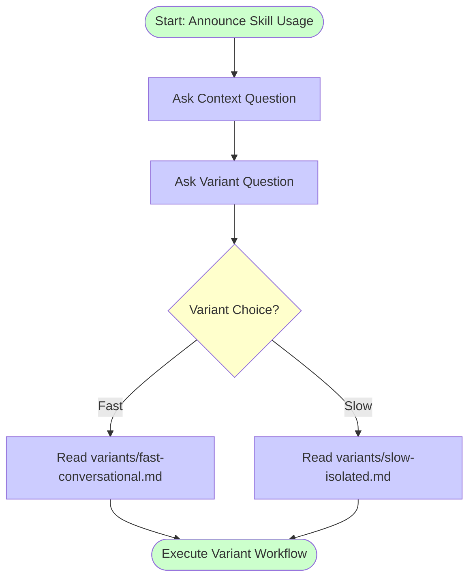

<!-- markdownlint-disable MD040 -->
# Epic 1: Router Implementation - Implementation Plan

> **For Claude:** REQUIRED SUB-SKILL: Use superpowers:executing-plans to implement this plan task-by-task.

**Goal:** Implement the main SKILL.md router that presents context and variant questions, then directs to the appropriate variant file based on user selection.

**Architecture:** Sequential AskUserQuestion pattern with directive-based routing. Router asks two questions (context, then variant), then uses critical instructions to direct LLM to read the selected variant file. Mermaid flowchart enforces workflow sequencing.

**Tech Stack:** Markdown, Obsidian wiki-links, AskUserQuestion tool, Mermaid diagrams

---

## Task 1 - Create Directory Structure

### Files
- `.claude/skills/testing-skills-with-subagents/variants/` (CREATE)
- `.claude/skills/testing-skills-with-subagents/shared/` (CREATE)

### Step 1: Create variants directory

Run: `mkdir -p .claude/skills/testing-skills-with-subagents/variants`

### Step 2: Create shared directory

Run: `mkdir -p .claude/skills/testing-skills-with-subagents/shared`

### Step 3: Verify directory creation

Run: `ls -la .claude/skills/testing-skills-with-subagents/`
Expected: Output shows `variants/` and `shared/` directories

### Step 4: Commit
Use `create-git-commit` skill to commit

---

## Task 2 - Move Pressure Scenarios to Shared

### Files
- `.claude/skills/testing-skills-with-subagents/pressure-scenarios.md` (MOVE FROM)
- `.claude/skills/testing-skills-with-subagents/shared/pressure-scenarios.md` (MOVE TO)

### Step 1: Move pressure scenarios file

Run: `mv .claude/skills/testing-skills-with-subagents/pressure-scenarios.md .claude/skills/testing-skills-with-subagents/shared/`

### Step 2: Verify move

Run: `ls -la .claude/skills/testing-skills-with-subagents/shared/`
Expected: Output shows `pressure-scenarios.md`

Run: `ls .claude/skills/testing-skills-with-subagents/pressure-scenarios.md`
Expected: Error "No such file or directory" (file no longer in root)

### Step 3: Commit
Use `create-git-commit` skill to commit

---

## Task 3 - Create Shared Rationalization Patterns

### Files
- `.claude/skills/testing-skills-with-subagents/shared/rationalization-patterns.md` (CREATE)

### Step 1: Write the file

```markdown
# Rationalization Patterns for Skill Testing

## Overview

Common rationalization categories and counters extracted from both fast and slow testing variants. Use these patterns to identify when agents are trying to bypass skill requirements.

## Common Rationalization Categories

### 1. "I already tested manually"

**Pattern:** Agent claims manual testing is equivalent to automated tests or TDD compliance.

**Reality:** Manual testing doesn't provide regression protection, doesn't enforce design discipline, and doesn't prevent future breakage.

**Counter in skill:** "Manual testing and automated tests serve different purposes. Manual testing validates current behavior, automated tests prevent future regressions."

### 2. "Tests after achieve same goals"

**Pattern:** Agent claims writing tests after implementation achieves the same result as TDD.

**Reality:** Tests-after don't drive design, don't prevent over-engineering, and don't catch design flaws early.

**Counter in skill:** "TDD is not about having tests, it's about tests driving design. Tests-after validate implementation, tests-first guide design."

### 3. "Deleting work is wasteful"

**Pattern:** Agent claims deleting implementation to start with TDD is a waste of time/effort.

**Reality:** Sunk cost fallacy. Keeping flawed implementation costs more in maintenance than rewriting with proper design.

**Counter in skill:** "Sunk cost is not a reason to keep poorly designed code. Delete means delete. Start fresh with tests first."

### 4. "Being pragmatic not dogmatic"

**Pattern:** Agent frames rule-following as dogmatism and rule-breaking as pragmatism.

**Reality:** Pragmatism means choosing proven practices that reduce long-term cost. TDD is pragmatic.

**Counter in skill:** "Pragmatism means following practices with proven ROI. TDD reduces bugs and maintenance costs. That's pragmatic, not dogmatic."

### 5. "Keep as reference while writing tests"

**Pattern:** Agent wants to keep implementation code visible while writing tests "from scratch."

**Reality:** Looking at implementation while writing tests leads to implementation-driven tests, not behavior-driven tests.

**Counter in skill:** "Delete means delete. Don't keep as reference, don't adapt it, don't look at it. If you need to reference it, you're testing the implementation, not the behavior."

### 6. "I'm following the spirit not the letter"

**Pattern:** Agent claims to follow the intent while violating the explicit rule.

**Reality:** Spirit vs letter is a false dichotomy. Following the letter IS following the spirit.

**Counter in skill:** "Violating the letter is violating the spirit. The rule exists because the spirit requires it. There is no 'spirit without letter.'"

### 7. "This case is different because..."

**Pattern:** Agent invents special circumstances to justify exception.

**Reality:** Every case feels different. Rules exist to prevent rationalization of "special cases."

**Counter in skill:** "No exceptions. If the rule says X, do X. Special circumstances are when rules matter most."

### 8. "I'll just do this one thing first"

**Pattern:** Agent wants to do "quick" action before following proper workflow.

**Reality:** "One thing first" becomes implementation before tests, which violates TDD.

**Counter in skill:** "Check for skills BEFORE doing anything. One thing first = skipping workflow."

## Red Flag Language Patterns

Words and phrases that signal rationalization in progress:

- **Justification phrases:**
  - "Just this once"
  - "Normally I would but..."
  - "In this case it's different"
  - "Being pragmatic means..."
  - "The spirit of the rule is..."

- **Minimizing phrases:**
  - "It's only a small change"
  - "This is just a simple..."
  - "Quick fix before..."
  - "I'll just..."

- **False equivalence:**
  - "X achieves the same goal as Y"
  - "Tests after work just as well"
  - "Manual testing is equivalent"

- **Sunk cost appeals:**
  - "I already spent X hours"
  - "Deleting this is wasteful"
  - "All this work for nothing"

## Meta-Testing Questions

When evaluating test results, ask:

1. **Did the agent rationalize or follow the skill?**
   - If rationalized: Which category above?
   - If followed: What pressure was most effective?

2. **Which pressures were most effective?**
   - Time pressure (deadlines, emergencies)
   - Sunk cost pressure (hours invested)
   - Authority pressure (senior says skip it)
   - Exhaustion pressure (end of day)
   - Economic pressure (job, promotion)
   - Social pressure (looking dogmatic)

3. **What loopholes remain?**
   - New rationalizations not covered above
   - Variations on existing patterns
   - Combinations that weren't tested

4. **Does the skill explicitly counter this rationalization?**
   - If yes: Is the counter prominent enough?
   - If no: Add explicit counter to skill

## Using This Document

**During RED phase (baseline testing):**
- Document agent rationalizations verbatim
- Categorize using patterns above
- Identify which patterns appear repeatedly

**During GREEN phase (writing skill):**
- Add explicit counters for each pattern observed
- Use counter-argument templates from above
- Make red flag phrases prominent

**During REFACTOR phase (closing loopholes):**
- Check if new rationalizations fit existing categories
- Add new categories if patterns emerge
- Update skill with explicit negations

**During meta-testing:**
- Ask agent which rationalization they used
- Verify skill has explicit counter
- Confirm counter is prominent/clear enough
```

### Step 2: Create the file

Run: Write the content above to `.claude/skills/testing-skills-with-subagents/shared/rationalization-patterns.md`

### Step 3: Verify file creation

Run: `cat .claude/skills/testing-skills-with-subagents/shared/rationalization-patterns.md | head -20`
Expected: Output shows file content with heading "# Rationalization Patterns for Skill Testing"

### Step 4: Commit
Use `create-git-commit` skill to commit

---

## Task 4 - Create Fast Variant File

### Files
- `.claude/skills/testing-skills-with-subagents/variants/fast-conversational.md` (CREATE)

### Step 1: Copy global skill as base

Run: `cp ~/.claude/plugins/cache/superpowers/skills/testing-skills-with-subagents/SKILL.md .claude/skills/testing-skills-with-subagents/variants/fast-conversational.md`

### Step 2: Update shared content references

Update references in `variants/fast-conversational.md`:
- Change any references to match project structure
- Add reference to `../shared/rationalization-patterns.md`
- Add reference to `../shared/pressure-scenarios.md` if needed

### Step 3: Add lightweight logging section

Add this section after "Overview":

```markdown
## Logging (Fast Variant)

This variant uses lightweight conversational logging:

**Log location:** `.claude/skills/testing-skills-with-subagents/logs/YYYYMMDD-HHMMSS-{skill-name}/`

**What to log:**
- Scenario text (verbatim)
- Agent response (verbatim)
- Rationalization used (if any)
- Compliance result (pass/fail)

**How to log:**
- Create log directory at start: `mkdir -p .claude/skills/testing-skills-with-subagents/logs/$(date +%Y%m%d-%H%M%S)-{skill-name}`
- Write results as you go (don't wait until end)
- One file per scenario: `scenario-01-baseline.md`, `scenario-02-pressure.md`, etc.
```

### Step 4: Add control scenario guidance

Add this section in the "VERIFY GREEN" phase:

```markdown
### Control Scenarios (3:1 Ratio)

For every 3 pressure scenarios, include 1 control scenario (red herring).

**Purpose:** Verify agent understands skill, not just following pattern.

**Control scenario characteristics:**
- Looks like it should trigger skill
- Actually doesn't violate skill rules
- Tests agent's understanding vs pattern-matching

**Example:**
```text

You need to add a feature. You've thought through the design.
You haven't written any code yet. What's your first step?

```

Expected: Agent writes test first (correct - no code exists yet)
Anti-pattern: Agent says "delete code and start over" (misunderstood - no code to delete)

**3:1 ratio ensures:**
- Agent isn't just always choosing "strictest option"
- Agent actually reads and understands scenarios
- Testing skill comprehension, not reflexive compliance

### Step 5: Verify file creation

Run: `cat .claude/skills/testing-skills-with-subagents/variants/fast-conversational.md | head -30`
Expected: Output shows file content with metadata and overview

### Step 6: Commit
Use `create-git-commit` skill to commit

---

## Task 5 - Create Slow Variant File

### Files
- `.claude/skills/testing-skills-with-subagents/SKILL.md` (SOURCE)
- `.claude/skills/testing-skills-with-subagents/variants/slow-isolated.md` (CREATE)

### Step 1: Copy current SKILL.md to variants

Run: `cp .claude/skills/testing-skills-with-subagents/SKILL.md .claude/skills/testing-skills-with-subagents/variants/slow-isolated.md`

### Step 2: Update shared content references

Edit `variants/slow-isolated.md`:
- Change `[pressure-scenarios.md](pressure-scenarios.md)` to `[pressure-scenarios.md](../shared/pressure-scenarios.md)`
- Add reference to rationalization patterns: `[rationalization-patterns.md](../shared/rationalization-patterns.md)`

### Step 3: Verify infrastructure references still work

Check that these references in `slow-isolated.md` are correct:
- `[infrastructure-setup.md](../infrastructure-setup.md)`
- `[running-tests.md](../running-tests.md)`

### Step 4: Verify file creation

Run: `cat .claude/skills/testing-skills-with-subagents/variants/slow-isolated.md | head -30`
Expected: Output shows file content with metadata and overview

### Step 5: Commit
Use `create-git-commit` skill to commit

---

## Task 6 - Update Variant File References

### Files
- `.claude/skills/testing-skills-with-subagents/variants/fast-conversational.md` (MODIFY)
- `.claude/skills/testing-skills-with-subagents/variants/slow-isolated.md` (MODIFY)

### Step 1: Test fast variant references

Run: `grep -n "\.\./shared/" .claude/skills/testing-skills-with-subagents/variants/fast-conversational.md`
Expected: Output shows references to shared content with correct relative paths

### Step 2: Test slow variant references

Run: `grep -n "\.\./shared/" .claude/skills/testing-skills-with-subagents/variants/slow-isolated.md`
Expected: Output shows references to shared content with correct relative paths

Run: `grep -n "\.\./infrastructure-setup.md\|\.\./running-tests.md" .claude/skills/testing-skills-with-subagents/variants/slow-isolated.md`
Expected: Output shows references to infrastructure files

### Step 3: Verify no broken references

Run: `cd .claude/skills/testing-skills-with-subagents/variants && ls -la ../shared/pressure-scenarios.md ../shared/rationalization-patterns.md ../infrastructure-setup.md ../running-tests.md`
Expected: All files exist

### Step 4: Commit (if any fixes needed)
Use `create-git-commit` skill to commit if you made reference corrections

---

## Task 7 - Create New Router SKILL.md

### Files
- `.claude/skills/testing-skills-with-subagents/SKILL.md` (REPLACE)

### Step 1: Backup current SKILL.md

Run: `cp .claude/skills/testing-skills-with-subagents/SKILL.md .claude/skills/testing-skills-with-subagents/SKILL.md.backup`

### Step 2: Write new router SKILL.md

```markdown
---
name: testing-skills-with-subagents
description: Use after writing a new skill and/or when testing existing skills, creating skill evaluations, or verifying skills work under pressure - applies TDD/RED-GREEN-REFACTOR to skill documentation by running baseline tests, measuring compliance, and closing rationalization loopholes
---

# Testing Skills With Subagents

## Overview

**Testing skills is just TDD applied to process documentation.**

Choose your testing approach based on development phase:
- **Fast variant**: Quick iteration during skill development (15-30 min)
- **Slow variant**: Rigorous validation before deployment (45-90 min)

**Announce at start:** "I'm using the testing-skills-with-subagents skill."
```

### Step 3: Verify file replacement

Run: `head -20 .claude/skills/testing-skills-with-subagents/SKILL.md`
Expected: Output shows new router content with overview section

### Step 4: Commit
Use `create-git-commit` skill to commit

---

## Task 8 - Add Workflow Enforcement Diagram

### Files
- `.claude/skills/testing-skills-with-subagents/SKILL.md` (MODIFY)

### Step 1: Add workflow section after Overview

````markdown
## Workflow

Follow this workflow exactly - do not skip steps:



**Design Rationale:** Mermaid flowchart provides visual enforcement of workflow sequence, preventing LLM from skipping announcement or questions.
````

### Step 2: Verify diagram syntax

Run: `grep -A 30 "graph TD" .claude/skills/testing-skills-with-subagents/SKILL.md`
Expected: Output shows complete Mermaid diagram

### Step 3: Commit
Use `create-git-commit` skill to commit

---

## Task 9 - Implement Context Question

### Files
- `.claude/skills/testing-skills-with-subagents/SKILL.md` (MODIFY)

### Step 1: Add Step 1 section after Workflow

```markdown
## Step 1: Identify Testing Context

<critical-instruction>
Use the AskUserQuestion tool with these exact parameters:
</critical-instruction>

**Question:** "What's your testing context?"

**Options:**
1. **"New skill (never tested before)"** - First-time testing, establishing baseline
2. **"Iterating on existing skill (failed previous test)"** - Refining after failures, closing loopholes
3. **"Final validation (before deployment)"** - Pre-deployment verification, high confidence needed
4. **"Regression test (skill changed, re-verify)"** - Skill modified, ensuring still works

**Purpose:** Context helps you understand the user's goal but does NOT automatically select variant. User makes explicit choice in Step 2.
```

### Step 2: Verify section added

Run: `grep -A 15 "Step 1: Identify Testing Context" .claude/skills/testing-skills-with-subagents/SKILL.md`
Expected: Output shows complete Step 1 with all 4 options

### Step 3: Commit
Use `create-git-commit` skill to commit

---

## Task 10 - Implement Variant Question

### Files
- `.claude/skills/testing-skills-with-subagents/SKILL.md` (MODIFY)

### Step 1: Add Step 2 section after Step 1

```markdown
## Step 2: Choose Testing Variant

<critical-instruction>
Use the AskUserQuestion tool with these exact parameters:
</critical-instruction>

**Question:** "Which testing variant do you want to use?"

**Options:**
1. **"Fast: Conversational testing with control scenarios"** - 15-30 min iteration, lightweight logging, good for skill development
2. **"Slow: Worktree-based isolated testing"** - 45-90 min validation, full infrastructure, deployment-ready confidence

**Trade-offs:**

| Aspect | Fast Variant | Slow Variant |
|--------|-------------|--------------|
| Time | 15-30 min | 45-90 min |
| Infrastructure | Lightweight logs | Full worktree isolation |
| Confidence | Moderate | High (deployment-ready) |
| Best For | Iteration, hypothesis testing | Pre-deployment validation |
```

### Step 2: Verify section added

Run: `grep -A 20 "Step 2: Choose Testing Variant" .claude/skills/testing-skills-with-subagents/SKILL.md`
Expected: Output shows complete Step 2 with trade-offs table

### Step 3: Commit
Use `create-git-commit` skill to commit

---

## Task 11 - Implement Routing Logic

### Files
- `.claude/skills/testing-skills-with-subagents/SKILL.md` (MODIFY)

### Step 1: Add Step 3 section after Step 2

```markdown
## Step 3: Execute Selected Variant

<critical-instruction>
Based on the user's variant choice from Step 2:

**IF user selected "Fast: Conversational testing":**
- Read the file: [variants/fast-conversational.md](variants/fast-conversational.md)
- Follow ALL instructions in that file
- Use the context from Step 1 to inform your testing approach

**IF user selected "Slow: Worktree-based testing":**
- Read the file: [variants/slow-isolated.md](variants/slow-isolated.md)
- Follow ALL instructions in that file
- Use the context from Step 1 to inform your testing approach

Do NOT proceed without reading the selected variant file.
</critical-instruction>
```

### Step 2: Verify routing section added

Run: `grep -A 15 "Step 3: Execute Selected Variant" .claude/skills/testing-skills-with-subagents/SKILL.md`
Expected: Output shows complete routing logic with critical instructions

### Step 3: Commit
Use `create-git-commit` skill to commit

---

## Task 12 - Add Error Handling

### Files
- `.claude/skills/testing-skills-with-subagents/SKILL.md` (MODIFY)

### Step 1: Add Error Handling section after Step 3

````markdown
## Error Handling

**If variant file doesn't exist:**
Display this error message:

```text
❌ Error: Variant file not found

Expected file: variants/{variant-name}.md

This indicates incomplete skill installation. Please check:
1. File structure is correct (.claude/skills/testing-skills-with-subagents/variants/)
2. Variant files exist (fast-conversational.md, slow-isolated.md)
3. Repository is up to date

Cannot proceed without variant file.
```

**Design Rationale:**
- `<critical-instruction>` tags ensure LLM doesn't skip file read
- Context passed forward but doesn't override variant's workflow
- Clear error message for missing files (FR5 from user stories)
````

### Step 2: Verify error handling added

Run: `grep -A 15 "Error Handling" .claude/skills/testing-skills-with-subagents/SKILL.md`
Expected: Output shows error handling section with formatted error message

### Step 3: Commit
Use `create-git-commit` skill to commit

---

## Task 13 - Test Fast Variant Selection

### Files
- None (testing only)

### Step 1: Start fresh session simulation

Prepare test scenario:
- Fresh conversation context
- User invokes skill
- Select "New skill" for context
- Select "Fast" variant

### Step 2: Verify router behavior

Expected flow:
1. Skill announces usage
2. Context question displays with 4 options
3. Variant question displays with 2 options
4. Router reads `variants/fast-conversational.md`

### Step 3: Document test results

Create test log: `.claude/skills/testing-skills-with-subagents/logs/test-fast-variant-selection.md`

Document:
- Questions asked in correct order? (Y/N)
- Correct variant file read? (Y/N)
- Fast variant workflow begins? (Y/N)

### Step 4: Commit test log
Use `create-git-commit` skill to commit

---

## Task 14 - Test Slow Variant Selection

### Files
- None (testing only)

### Step 1: Start fresh session simulation

Prepare test scenario:
- Fresh conversation context
- User invokes skill
- Select "Final validation" for context
- Select "Slow" variant

### Step 2: Verify router behavior

Expected flow:
1. Skill announces usage
2. Context question displays with 4 options
3. Variant question displays with 2 options
4. Router reads `variants/slow-isolated.md`

### Step 3: Document test results

Create test log: `.claude/skills/testing-skills-with-subagents/logs/test-slow-variant-selection.md`

Document:
- Questions asked in correct order? (Y/N)
- Correct variant file read? (Y/N)
- Slow variant workflow begins? (Y/N)

### Step 4: Commit test log
Use `create-git-commit` skill to commit

---

## Task 15 - Test Error Handling

### Files
- `.claude/skills/testing-skills-with-subagents/variants/fast-conversational.md` (TEMPORARILY RENAME)

### Step 1: Temporarily rename variant file

Run: `mv .claude/skills/testing-skills-with-subagents/variants/fast-conversational.md .claude/skills/testing-skills-with-subagents/variants/fast-conversational.md.hidden`

### Step 2: Simulate variant selection

Select "Fast" variant when variant file doesn't exist

### Step 3: Verify error message displays

Expected output:

```
❌ Error: Variant file not found

Expected file: variants/fast-conversational.md
[Full error message with troubleshooting steps]
```

### Step 4: Restore variant file

Run: `mv .claude/skills/testing-skills-with-subagents/variants/fast-conversational.md.hidden .claude/skills/testing-skills-with-subagents/variants/fast-conversational.md`

### Step 5: Document test results

Create test log: `.claude/skills/testing-skills-with-subagents/logs/test-error-handling.md`

Document:
- Clear error message displayed? (Y/N)
- Indicates which file missing? (Y/N)
- Provides troubleshooting steps? (Y/N)

### Step 6: Commit test log
Use `create-git-commit` skill to commit

---

## Task 16 - Verify Shared Content Links

### Files
- `.claude/skills/testing-skills-with-subagents/variants/fast-conversational.md` (READ)
- `.claude/skills/testing-skills-with-subagents/variants/slow-isolated.md` (READ)

### Step 1: Test fast variant shared references

Run: `cd .claude/skills/testing-skills-with-subagents/variants && cat fast-conversational.md | grep -o '\.\./shared/[^)]*'`
Expected: Output shows relative paths to shared content

Verify files exist:
Run: `ls -la .claude/skills/testing-skills-with-subagents/shared/pressure-scenarios.md .claude/skills/testing-skills-with-subagents/shared/rationalization-patterns.md`
Expected: Both files exist

### Step 2: Test slow variant shared references

Run: `cd .claude/skills/testing-skills-with-subagents/variants && cat slow-isolated.md | grep -o '\.\./shared/[^)]*'`
Expected: Output shows relative paths to shared content

### Step 3: Test slow variant infrastructure references

Run: `cd .claude/skills/testing-skills-with-subagents/variants && cat slow-isolated.md | grep -o '\.\./[^)]*setup\|running[^)]*'`
Expected: Output shows paths to infrastructure-setup.md and running-tests.md

Verify files exist:
Run: `ls -la .claude/skills/testing-skills-with-subagents/infrastructure-setup.md .claude/skills/testing-skills-with-subagents/running-tests.md`
Expected: Both files exist

### Step 4: Use citation-manager to validate all links

Run: `citation-manager validate .claude/skills/testing-skills-with-subagents/SKILL.md`
Expected: No broken links

Run: `citation-manager validate .claude/skills/testing-skills-with-subagents/variants/fast-conversational.md`
Expected: No broken links

Run: `citation-manager validate .claude/skills/testing-skills-with-subagents/variants/slow-isolated.md`
Expected: No broken links

### Step 5: Document verification results

Create verification log: `.claude/skills/testing-skills-with-subagents/logs/shared-content-verification.md`

Document:
- Fast variant references work? (Y/N)
- Slow variant shared references work? (Y/N)
- Slow variant infrastructure references work? (Y/N)
- Citation-manager validation passes? (Y/N)

### Step 6: Commit verification log
Use `create-git-commit` skill to commit

---

## Execution Complete

All 16 tasks completed. The router implementation is now ready for use.

**What was built:**
- Router SKILL.md with sequential questions and Mermaid workflow diagram
- Variant files (fast and slow) with proper references
- Shared content (pressure scenarios and rationalization patterns)
- Complete test coverage (fast selection, slow selection, error handling)
- Verified link integrity across all files

**Next steps:**
1. Test the router in a real session
2. Verify variant workflows execute correctly
3. Update PRD with link to implementation plan
4. Consider adding more variants in future (e.g., medium variant)
