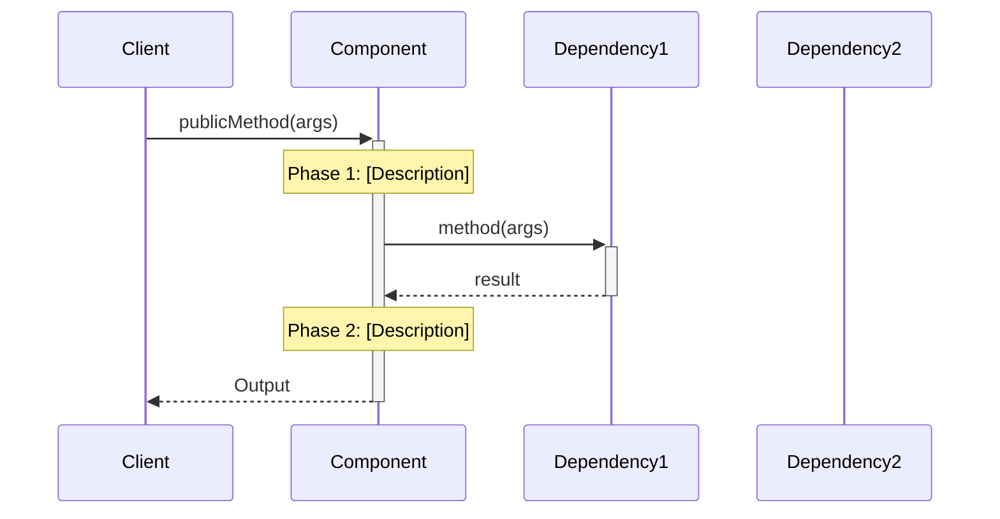
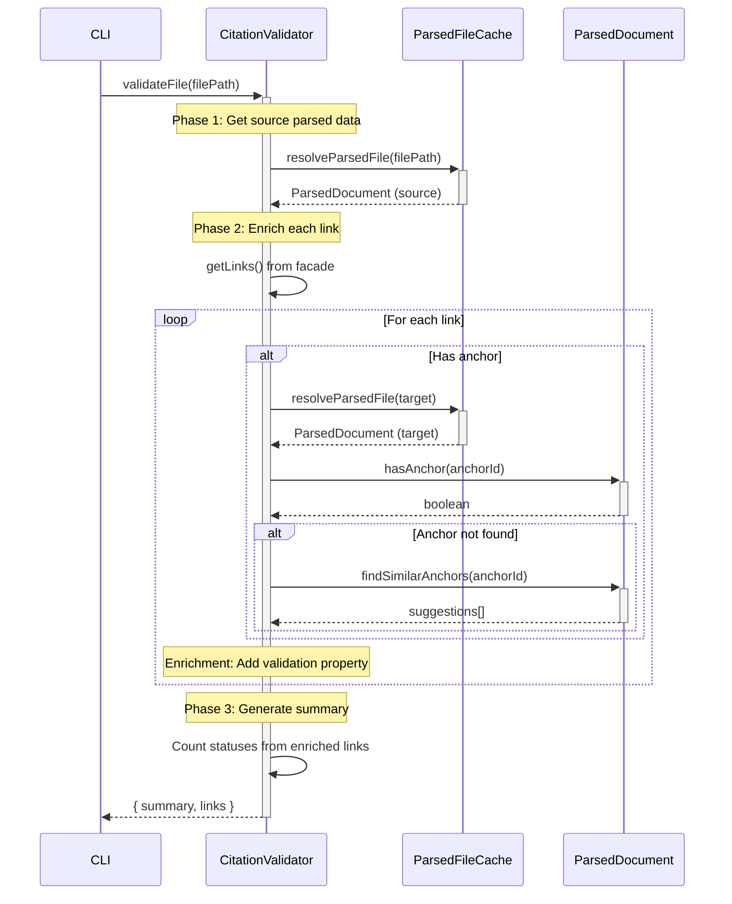

<!-- markdownlint-disable MD025 MD041 -->

# Whiteboard: Component Implementation Guide Skill

**Date**: 2025-11-29
**Phase**: Discovery & Ideation

> [!CRITICAL] Source of Truth
> The [Markdown Parser Implementation Guide](../../../../tools/citation-manager/design-docs/component-guides/Markdown%20Parser%20Implementation%20Guide.md) IS the canonical source for all patterns documented here. If divergence exists between this whiteboard and that guide, update this whiteboard to match.

> [!CRITICAL] Critical Skills
> Use the [writing-for-token-optimized-and-ceo-scannable-content](../../../../.claude/skills/writing-for-token-optimized-and-ceo-scannable-content/SKILL.md) when writing to this document

## Problem Statement

Engineers and agents module guides that:
1. **Capture stable contracts**: Interfaces, data shapes, input/output contracts - the things that should NOT change
2. **Document high-level implementation patterns**: How the component works conceptually (complements actual code)
3. **Maintain consistency** across all component guides
4. **Enable autonomous agent execution** with clear contracts and pseudocode
5. **Link to architecture principles** showing how design decisions align with system standards

**Scope**: These guides complement (not replace) actual code implementation. They provide conceptual understanding and contract stability while code references provide implementation details.

**Current state**: We have implementation guides with varying quality and structure. Need to extract patterns from best example (Markdown Parser) and codify into reusable skill.

## Template Analysis: Markdown Parser Implementation Guide

### Structural Elements (Sections Present)

| Section | Link | Purpose | Required | Status in CitationValidator |
|---------|------|---------|----------|---------------------------|
| **Overview** | [§Overview](../../../../tools/citation-manager/design-docs/component-guides/Markdown%20Parser%20Implementation%20Guide.md#Overview) | One-line summary + contains Problem/Solution/Impact | ✅ Required | ✗ **MISSING** |
| ↳ **Problem** | [§Problem](../../../../tools/citation-manager/design-docs/component-guides/Markdown%20Parser%20Implementation%20Guide.md#Problem) | Frame the gap from consumer perspective | ✅ Required | ✓ Present |
| ↳ **Solution** | [§Solution](../../../../tools/citation-manager/design-docs/component-guides/Markdown%20Parser%20Implementation%20Guide.md#Solution) | Component's role, approach, data contracts | ✅ Required | ✓ Present |
| ↳ **Impact** | [§Impact](../../../../tools/citation-manager/design-docs/component-guides/Markdown%20Parser%20Implementation%20Guide.md#Impact) | Solution → Outcome → Architecture Principles (table) | ✅ Required | ✗ **MISSING** |
| **Structure** | [§Structure](../../../../tools/citation-manager/design-docs/component-guides/Markdown%20Parser%20Implementation%20Guide.md#Structure) | Contains Class Diagram + File Structure | ✅ Required | ✓ Present |
| ↳ **Class Diagram** | [§Class Diagram](../../../../tools/citation-manager/design-docs/component-guides/Markdown%20Parser%20Implementation%20Guide.md#Class%20Diagram) | Mermaid class diagram + numbered element list | ✅ Required | ✓ Present |
| ↳ **File Structure** | [§File Structure](../../../../tools/citation-manager/design-docs/component-guides/Markdown%20Parser%20Implementation%20Guide.md#File%20Structure) | Current implementation tree, line counts, tech debt | ✅ Required | ✓ Present |
| **Component Workflow** | [§Component Workflow](../../../../tools/citation-manager/design-docs/component-guides/Markdown%20Parser%20Implementation%20Guide.md#Component%20Workflow) | Sequence diagram + high-level flow + integration points | ✅ Required | ✗ **MISSING** |
| **Public Contracts** | [§Public Contracts](../../../../tools/citation-manager/design-docs/component-guides/Markdown%20Parser%20Implementation%20Guide.md#Public%20Contracts) | Input/Output requirements | ✅ Required | ✓ Present |
| **Data Contracts** | [§Data Contracts](../../../../tools/citation-manager/design-docs/component-guides/Markdown%20Parser%20Implementation%20Guide.md#Data%20Contracts) | TypeScript interfaces + JSON examples + tables | ✅ Required | ✓ Present |
| **Testing Strategy** | [§Testing Strategy](../../../../tools/citation-manager/design-docs/component-guides/Markdown%20Parser%20Implementation%20Guide.md#Testing%20Strategy) | Philosophy + test categories + contract validation | ✅ Required | ✓ Present |
| **Whiteboard** | [§Whiteboard](../../../../tools/citation-manager/design-docs/component-guides/Markdown%20Parser%20Implementation%20Guide.md#Whiteboard) | Deep technical Q&A, layer breakdown, research dates | 🔶 Optional | ✗ **MISSING** |
| **Technical Debt** | [§Technical Debt](../../../../tools/citation-manager/design-docs/component-guides/Markdown%20Parser%20Implementation%20Guide.md#Technical%20Debt) | GitHub query for component issues | 🔶 Optional | ✓ Present (very detailed) |

## Emerging Skill Structure

### Required Sections (in order)
<!-- markdownlint-disable MD029 -->
1. **Problem** (Frame consumer need and gap)
2. **Solution** (Component role and approach)
3. **Impact** (Table: Solution → Outcome → Principle)
4. **Structure** (Mermaid class diagram + element list)
1. 
5. **File Structure** (Current tree + line counts + tech debt notes)
6. **Component Workflow** (Sequence diagram + text flow + integration points)
7. **Public Contracts** (Input + Output requirements)
8. **Data Contracts** (TypeScript interfaces + JSON examples + tables)
9. **Testing Strategy** (Philosophy + categories + validation pattern)
10. **Whiteboard** (Deep technical Q&A, research dates, POC validation)
11. **Technical Debt** (GitHub query + detailed issues)
12. **Research** (Optional: External tool analysis)
<!-- markdownlint-enable MD029 -->

### Visual Requirements

- **Mermaid diagrams**: Structure (class) + Workflow (sequence)
- **Text diagrams**: ASCII tree for high-level flow
- **Tables**: Impact, special cases, comparisons

### Content Requirements

- **Architecture principle links**: Throughout, with block anchors
- **Component interaction notes**: Every section
- **Concrete metrics**: Line counts, test counts, dates
- **Progressive disclosure**: High-level → detailed (workflow → whiteboard)

---

## Patterns

### Markdown Links

**Principle**: Every component/module reference MUST link to its definition. No orphan references.

**Architecture Doc Structure**:
- `ARCHITECTURE.md` - Workspace-level modules
- `ARCHITECTURE-PRINCIPLES.md` - Shared design principles
- `tools/*/ARCHITECTURE-*.md` - Tool-specific components (e.g., `ARCHITECTURE-Citation-Manager.md`)

#### Level 3: Component Reference (→ Tool ARCHITECTURE doc)

**When**: Referencing a component (class, module) - links to its definition in the tool's architecture doc
**Format**: `[**\`ComponentName\`**](../ARCHITECTURE-{tool}.md#Module.Component%20Name)`

##### Examples

```markdown
 Links and anchors identified by the [**`MarkdownParser`**](../ARCHITECTURE-Citation-Manager.md#Citation%20Manager.Markdown%20Parser) are purely syntactic constructs...
```

**Format Examples**:

```markdown
[**`MarkdownParser`**](../ARCHITECTURE-Citation-Manager.md#Citation%20Manager.Markdown%20Parser)
[**`ParsedDocument`**](../ARCHITECTURE-Citation-Manager.md#Citation%20Manager.ParsedDocument)
[**`ParsedFileCache`**](../ARCHITECTURE-Citation-Manager.md#Citation%20Manager.ParsedFileCache)
```

**Anchor Pattern**: `#Module%20Name.Component%20Name` (URL-encoded spaces)

#### Level 4: Component.Funtionality Reference (→ Component Guide section)

**When**: Referencing a data contract, interface, or section inside a component guide

**Can be**: Same document (internal) OR different document (cross-document)

**First Mention Rule**:
- **First introduction** → `ComponentName.DataStructure` (prefix roots ownership)
- **Subsequent mentions** → Just `DataStructure` (prefix drops)

**Cross-Document Example** (from CitationValidator line 4 - linking to MarkdownParser guide):

```markdown
[**`MarkdownParser.LinkObjects`**](Markdown%20Parser%20Implementation%20Guide.md#LinkObject%20Interface)
```

**Same-Document Examples** (from CitationValidator lines 15-16):

```markdown
[**`CitationValidator.ValidationMetadata`**](#ValidationMetadata%20Type%20(Discriminated%20Union))
[**`CitationValidator.ValidationResult`**](#ValidationResult%20Interface)
```

**Subsequent Mention** (prefix drops after established):

```markdown
[**`ValidationMetadata`**](#ValidationMetadata%20Type%20(Discriminated%20Union))
```

#### Architecture Principles Link Reference

**When**: Impact table or design justification
**Format**: `[Principle Name](path/to/ARCHITECTURE-PRINCIPLES.md#anchor)`
**Examples** (from CitationValidator Impact table lines 25-27):

```markdown
[One Source of Truth](../path/ARCHITECTURE-PRINCIPLES.md#^one-source-of-truth)
[Illegal States Unrepresentable](../path/ARCHITECTURE-PRINCIPLES.md#^illegal-states-unrepresentable)
[Black Box Interfaces](../path/ARCHITECTURE-PRINCIPLES.md#^black-box-interfaces)
```

**Anchor Options**:
- Section header: `#Data-First%20Design%20Principles`
- Block anchor: `#^one-source-of-truth` (more precise)

---
### Overview Section

#### Overview Section Header Depth Pattern

```markdown
## Overview                                    ← H2: Section title
[One-line component summary]                  ← Concise description

### Problem                                   ← H3: Subsection
- [Consumer need]
- [Current gap/pain]
- [Why it matters]

### Solution                                  ← H3: Subsection
- The [Component] acts as [role]. It:
  - [capability 1]
  - [capability 2]
- The [Output]:
  - [how it's consumed]
  - [what it contains]

### Impact                                    ← H3: Subsection
[Table: Solution → Impact → Principles]

---                                           ← Horizontal rule separator
```

#### Overview Sentence Tone & Style
- **One-line summary**: Active verb + object + purpose
- **Best practice**: Keep summary concise and generic. Specific components/data structures get properly linked in Problem/Solution sections below. Create at most 1-3 linked components if adding a component reference makes the overview clearer; more than 3 is visually confusing.
- **Links:** 
	- [Level 3: Component Reference (→ Tool ARCHITECTURE doc)](#Level%203%20Component%20Reference%20(→%20Tool%20ARCHITECTURE%20doc))
	- [Level 4: Component.Funtionality Reference (→ Component Guide section)](#Level%204%20Component.Funtionality%20Reference%20(→%20Component%20Guide%20section))
  
##### Examples

 ```markdown
Parses markdown files into structured objects containing outgoing links and header/anchors for consumption by downstream components.
 ```

 ```markdown
Wraps [**`MarkdownParser.ParserOutput`**](Markdown%20Parser%20Implementation%20Guide.md#ParserOutput%20Interface) in a facade providing stable query methods for anchor validation, link retrieval, and content extraction for consumption by [**`CitationValidator`**](../ARCHITECTURE-Citation-Manager.md#Citation%20Manager.Citation%20Validator) and [**`ContentExtractor`**](../ARCHITECTURE-Citation-Manager.md#Citation%20Manager.ContentExtractor).
 ```

#### Problem Tone & Style

- **Format**: Bullet list
- **Structure** (3 bullets):
	1. **Consumer need** - Who needs what (link consumers on first mention)
	2. **Pain point** - Why current/alternative approach fails
	3. **Gap statement** - What the system needs
- **Links:**
	- [Level 3: Component Reference (→ Tool ARCHITECTURE doc)](#Level%203%20Component%20Reference%20(→%20Tool%20ARCHITECTURE%20doc))
	- [Level 4: Component.Funtionality Reference (→ Component Guide section)](#Level%204%20Component.Funtionality%20Reference%20(→%20Component%20Guide%20section))

##### Examples

```markdown
### Problem
- Downstream components like the [**`CitationValidator`**](...) need structured representation of links and anchors.
- Parsing raw markdown with regex in each component would be repetitive, brittle, and inefficient.
- The system needs a single, reliable component to transform markdown into a consistent data model.
```

```markdown
### Problem
- Consumers like the [**`CitationValidator`**](../ARCHITECTURE-Citation-Manager.md#Citation%20Manager.Citation%20Validator) are tightly coupled to the internal structure of [**`MarkdownParser.ParserOutput`**](Markdown%20Parser%20Implementation%20Guide.md#ParserOutput%20Interface), making them complex and forcing them to contain data-querying logic.
- Any change to the parser's output structure becomes a breaking change for all consumers.
- Direct data structure access violates encapsulation and makes the system brittle to refactoring.
```

#### Solution Tone & Style

- **Format**: Bullet list (2 major bullets with sub-bullets)
- **Structure**:
	1. **Component role** - "The [Component] acts as [role]. It:" + capability sub-bullets
	2. **Value proposition** - "The [Component/Output/Methods]:" + benefit sub-bullets
- **Links:**
	- [Level 3: Component Reference (→ Tool ARCHITECTURE doc)](#Level%203%20Component%20Reference%20(→%20Tool%20ARCHITECTURE%20doc))
	- [Level 4: Component.Funtionality Reference (→ Component Guide section)](#Level%204%20Component.Funtionality%20Reference%20(→%20Component%20Guide%20section))

##### Examples

```markdown
### Solution
- The [**`MarkdownParser`**](...) component acts as a specialized transformer. It:
  - accepts a file path,
  - reads the document, and
  - applies a series of parsing strategies to produce a single [**`MarkdownParser.ParserOutput`**](...) object.
- The [**`MarkdownParser.ParserOutput`**](...) object:
  - is wrapped by the [**`ParsedDocument`**](...) facade before being consumed by other components
  - contains two primary collections: [**`MarkdownParser.Link Objects`**](...) and [**`MarkdownParser.Anchor Objects`**](...)
```

```markdown
### Solution
- The [**`ParsedDocument`**](...) facade acts as a stable interface wrapper. It:
  - encapsulates the raw [**`MarkdownParser.ParserOutput`**](...) object,
  - provides method-based query APIs for anchors, links, and content, and
  - hides complex internal data structures from all consumers.
- The [**`ParsedDocument`**](...) query methods:
  - are consumed by the [**`CitationValidator`**](...) and [**`ContentExtractor`**](...),
  - provide a stable API that decouples consumers from parser internals, and
  - enable parser refactoring without breaking consumer code.
```

#### Impact Tone & Style

- **Format**: Table with 3 columns
- **Structure**:
	1. **Solution** - Design decision or pattern name (noun phrase)
	2. **Impact** - Measurable engineer benefit (result phrase)
	3. **Principles** - Architecture principle link(s)
- **Links**: [Architecture Principles Link Reference](#Architecture%20Principles%20Link%20Reference)
	- **Principle Link Options**:
		- **Section header**: `#Data-First%20Design%20Principles` - broader context
		- **Block anchor**: `#^data-first-principles-definition` - precise reference (see ParsedDocument guide)

##### Examples

```markdown
### Impact

| Solution | Impact | Principles |
|----------|--------|------------|
| Well defined interfaces and data shapes | Less errors when navigating and consuming data | [Data-First Design Principles](...) |
| Dependency Injection | Flexible testing (real/mock components) | [Modular Design Principles](...) |
| TypeScript discriminated unions (AnchorObject) | Impossible to represent invalid states | [Data-First Design Principles](...) |
```

```markdown
### Impact

| Solution | Impact | Principles |
|----------|--------|------------|
| Facade pattern with query methods | Zero direct data structure access from consumers | [Black Box Interfaces](...), [Modular Design](...) |
| Lazy-loaded anchor cache | Reduced memory overhead and improved query performance | [Access-Pattern Fit](...) |
| Dual-key anchor matching | Handles Obsidian encoding variations transparently | [Simplicity First](...) |
```


#### Overview Horizontal Rule
- Separates Overview from detailed Structure section below.

---
### Structure Section

#### Structure Section Header Depth  Pattern

#### Class Diagram Tone & Style

#### File Structure Diagram Tone & Style

---

> [!CRITICAL] Patterns Below This HR
> The patterns below were the first pass at pattern recognition. They can be used to help populate our section by section approach. BE WARNED THE INFORMATION MIGHT BE DATED

---
### Visual-First Documentation

**Principle**: Diagrams before text, mermaid for all visualizations.

**Structure Diagram** (Template: Lines 35-80):
- **Format**: Mermaid class diagram
- **Shows**: Data contracts, relationships, cardinality
- **Follows with**: Numbered list explaining each element

⚠️ **GAP**: Current patterns not fully documented:
- Stereotypes: `<<interface>>`, `<<data>>`, `<<class>>`
- Direction: `direction LR`
- Relationships: composition `*--`, dependency `..>` with cardinality
- Numbered list links to sections in current guide

**Component Workflow** (Template: Lines 142-166):
- **Format 1**: Mermaid sequence diagram
- **Format 2**: Text-based flow diagram with ASCII tree
- **Format 3**: Bullet list of integration points

**Example sequence diagram structure**:



**Example text flow**:

```text
publicMethod(args) → Output
├── PHASE 1: [Description]
│   └── dependency.method() → intermediate
├── PHASE 2: [Description]
│   └── processing → result
└── RETURN: Output structure
```

**Missing in CitationValidator**: Sequence diagram showing validation workflow phases.

---

### Contract-First with Examples

**Public Contracts Section** (Template: Lines 192-203):

```markdown
## Public Contracts

### Input Contract
The component's contract requires the following inputs for operation:
1. [Interface/dependency 1], provided at [when]
2. [Interface/dependency 2], provided at [when]
3. [Parameter], provided to [method]

### Output Contract
1. The [method] returns a [type] that [description]
```

**Data Contracts Section** (Template: Lines 204-367):

```markdown
## Data Contracts

TypeScript interfaces defining [component] output structure. Source: `[file path]`

> [!danger] Technical Lead Note
> [Critical information about contract usage/limitations]

### [InterfaceName] Interface

```typescript
export interface InterfaceName {
  /** JSDoc comment */
  field: type;
}
```

**Contract Examples** (Template: Lines 369-478):

```markdown
### [ContractName] Example

> **Note**: [Important clarification about the example]

```json
{
  "field": "value"
}
```

**Pattern observed**:
- TypeScript interfaces FIRST (lines 214-366)
- JSON examples SECOND (lines 369-478)
- Tables for special cases THIRD (lines 480-492)

---

### Progressive Disclosure in Workflow

**High-Level Flow** (Template: Lines 168-183):

```text
mainMethod(input) → Output
├── STEP 1: [verb phrase] → intermediate
├── STEP 2: [verb phrase] → intermediate
│   ├── Pattern: [specific case] → classification
│   ├── Pattern: [specific case] → classification
│   └── Pattern: [specific case] → classification
└── STEP 3: [verb phrase] → Output
```

**Key Integration Points** (Template: Lines 185-191):
- **[Library/Component]**: [What it does for this component]
- **[Library/Component]**: [What it does for this component]

**Whiteboard Deep Dive** (Template: Lines 520-735):

```markdown
## Whiteboard

## [Specific Technical Question]

**Key Question**: [The exact question being answered]

**Answer**: [Summary answer first, details follow]

### Layer 1: [Approach Name]

**Code Location**: `[file]` lines [range]

[Code example or detailed explanation]

**What [tool/library] creates**:
- [Output 1]
- [Output 2]

**[Section] used by**:
- [Consumer 1] - [Usage description]
- [Consumer 2] - [Usage description]
```

**Pattern observed**:
1. Start with sequence diagram (visual, scannable)
2. Provide text flow (scannable alternative)
3. List integration points (quick reference)
4. Deep technical details in Whiteboard section (progressive disclosure)

---

### Context Integration Throughout

**Architecture Principle Links**:
- Impact table links to specific principles with anchors
- Technical debt issues reference principles (line 483)
- File naming patterns referenced (line 134)

**Component Interaction Notes**:
- Every section mentions integration points
- Structure diagram shows all dependencies
- Boundaries section clarifies responsibilities

**Example integration callouts**:
- Line 17: "wrapped by the ParsedDocument facade before being consumed by other components"
- Line 185: "marked.js: Standard markdown tokenization (CommonMark spec)"
- Line 96: Links to other component guides

---

### Implementation Reality

**Current vs Proposed**:
- Line 99: "Current Structure (TypeScript Implementation)"
- Line 134: "Technical Debt: The current monolithic structure violates..."

**Concrete Metrics**:
- Line 108: "~640 lines"
- Line 732: "Research Date: 2025-10-07"
- Line 733: "POC Validation: Section extraction (7/7 tests) + Block extraction (9/9 tests) = 100% success rate"

**Known Limitations**:
- Line 209: Technical Lead Note about unused .headings[] array
- Line 491: "See [Issue 5] for MVP technical debt discussion"

**Migration Strategies**:
- Line 134: Proposes component folder refactoring
- Links to GitHub issues for tracking

---

## CitationValidator Gap Analysis

### Missing Patterns

1. **Impact Table**: No table linking validation enrichment pattern → data reduction → data-first principles
2. **Component Workflow Diagram**: Has pseudocode (good!) but missing sequence diagram showing validation phases
3. **Whiteboard Section**: No deep technical Q&A section (e.g., "How does enrichment eliminate duplication?")
4. **Research Section**: No external tool comparison (e.g., how do other validators handle enrichment?)

### Strengths to Preserve

1. **Detailed Technical Debt**: Issues 1-4 are comprehensive with resolution strategies
2. **Pseudocode**: Includes implementation pseudocode with line number references
3. **Enrichment Pattern**: Well-documented US1.8 pattern with clear explanation
4. **Test Strategy**: Comprehensive with contract validation focus

---

## Test Application: CitationValidator Improvements

### What to Add

1. **Impact Table**:

```markdown
| Solution | Impact | Principles |
|----------|--------|------------|
| Enrichment pattern (add validation to LinkObject) | 80% reduction in data duplication | [Data-First Design](link), [One Source of Truth](link) |
| Discriminated union ValidationMetadata | Illegal states unrepresentable (no valid+error state) | [Illegal States Unrepresentable](link) |
| ParsedDocument facade integration | Zero direct data structure access from validator | [Modular Design](link) |
```

1. **Component Workflow Sequence Diagram**:



claudeclaude

### Estimated Improvement Impact

| Before | After | Change |
|--------|-------|--------|
| No Impact table | Impact table with 3 rows | Shows architecture alignment |
| Pseudocode only | Pseudocode + sequence diagram | Visual workflow clarity |
| No whiteboard | Whiteboard with enrichment Q&A | Deep technical context |
| Good tech debt docs | Keep as-is | Already comprehensive |

**Total addition**: ~150 lines (Impact table + sequence diagram + whiteboard section)
**Readability improvement**: High (visual hierarchy + progressive disclosure)
**Agent execution improvement**: Medium (sequence diagram helps understand flow)

---

## Next Steps for Skill Development

1. **Create formal requirements** defining all mandatory sections
2. **Design template structure** with placeholders and examples
3. **Create skill prompt** with:
   - Section-by-section instructions
   - Mermaid diagram templates
   - Contract documentation patterns
   - Whiteboard Q&A format
4. **Test with CitationValidator** as first iteration
5. **Validate with ContentExtractor** as second iteration
