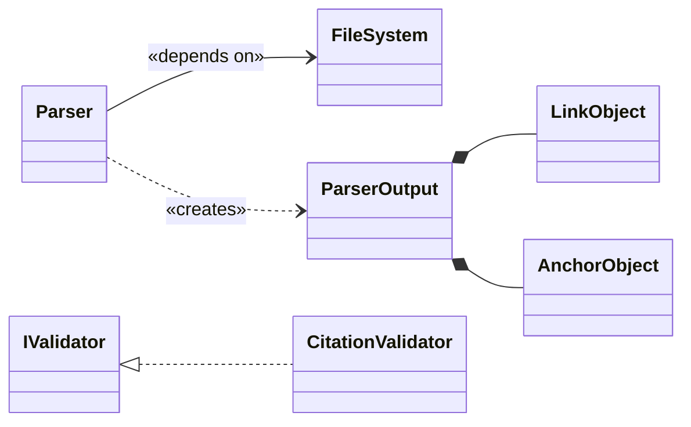
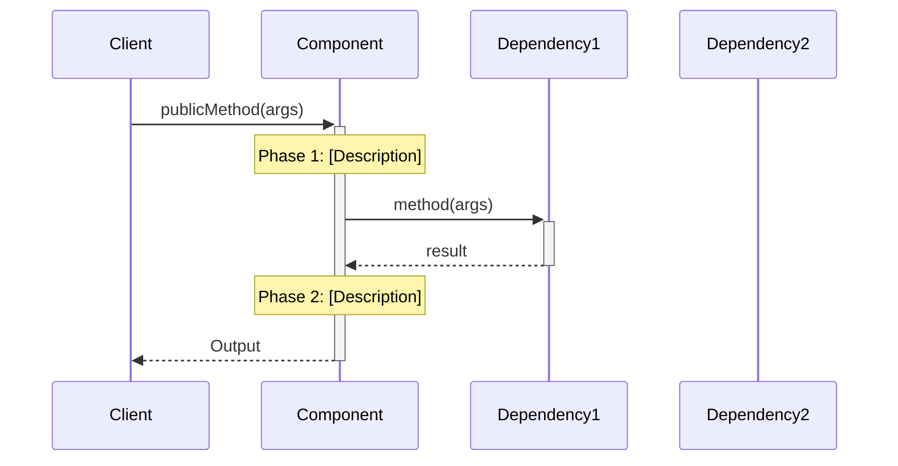
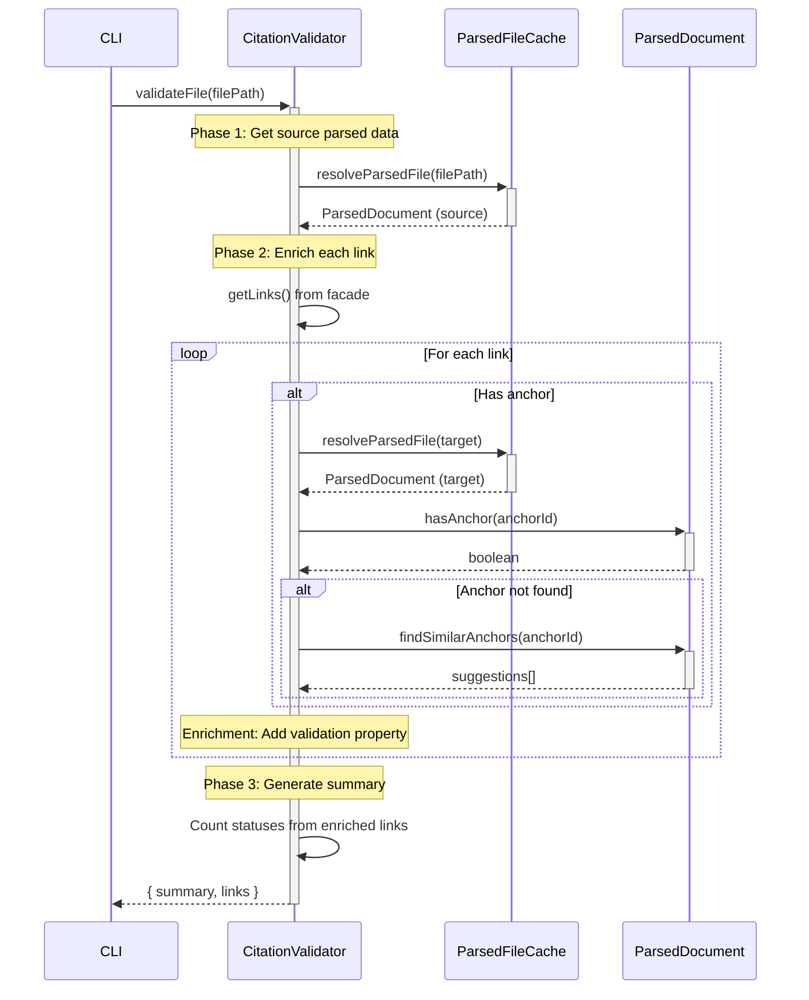

<!-- markdownlint-disable MD025 MD041 -->

# Whiteboard: Component Implementation Guide Skill

**Date**: 2025-11-29
**Phase**: Discovery & Ideation

> [!CRITICAL] Source of Truth
> The [Markdown Parser Implementation Guide](../../../../tools/citation-manager/design-docs/component-guides/Markdown%20Parser%20Implementation%20Guide.md) IS the canonical source for all patterns documented here. If divergence exists between this whiteboard and that guide, update this whiteboard to match.

> [!CRITICAL] Critical Skills
> Use the [writing-for-token-optimized-and-ceo-scannable-content](../../../../.claude/skills/writing-for-token-optimized-and-ceo-scannable-content/SKILL.md) when writing to this document AND when using its Patterns to update a component guide

## Problem Statement

Engineers and agents module guides that:
1. **Capture stable contracts**: Interfaces, data shapes, input/output contracts - the things that should NOT change
2. **Document high-level implementation patterns**: How the component works conceptually (complements actual code)
3. **Maintain consistency** across all component guides
4. **Enable autonomous agent execution** with clear contracts and pseudocode
5. **Link to architecture principles** showing how design decisions align with system standards

**Scope**: These guides complement (not replace) actual code implementation. They provide conceptual understanding and contract stability while code references provide implementation details.

**Current state**: We have implementation guides with varying quality and structure. Need to extract patterns from best example (Markdown Parser) and codify into reusable skill.

## Template Analysis: Markdown Parser Implementation Guide

### Structural Elements (Sections Present)


### Content Requirements

- **Architecture principle links**: Throughout, with block anchors
- **Component interaction notes**: Every section
- **Concrete metrics**: Line counts, test counts, dates
- **Progressive disclosure**: High-level → detailed (workflow → whiteboard)

---

## Patterns

### Markdown Links

**Principle**: Every component/module reference MUST link to its definition. No orphan references.

**Architecture Doc Structure**:
- `ARCHITECTURE.md` - Workspace-level modules
- `ARCHITECTURE-PRINCIPLES.md` - Shared design principles
- `tools/*/ARCHITECTURE-*.md` - Tool-specific components (e.g., `ARCHITECTURE-Citation-Manager.md`)

#### Level 3: Component Reference (→ Tool ARCHITECTURE doc)

**When**: Referencing a component (class, module) - links to its definition in the tool's architecture doc
**Format**: `[**\`ComponentName\`**](../ARCHITECTURE-{tool}.md#Module.Component%20Name)`

##### Examples

<!-- citation-ignore -->
```markdown
 Links and anchors identified by the [**`MarkdownParser`**](../ARCHITECTURE-Citation-Manager.md#Citation%20Manager.Markdown%20Parser) are purely syntactic constructs...
```
<!-- /citation-ignore -->

**Format Examples**:

<!-- citation-ignore -->
```markdown
[**`MarkdownParser`**](../ARCHITECTURE-Citation-Manager.md#Citation%20Manager.Markdown%20Parser)
[**`ParsedDocument`**](../ARCHITECTURE-Citation-Manager.md#Citation%20Manager.ParsedDocument)
[**`ParsedFileCache`**](../ARCHITECTURE-Citation-Manager.md#Citation%20Manager.ParsedFileCache)
```
<!-- /citation-ignore -->

**Anchor Pattern**: `#Module%20Name.Component%20Name` (URL-encoded spaces)

#### Level 4: Component.Funtionality Reference (→ Component Guide section)

**When**: Referencing a data contract, interface, or section inside a component guide
**Can be**: Same document (internal) OR different document (cross-document)
**First Mention Rule**:
- **First introduction** → `ComponentName.DataStructure` (prefix roots ownership)
- **Subsequent mentions** → Just `DataStructure` (prefix drops)
  
**Cross-Document Example** (from CitationValidator line 4 - linking to MarkdownParser guide):

```markdown
[**`MarkdownParser.LinkObjects`**](Markdown%20Parser%20Implementation%20Guide.md#LinkObject%20Interface)
```

**Same-Document Examples** (from CitationValidator lines 15-16):

```markdown
[**`CitationValidator.ValidationMetadata`**](#ValidationMetadata%20Type%20(Discriminated%20Union))
[**`CitationValidator.ValidationResult`**](#ValidationResult%20Interface)
```

**Subsequent Mention** (prefix drops after established):

```markdown
[**`ValidationMetadata`**](#ValidationMetadata%20Type%20(Discriminated%20Union))
```

#### Architecture Principles Link Reference

**When**: Impact table or design justification
**Format**: `[Principle Name](path/to/ARCHITECTURE-PRINCIPLES.md#anchor)`
**Examples** (from CitationValidator Impact table lines 25-27):

```markdown
[One Source of Truth](../path/ARCHITECTURE-PRINCIPLES.md#^one-source-of-truth)
[Illegal States Unrepresentable](../path/ARCHITECTURE-PRINCIPLES.md#^illegal-states-unrepresentable)
[Black Box Interfaces](../path/ARCHITECTURE-PRINCIPLES.md#^black-box-interfaces)
```

**Anchor Options**:
- Section header: `#Data-First%20Design%20Principles`
- Block anchor: `#^one-source-of-truth` (more precise)

---
### Overview Section

#### Overview Section Header Depth Pattern

```markdown
## Overview                                    ← H2: Section title
[One-line component summary]                  ← Concise description

### Problem                                   ← H3: Subsection
- [Consumer need]
- [Current gap/pain]
- [Why it matters]

### Solution                                  ← H3: Subsection
- The [Component] acts as [role]. It:
  - [capability 1]
  - [capability 2]
- The [Output]:
  - [how it's consumed]
  - [what it contains]

### Impact                                    ← H3: Subsection
[Table: Solution → Impact → Principles]

---                                           ← Horizontal rule separator
```

#### Overview Sentence Tone & Style
- **One-line summary**: Active verb + object + purpose
- **Best practice**: Keep summary concise, generic, and easy to understand. **NO component links** in the overview sentence - save all component references for Problem/Solution sections below. The overview should be scannable without requiring the reader to follow links.

##### Examples

 ```markdown
Parses markdown files into structured objects containing outgoing links and header/anchors for consumption by downstream components.
 ```

 ```markdown
Wraps parser output in a facade providing stable query methods for anchor validation, link retrieval, and content extraction.
 ```

 ```markdown
Validates link paths and anchors, enriching links with validation metadata for downstream processing.
 ```

#### Problem Tone & Style

- **Format**: Numbered list with block anchors (`^P1`, `^P2`, `^P3`)
- **Structure** (3 items):
 1. **Consumer need** - Who needs what (link consumers on first mention) `^P1`
 2. **Pain point** - Why current/alternative approach fails `^P2`
 3. **Gap statement** - What the system needs `^P3`
- **Block anchors**: Enable bidirectional traceability from Impact table back to problems
- **Links:**
  - [Level 3: Component Reference (→ Tool ARCHITECTURE doc)](#Level%203%20Component%20Reference%20(→%20Tool%20ARCHITECTURE%20doc))
  - [Level 4: Component.Funtionality Reference (→ Component Guide section)](#Level%204%20Component.Funtionality%20Reference%20(→%20Component%20Guide%20section))

##### Examples

```markdown
### Problem
1. Downstream components like [**`CitationValidator`**](...) need structured representation of links and anchors. ^P1
2. Parsing raw markdown with regex in each component would be repetitive, brittle, and inefficient. ^P2
3. The system needs a single, reliable component to transform markdown into a consistent data model. ^P3
```

```markdown
### Problem
1. Consumers like the [**`CitationValidator`**](...) are tightly coupled to the internal structure of [**`MarkdownParser.ParserOutput`**](...), making them complex. ^P1
2. Any change to the parser's output structure becomes a breaking change for all consumers. ^P2
3. Direct data structure access violates encapsulation and makes the system brittle to refactoring. ^P3
```

#### Solution Tone & Style

- **Format**: Numbered list with block anchors (`^S1`, `^S2`, `^S3`)
- **Structure**:
 1. **Intro sentence** - "The [Component] provides [capability] by:"
 2. **Numbered capabilities** - Each with problem reference and block anchor
- **Problem references**: Link back to problems addressed using `(addresses [P1](#^P1))`
- **Block anchors**: Enable bidirectional traceability from Impact table back to solutions
- **Links:**
  - [Level 3: Component Reference (→ Tool ARCHITECTURE doc)](#Level%203%20Component%20Reference%20(→%20Tool%20ARCHITECTURE%20doc))
  - [Level 4: Component.Funtionality Reference (→ Component Guide section)](#Level%204%20Component.Funtionality%20Reference%20(→%20Component%20Guide%20section))

##### Examples

```markdown
### Solution
The [**`MarkdownParser`**](...) component provides centralized markdown parsing by:
1. accepting a file path, reading the document, and applying parsing strategies to produce a comprehensive [**`ParserOutput`**](...) object ^S1
2. wrapping output in the [**`ParsedDocument`**](...) facade before consumption, decoupling consumers from parser internals (addresses [P1](#^P1)) ^S2
3. producing two primary collections: [**`LinkObject[]`**](...) and [**`AnchorObject[]`**](...), centralizing parsing logic (addresses [P2](#^P2), [P3](#^P3)) ^S3
```

```markdown
### Solution
The [**`ParsedDocument`**](...) facade provides a stable query interface by:
1. encapsulating the raw [**`MarkdownParser.ParserOutput`**](...) and hiding internal data structures (addresses [P1](#^P1)) ^S1
2. providing method-based APIs for anchors, links, and content extraction (addresses [P2](#^P2)) ^S2
3. enabling parser refactoring without breaking consumer code (addresses [P3](#^P3)) ^S3
```

#### Impact Tone & Style

- **Format**: Table with 7 columns (bidirectional traceability)
- **Structure**:
 1. **Problem ID** - Link back to problem anchor `[P1](#^P1)`
 2. **Problem** - Brief problem description
 3. **Solution ID** - Link to solution anchor(s) `[S1](#^S1)`
 4. **Solution** - Design decision or pattern name
 5. **Impact** - Measurable engineer benefit
 6. **Principles** - Architecture principle link(s)
 7. **How Principle Applies** - Concrete explanation of principle application
- **Principle link specificity**: Choose the level that best captures the relationship
  - **Specific sub-principle** when it's a precise match (e.g., `^illegal-states-unrepresentable`, `^single-responsibility`)
  - **High-level category** when broader context is needed (e.g., `#Data-First%20Design%20Principles`)
- **Links**: [Architecture Principles Link Reference](#Architecture%20Principles%20Link%20Reference)

##### Examples

```markdown
### Impact

| Problem ID | Problem | Solution ID | Solution | Impact | Principles | How Principle Applies |
| :--------: | ------- | :---------: | -------- | ------ | ---------- | --------------------- |
| [P1](#^P1) | Components need structured representation | [S1](#^S1), [S2](#^S2) | Single parse + facade wrapping | Fewer errors navigating data | [Data Model First](...#^data-model-first) | Clean data structures lead to clean code |
| [P2](#^P2) | Regex duplication across components | [S3](#^S3) | Centralized extraction | 100% reduction in duplicated logic | [Single Responsibility](...#^single-responsibility) | Parser parses; consumers consume |
| [P3](#^P3) | No reliable transformer | [S1](#^S1) | DI-enabled class | Flexible testing (mock/real fs) | [Dependency Abstraction](...#^dependency-abstraction) | Depend on abstraction, not concrete node:fs |
```

```markdown
### Impact

| Problem ID | Problem | Solution ID | Solution | Impact | Principles | How Principle Applies |
| :--------: | ------- | :---------: | -------- | ------ | ---------- | --------------------- |
| [P1](#^P1) | Tight coupling to parser internals | [S1](#^S1) | Facade with query methods | Zero direct data structure access | [Black Box Interfaces](...#^black-box-interfaces) | Expose clean API; hide implementation |
| [P2](#^P2) | Breaking changes propagate | [S2](#^S2) | Stable method-based API | Parser refactoring doesn't break consumers | [Replaceable Parts](...#^replaceable-parts) | Components swapped via interfaces |
```

#### Overview Horizontal Rule
- Separates Overview from detailed Structure section below.

---
### Structure Section

#### Structure Section Header Depth Pattern

```markdown
## Structure                                  ← H2: Section title (no intro)

### Class Diagram                             ← H3: Subsection
[Intro sentence: dependencies + public API]
[Mermaid class diagram]
[Numbered list linking elements to guide sections]

---                                           ← HR: Separates Class Diagram from File Structure
### File Structure                            ← H3: Subsection
[ASCII tree: ONLY this component's files - NO dependencies]
[Optional: Architecture Notes, tech debt, or references]

---                                           ← HR: Separates Structure from next major section
```

##### Horizontal Rule Placement (Required)

Structure section uses two horizontal rules:

| Position | What It Separates | Example |
|----------|-------------------|---------|
| After numbered list | Class Diagram subsection → File Structure subsection | See MarkdownParser line 90 |
| After File Structure | Structure section → Public Contracts section | See MarkdownParser line 128 |

**Why**: Visual separation improves scannability between subsections and major sections.

#### Class Diagram Tone & Style

- **Format**: Mermaid class diagram with `direction LR`
- **Intro sentence**: One line stating dependencies + public API before diagram
- **Follow-up**: Numbered list linking diagram elements to guide sections

##### Diagram Header

```mermaid
classDiagram
    direction LR
```

##### Intro Sentence (Diagram Header)

The intro sentence precedes the mermaid diagram. It follows a structured "dot sentence" pattern with specific link conventions.

**Pattern**:

```text
[Subject](ARCH-link) depends on [Dependency](link) for [purpose]. It exposes [method()](#section), which returns [Type](#Data%20Contracts).
```

**Link conventions by part**:

| Sentence Part | Link Target | Format |
|---------------|-------------|--------|
| Subject component | Tool ARCHITECTURE doc | Bold backtick name |
| Dependencies | ARCHITECTURE or internal section | Bold backtick name |
| Public methods | Internal section (sequence diagram, contract) | Backtick name only |
| Return types | Data Contracts or interface section | Bold backtick name |

**Examples**:

Single dependency, single method (from MarkdownParser guide):

<!-- citation-ignore -->
```text
[**`MarkdownParser`**](../ARCHITECTURE-Citation-Manager.md#...) depends on [**`FileSystemInterface`**](#FileSystemInterface) for file I/O. It exposes a single public method, [`parseFile()`](#...), which returns the [**`ParserOutput`**](#ParserOutput%20Interface) interface.
```
<!-- /citation-ignore -->

Multiple dependencies, multiple methods (from CitationValidator guide):

<!-- citation-ignore -->
```text
[**`CitationValidator`**](../ARCHITECTURE-Citation-Manager.md#...) depends on [**`ParsedFileCache`**](...) for parsed document retrieval and [**`FileCache`**](...) for legacy path resolution. It exposes public methods [`validateFile()`](#...) and [`validateSingleCitation()`](#...), which return [**`ValidationResult`**](#...).
```
<!-- /citation-ignore -->

##### Common Stereotypes

| Stereotype | Use For |
|------------|---------|
| `<<interface>>` | Dependency injection contracts, public APIs |
| `<<class>>` | Implementation classes |
| `<<data>>` | Data transfer objects, value types |
| `<<facade>>` | Facade classes wrapping complex internals |
| `<<anonymous>>` | Inline/anonymous types (e.g., return objects) |
| `<<abstract>>` | Abstract base classes |
| `<<enumeration>>` | Enums |
| `<<service>>` | Service layer classes |

##### Class Member Syntax

**Goal**: Communicate boundaries, not internals. Show public API surface only.

```mermaid
class ComponentName {
    <<class>>
    +publicMethod(input): OutputType
}

class OutputInterface {
    <<interface>>
    +fieldA: TypeA
    +fieldB: TypeB[]
}
```

- Show **public methods** that define the component's contract
- Show **interface fields** that define data shape
- Omit private members, implementation details → code is source of truth

##### Type Naming Convention

**Rule**: Use actual component/interface names from codebase, not generic placeholders.

| Don't | Do | Rationale |
|-------|-----|-----------|
| `object[]` | `Token[]` | Reveals actual type from codebase |
| `Link[]` | `LinkObject[]` | Matches interface name in code |
| `Anchor[]` | `AnchorObject[]` | Matches type name in code |
| `{ inline }` | Use `<<anonymous>>` stereotype | Indicates intentionally unnamed type |

**When to use `<<anonymous>>`**: For inline return types or objects that have no named interface in the codebase (e.g., callback parameters, configuration objects without explicit types).

##### Core Relationship Arrows

| Arrow | Meaning | Example |
|-------|---------|---------|
| `A --> B` | Dependency (uses) | `Parser --> FileSystem` |
| `A ..> B` | Creates/produces | `Parser ..> ParserOutput` |
| `A *-- B` | Composition (owns) | `ParserOutput *-- LinkObject` |
| `A o-- B` | Aggregation (has) | `Cart o-- Product` |
| `A <\|-- B` | Inheritance | `BaseClass <\|-- DerivedClass` |
| `A <\|.. B` | Implements | `IService <\|.. ServiceImpl` |

##### Relationship Labels (Guillemets)

Use **guillemets** `« »` for semantic labels on arrows:

```text
A --> B : «depends on»
A ..> B : «creates»
```

**Common labels**: `«depends on»`, `«creates»`, `«returns»`, `«uses»`, `«extends»`, `«has»`, `«contains»`, `«implements»`

**Why guillemets**: Visual distinction from regular text, matches UML convention.

##### Relationship Examples



##### Numbered Element List (Required)

> [!warning] Link Guidance
> Prefer using [Level 3: Component Reference (→ Tool ARCHITECTURE doc)](#Level%203%20Component%20Reference%20(→%20Tool%20ARCHITECTURE%20doc)) links
> Use [Level 4: Component.Funtionality Reference (→ Component Guide section)](#Level%204%20Component.Funtionality%20Reference%20(→%20Component%20Guide%20section)) when there is a need to clarify the class diagram with more specific data contracts and/or input/output contracts

After diagram, list elements with links to guide sections:

```markdown
1. [**`ParserOutput`**](#Data%20Contracts): The composite object returned.
2. [**`LinkObject`**](#LinkObject%20Interface): Outgoing link representation.
3. [**`MarkdownParser`**](../ARCHITECTURE-Tool.md#Module.Component): The orchestrator class.
```

**Pattern**: Bold backtick name + link to definition + colon + one-line description

---

#### File Structure Diagram Tone & Style

- **Format**: ASCII tree using `├──`, `│`, `└──` box-drawing characters
- **Scope**: ONLY this component's files - **NO dependency files** (dependencies shown in Class Diagram, not here)
- **Comment style**: `// Description` inline after each entry
- **Metrics**: Include line counts in comments where helpful (e.g., `(~670 lines)`)
- **Depth**: Component folder → files → methods/helpers (two levels inside files)
- **Spacing**: Align comments for readability

##### Monolithic Structure (single file)

```text
tools/component-name/
├── src/
│   ├── ComponentName.ts                       // Implementation (~N lines)
│   │   ├── publicMethod()                     // Main entry point
│   │   ├── internalMethod()                   // Internal processing
│   │   └── helpers                            // Inline helper methods
│   │       └── helperMethod()                 // Helper description
│   │
│   └── types/
│       └── componentTypes.ts                  // Type definitions
│
└── test/
    └── component.test.js                      // Test file description
```

##### Multi-File Structure (component folder)

```text
src/core/ComponentName/
├── ComponentName.js                           // Main orchestrator (~N lines)
│   ├── publicMethod()                         // Entry point
│   └── orchestrateWorkflow()                  // Coordinates action files
│
├── actionVerb.js                              // Action file (~N lines)
│   └── actionVerb()                           // Single responsibility action
│
├── anotherAction.js                           // Action file
│   └── anotherAction()                        // Another action
│
├── helperNoun.js                              // Helper file
│   └── helperNoun()                           // Utility function
│
└── strategies/                                // Grouped pattern subfolder
    ├── StrategyInterface.js                   // Interface definition
    ├── ConcreteStrategyA.js                   // Implementation
    └── ConcreteStrategyB.js                   // Implementation
```

##### Optional Notes

- **Technical debt**: Link to GitHub issue if applicable
- **Cross-reference**: Link to related component guides for alignment examples
- **Migration notes**: Document planned structural changes

---

> [!CRITICAL] Patterns Below This HR
> The patterns below were the first pass at pattern recognition. They can be used to help populate our section by section approach. BE WARNED THE INFORMATION MIGHT BE DATED

---
<!-- markdownlint-disable -->

### Visual-First Documentation

**Principle**: Diagrams before text, mermaid for all visualizations.

**Structure Diagram** (Template: Lines 35-80):
- **Format**: Mermaid class diagram
- **Shows**: Data contracts, relationships, cardinality
- **Follows with**: Numbered list explaining each element

⚠️ **GAP**: Current patterns not fully documented:
- Stereotypes: `<<interface>>`, `<<data>>`, `<<class>>`
- Direction: `direction LR`
- Relationships: composition `*--`, dependency `..>` with cardinality
- Numbered list links to sections in current guide

**Component Workflow** (Template: Lines 142-166):
- **Format 1**: Mermaid sequence diagram
- **Format 2**: Text-based flow diagram with ASCII tree
- **Format 3**: Bullet list of integration points

**Example sequence diagram structure**:



**Example text flow**:

```text
publicMethod(args) → Output
├── PHASE 1: [Description]
│   └── dependency.method() → intermediate
├── PHASE 2: [Description]
│   └── processing → result
└── RETURN: Output structure
```

**Missing in CitationValidator**: Sequence diagram showing validation workflow phases.

---

### Contract-First with Examples

**Public Contracts Section** (Template: Lines 192-203):

```markdown
## Public Contracts

### Input Contract
The component's contract requires the following inputs for operation:
1. [Interface/dependency 1], provided at [when]
2. [Interface/dependency 2], provided at [when]
3. [Parameter], provided to [method]

### Output Contract
1. The [method] returns a [type] that [description]
```

**Data Contracts Section** (Template: Lines 204-367):

```markdown
## Data Contracts

TypeScript interfaces defining [component] output structure. Source: `[file path]`

> [!danger] Technical Lead Note
> [Critical information about contract usage/limitations]

### [InterfaceName] Interface

```typescript
export interface InterfaceName {
  /** JSDoc comment */
  field: type;
}
```

**Contract Examples** (Template: Lines 369-478):

```markdown
### [ContractName] Example

> **Note**: [Important clarification about the example]

```json
{
  "field": "value"
}
```

**Pattern observed**:
- TypeScript interfaces FIRST (lines 214-366)
- JSON examples SECOND (lines 369-478)
- Tables for special cases THIRD (lines 480-492)

---

### Progressive Disclosure in Workflow

**High-Level Flow** (Template: Lines 168-183):

```text
mainMethod(input) → Output
├── STEP 1: [verb phrase] → intermediate
├── STEP 2: [verb phrase] → intermediate
│   ├── Pattern: [specific case] → classification
│   ├── Pattern: [specific case] → classification
│   └── Pattern: [specific case] → classification
└── STEP 3: [verb phrase] → Output
```

**Key Integration Points** (Template: Lines 185-191):
- **[Library/Component]**: [What it does for this component]
- **[Library/Component]**: [What it does for this component]

**Whiteboard Deep Dive** (Template: Lines 520-735):

```markdown
## Whiteboard

## [Specific Technical Question]

**Key Question**: [The exact question being answered]

**Answer**: [Summary answer first, details follow]

### Layer 1: [Approach Name]

**Code Location**: `[file]` lines [range]

[Code example or detailed explanation]

**What [tool/library] creates**:
- [Output 1]
- [Output 2]

**[Section] used by**:
- [Consumer 1] - [Usage description]
- [Consumer 2] - [Usage description]
```

**Pattern observed**:
1. Start with sequence diagram (visual, scannable)
2. Provide text flow (scannable alternative)
3. List integration points (quick reference)
4. Deep technical details in Whiteboard section (progressive disclosure)

---

### Context Integration Throughout

**Architecture Principle Links**:
- Impact table links to specific principles with anchors
- Technical debt issues reference principles (line 483)
- File naming patterns referenced (line 134)

**Component Interaction Notes**:
- Every section mentions integration points
- Structure diagram shows all dependencies
- Boundaries section clarifies responsibilities

**Example integration callouts**:
- Line 17: "wrapped by the ParsedDocument facade before being consumed by other components"
- Line 185: "marked.js: Standard markdown tokenization (CommonMark spec)"
- Line 96: Links to other component guides

---

### Implementation Reality

**Current vs Proposed**:
- Line 99: "Current Structure (TypeScript Implementation)"
- Line 134: "Technical Debt: The current monolithic structure violates..."

**Concrete Metrics**:
- Line 108: "~640 lines"
- Line 732: "Research Date: 2025-10-07"
- Line 733: "POC Validation: Section extraction (7/7 tests) + Block extraction (9/9 tests) = 100% success rate"

**Known Limitations**:
- Line 209: Technical Lead Note about unused .headings[] array
- Line 491: "See [Issue 5] for MVP technical debt discussion"

**Migration Strategies**:
- Line 134: Proposes component folder refactoring
- Links to GitHub issues for tracking

---

## CitationValidator Gap Analysis

### Missing Patterns

1. **Component Workflow Diagram**: Has pseudocode (good!) but missing sequence diagram showing validation phases
2. **Whiteboard Section**: No deep technical Q&A section (e.g., "How does enrichment eliminate duplication?")
3. **Research Section**: No external tool comparison (e.g., how do other validators handle enrichment?)


---

## Test Application: CitationValidator Improvements

### What to Add


1. **Component Workflow Sequence Diagram**:




### Estimated Improvement Impact

| Before | After | Change |
|--------|-------|--------|
| No Impact table | Impact table with 3 rows | Shows architecture alignment |
| Pseudocode only | Pseudocode + sequence diagram | Visual workflow clarity |
| No whiteboard | Whiteboard with enrichment Q&A | Deep technical context |
| Good tech debt docs | Keep as-is | Already comprehensive |

**Total addition**: ~150 lines (Impact table + sequence diagram + whiteboard section)
**Readability improvement**: High (visual hierarchy + progressive disclosure)
**Agent execution improvement**: Medium (sequence diagram helps understand flow)

---

## Next Steps for Skill Development

1. **Create formal requirements** defining all mandatory sections
2. **Design template structure** with placeholders and examples
3. **Create skill prompt** with:
   - Section-by-section instructions
   - Mermaid diagram templates
   - Contract documentation patterns
   - Whiteboard Q&A format
4. **Test with CitationValidator** as first iteration
5. **Validate with ContentExtractor** as second iteration
