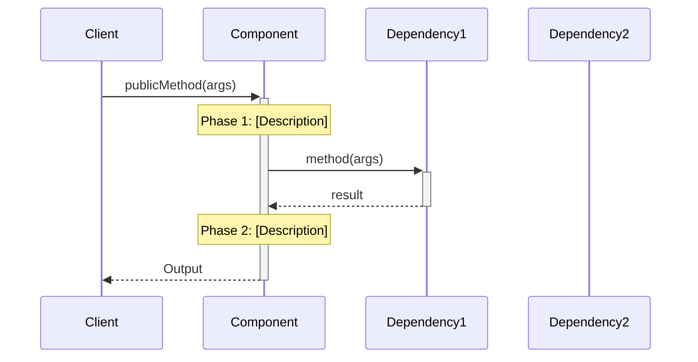
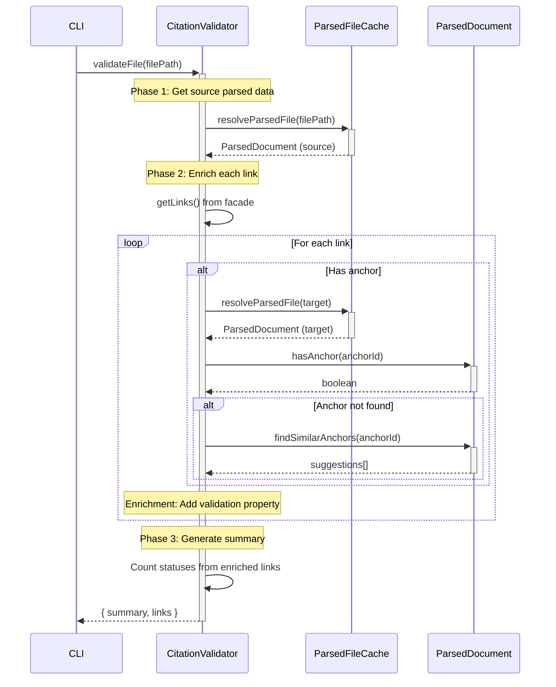

# Whiteboard: Component Implementation Guide Skill

**Date**: 2025-11-29
**Phase**: Discovery & Ideation

## Problem Statement

Engineers and agents module guides that:
1. **Capture stable contracts**: Interfaces, data shapes, input/output contracts - the things that should NOT change
2. **Document high-level implementation patterns**: How the component works conceptually (complements actual code)
3. **Maintain consistency** across all component guides
4. **Enable autonomous agent execution** with clear contracts and pseudocode
5. **Link to architecture principles** showing how design decisions align with system standards

**Scope**: These guides complement (not replace) actual code implementation. They provide conceptual understanding and contract stability while code references provide implementation details.

**Current state**: We have implementation guides with varying quality and structure. Need to extract patterns from best example (Markdown Parser) and codify into reusable skill.

## Template Analysis: Markdown Parser Implementation Guide

### Structural Elements (Sections Present)

| Section | Lines | Purpose | Required | Status in CitationValidator |
|---------|-------|---------|----------|---------------------------|
| **Problem** | 4-8 | Frame the gap from consumer perspective | ✅ Required | ✓ Present |
| **Solution** | 10-18 | Component's role, approach, data contracts | ✅ Required | ✓ Present |
| **Impact** | 20-26 | Solution → Outcome → Architecture Principles (table) | ✅ Required | ✗ **MISSING** |
| **Structure** | 28-97 | Mermaid class diagram + component list | ✅ Required | ✓ Present |
| **File Structure** | 99-135 | Current implementation tree, line counts, tech debt | ✅ Required | ✓ Present |
| **Component Workflow** | 137-191 | Sequence diagram + high-level flow + integration points | ✅ Required | ✗ **MISSING** |
| **Public Contracts** | 192-203 | Input/Output requirements | ✅ Required | ✓ Present |
| **Data Contracts** | 204-492 | TypeScript interfaces + JSON examples + tables | ✅ Required | ✓ Present |
| **Testing Strategy** | 493-516 | Philosophy + test categories + contract validation | ✅ Required | ✓ Present |
| **Whiteboard** | 518-735 | Deep technical Q&A, layer breakdown, research dates | 🔶 Optional | ✗ **MISSING** |
| **Technical Debt** | 737-748 | GitHub query for component issues | 🔶 Optional | ✓ Present (very detailed) |
| **Research** | 750-899 | External tool analysis, third-party extensions | 🔶 Optional | ✗ **MISSING** |

### Pattern 1: Overview Section Structure

**Header Depth Pattern** (Template: Lines 4-30):

```markdown
## Overview                                    ← H2: Section title
[One-line component summary]                  ← Concise description

### Problem                                   ← H3: Subsection
- [Consumer need]
- [Current gap/pain]
- [Why it matters]

### Solution                                  ← H3: Subsection
- The [Component] acts as [role]. It:
  - [capability 1]
  - [capability 2]
- The [Output]:
  - [how it's consumed]
  - [what it contains]

### Impact                                    ← H3: Subsection
[Table: Solution → Impact → Principles]

---                                           ← Horizontal rule separator
```

**Link Pattern Rules**:

1. **External component first mention** → Link to parent architecture doc:
   - **Format pattern**: Link text with bold+code formatting, relative path to ARCHITECTURE doc, anchor with parent prefix
   - **Real example** (line 8): CitationValidator component linked to architecture definition
   - **When**: First time mentioning component from same system

2. **Internal data structure first mention** → Link to section in THIS guide with component prefix:
   - **Format pattern**: Component name + dot + data structure name in link text, anchor to section in current doc
   - **Real example** (line 16): MarkdownParser.ParserOutput links to Data Contracts section
   - **Real example** (line 19): MarkdownParser.Link Objects links to LinkObject Interface
   - **Purpose**: Root the concept by showing which component owns it

3. **Architecture principle links** → Link to principle docs with anchors:
   - **Format pattern**: Uses relative paths to architecture principle documents with specific anchors
   - **Real example** (line 25): Links to Data-First Design Principles section

**Tone & Style**:

- **One-line summary** (line 5): Active verb + object + purpose
  - Example: "Parses markdown files into structured ParserOutput objects containing links, anchors, and headings for consumption by CitationValidator and ContentExtractor."
- **Problem bullets**: Consumer perspective, concrete pain points
- **Solution bullets**: Role metaphor + capabilities + value
- **Impact table**: Shows **how** design decisions align with architecture standards

**Impact Table Purpose** (Lines 21-28):

| Column | Purpose | Example |
|--------|---------|---------|
| **Solution** | What design decision was made | "Well defined interfaces and data shapes" |
| **Impact** | Measurable outcome for engineers | "Less errors when navigating and consuming data" |
| **Principles** | Architecture principle this demonstrates | Link to Data-First Design Principles |

**Why it exists**: Connects implementation choices to project-wide architecture standards, showing intentional alignment (not accidental).

**Horizontal Rule** (Line 30): Separates high-level Overview from detailed Structure section below.

---

### Pattern 2: Visual-First Documentation

**Principle**: Diagrams before text, mermaid for all visualizations.

**Structure Diagram** (Template: Lines 35-91):
- **Format**: Mermaid class diagram
- **Shows**: Data contracts, relationships, cardinality
- **Follows with**: Numbered list explaining each element

**Component Workflow** (Template: Lines 142-166):
- **Format 1**: Mermaid sequence diagram
- **Format 2**: Text-based flow diagram with ASCII tree
- **Format 3**: Bullet list of integration points

**Example sequence diagram structure**:



**Example text flow**:

```text
publicMethod(args) → Output
├── PHASE 1: [Description]
│   └── dependency.method() → intermediate
├── PHASE 2: [Description]
│   └── processing → result
└── RETURN: Output structure
```

**Missing in CitationValidator**: Sequence diagram showing validation workflow phases.

---

### Pattern 3: Contract-First with Examples

**Public Contracts Section** (Template: Lines 192-203):

```markdown
## Public Contracts

### Input Contract
The component's contract requires the following inputs for operation:
1. [Interface/dependency 1], provided at [when]
2. [Interface/dependency 2], provided at [when]
3. [Parameter], provided to [method]

### Output Contract
1. The [method] returns a [type] that [description]
```

**Data Contracts Section** (Template: Lines 204-367):

```markdown
## Data Contracts

TypeScript interfaces defining [component] output structure. Source: `[file path]`

> [!danger] Technical Lead Note
> [Critical information about contract usage/limitations]

### [InterfaceName] Interface

```typescript
export interface InterfaceName {
  /** JSDoc comment */
  field: type;
}
```

**Contract Examples** (Template: Lines 369-478):

```markdown
### [ContractName] Example

> **Note**: [Important clarification about the example]

```json
{
  "field": "value"
}
```

**Pattern observed**:
- TypeScript interfaces FIRST (lines 214-366)
- JSON examples SECOND (lines 369-478)
- Tables for special cases THIRD (lines 480-492)

---

### Pattern 4: Progressive Disclosure in Workflow

**High-Level Flow** (Template: Lines 168-183):

```text
mainMethod(input) → Output
├── STEP 1: [verb phrase] → intermediate
├── STEP 2: [verb phrase] → intermediate
│   ├── Pattern: [specific case] → classification
│   ├── Pattern: [specific case] → classification
│   └── Pattern: [specific case] → classification
└── STEP 3: [verb phrase] → Output
```

**Key Integration Points** (Template: Lines 185-191):
- **[Library/Component]**: [What it does for this component]
- **[Library/Component]**: [What it does for this component]

**Whiteboard Deep Dive** (Template: Lines 520-735):

```markdown
## Whiteboard

## [Specific Technical Question]

**Key Question**: [The exact question being answered]

**Answer**: [Summary answer first, details follow]

### Layer 1: [Approach Name]

**Code Location**: `[file]` lines [range]

[Code example or detailed explanation]

**What [tool/library] creates**:
- [Output 1]
- [Output 2]

**[Section] used by**:
- [Consumer 1] - [Usage description]
- [Consumer 2] - [Usage description]
```

**Pattern observed**:
1. Start with sequence diagram (visual, scannable)
2. Provide text flow (scannable alternative)
3. List integration points (quick reference)
4. Deep technical details in Whiteboard section (progressive disclosure)

---

### Pattern 5: Context Integration Throughout

**Architecture Principle Links**:
- Impact table links to specific principles with anchors
- Technical debt issues reference principles (line 483)
- File naming patterns referenced (line 134)

**Component Interaction Notes**:
- Every section mentions integration points
- Structure diagram shows all dependencies
- Boundaries section clarifies responsibilities

**Example integration callouts**:
- Line 17: "wrapped by the ParsedDocument facade before being consumed by other components"
- Line 185: "marked.js: Standard markdown tokenization (CommonMark spec)"
- Line 96: Links to other component guides

---

### Pattern 6: Implementation Reality

**Current vs Proposed**:
- Line 99: "Current Structure (TypeScript Implementation)"
- Line 134: "Technical Debt: The current monolithic structure violates..."

**Concrete Metrics**:
- Line 108: "~640 lines"
- Line 732: "Research Date: 2025-10-07"
- Line 733: "POC Validation: Section extraction (7/7 tests) + Block extraction (9/9 tests) = 100% success rate"

**Known Limitations**:
- Line 209: Technical Lead Note about unused .headings[] array
- Line 491: "See [Issue 5] for MVP technical debt discussion"

**Migration Strategies**:
- Line 134: Proposes component folder refactoring
- Links to GitHub issues for tracking

---

## CitationValidator Gap Analysis

### Missing Patterns

1. **Impact Table**: No table linking validation enrichment pattern → data reduction → data-first principles
2. **Component Workflow Diagram**: Has pseudocode (good!) but missing sequence diagram showing validation phases
3. **Whiteboard Section**: No deep technical Q&A section (e.g., "How does enrichment eliminate duplication?")
4. **Research Section**: No external tool comparison (e.g., how do other validators handle enrichment?)

### Strengths to Preserve

1. **Detailed Technical Debt**: Issues 1-4 are comprehensive with resolution strategies
2. **Pseudocode**: Includes implementation pseudocode with line number references
3. **Enrichment Pattern**: Well-documented US1.8 pattern with clear explanation
4. **Test Strategy**: Comprehensive with contract validation focus

---

## Emerging Skill Structure

### Required Sections (in order)

1. **Problem** (Frame consumer need and gap)
2. **Solution** (Component role and approach)
3. **Impact** (Table: Solution → Outcome → Principle)
4. **Structure** (Mermaid class diagram + element list)
5. **File Structure** (Current tree + line counts + tech debt notes)
6. **Component Workflow** (Sequence diagram + text flow + integration points)
7. **Public Contracts** (Input + Output requirements)
8. **Data Contracts** (TypeScript interfaces + JSON examples + tables)
9. **Testing Strategy** (Philosophy + categories + validation pattern)
10. **Whiteboard** (Deep technical Q&A, research dates, POC validation)
11. **Technical Debt** (GitHub query + detailed issues)
12. **Research** (Optional: External tool analysis)

### Visual Requirements

- **Mermaid diagrams**: Structure (class) + Workflow (sequence)
- **Text diagrams**: ASCII tree for high-level flow
- **Tables**: Impact, special cases, comparisons

### Content Requirements

- **Architecture principle links**: Throughout, with block anchors
- **Component interaction notes**: Every section
- **Concrete metrics**: Line counts, test counts, dates
- **Progressive disclosure**: High-level → detailed (workflow → whiteboard)

---

## Test Application: CitationValidator Improvements

### What to Add

1. **Impact Table**:

```markdown
| Solution | Impact | Principles |
|----------|--------|------------|
| Enrichment pattern (add validation to LinkObject) | 80% reduction in data duplication | [Data-First Design](link), [One Source of Truth](link) |
| Discriminated union ValidationMetadata | Illegal states unrepresentable (no valid+error state) | [Illegal States Unrepresentable](link) |
| ParsedDocument facade integration | Zero direct data structure access from validator | [Modular Design](link) |
```

1. **Component Workflow Sequence Diagram**:



claudeclaude

### Estimated Improvement Impact

| Before | After | Change |
|--------|-------|--------|
| No Impact table | Impact table with 3 rows | Shows architecture alignment |
| Pseudocode only | Pseudocode + sequence diagram | Visual workflow clarity |
| No whiteboard | Whiteboard with enrichment Q&A | Deep technical context |
| Good tech debt docs | Keep as-is | Already comprehensive |

**Total addition**: ~150 lines (Impact table + sequence diagram + whiteboard section)
**Readability improvement**: High (visual hierarchy + progressive disclosure)
**Agent execution improvement**: Medium (sequence diagram helps understand flow)

---

## Next Steps for Skill Development

1. **Create formal requirements** defining all mandatory sections
2. **Design template structure** with placeholders and examples
3. **Create skill prompt** with:
   - Section-by-section instructions
   - Mermaid diagram templates
   - Contract documentation patterns
   - Whiteboard Q&A format
4. **Test with CitationValidator** as first iteration
5. **Validate with ContentExtractor** as second iteration
