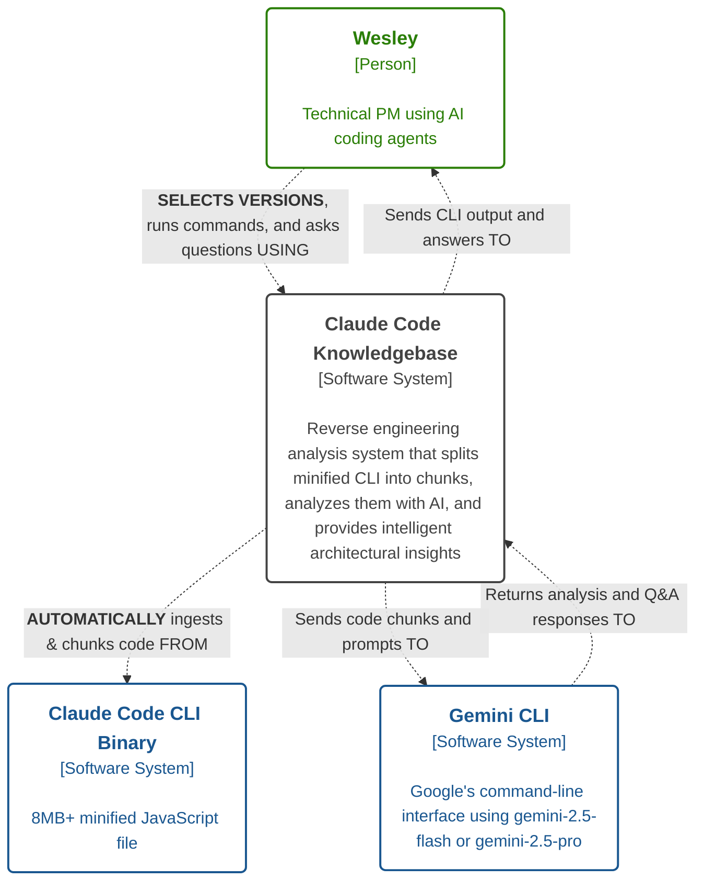

# [System Name] - Architecture

> [!attention] **AI Master Instruction**
> **CRITICAL**: Instructions for the AI are in callouts using this format: > [!attention] **AI {{task instruction title}}**
> **CRITICAL**: Goals for a document section are in callouts using this format: > [!done] **AI {{section}} Goal**
> **CRITICAL**: Content the AI must populate are in [single brackets]. [Further instructions on how to populate, style, and length of the content are in between the brackets]
> **CRTICAL**: Examples of content are in callouts using this format: > [!example] **AI {{section}} Example**
> **CRTICAL**: All other callouts and text outside of [brackets] are content that should be populated in the final document
>
> **Prime Directive #1: C4 Model Adherence.** Always structure architectural thinking through the four levels: Context (system boundaries), Containers (deployable units), Components (grouped functionality), and Code (implementation details). Each level serves a specific purpose and audience.
>
> **Prime Directive #2: Living Document Approach.** Treat this as a baseline architecture that evolves with features. Use the enhancement markup system (`==new functionality==` and `%% impact analysis %%`) to track changes while maintaining document coherence.
>
> **Prime Directive #3: Evidence-Based Decisions.** Support all architectural choices with concrete rationale: performance requirements, team constraints, technology capabilities, or business needs. Avoid "architecture astronaut" solutions.
>
> **Prime Directive #4: Implementation Reality.** Balance architectural idealism with delivery constraints. Choose patterns teams can successfully implement and maintain within project scope and timeline.
>
> - All ==enhancements== to the `Architecture Baseline` and/or ==new functionality is highlighted==, unless otherwise noted.
> - - ==Enhancements== are written as if the functionality already exists and has been merged into production. Do not use future tense or phrases like "...now includes...", or "...now interacts with..."
> - Enhancement additions and modification overviews are often included in markdown %% comment tags so they do not display in the read mode%%. This allows the llm to easily identify the feature's impact, while still maintaining the format of the `Architecture Baseline`. When it comes time to merge the feature architecture into the `Architecture Baseline`, we will programmatically strip the %% comment %% tags from the document.
<!-- -->
> [!danger] **Critial LLM Initialization Instructions**
> When first reading this file, you MUST IMMEDIATELY run citation manager to extract base paths: `npm run citation:base-paths <this-file-path> -- --format json`. Read ALL discovered base path files to gather complete architectural context before proceeding.
<!-- -->
> [!done] **AI System Purpose Statement Goal**
> **Establish System Identity and Value**
> Clearly articulate what this system does, who it serves, and why it exists before diving into architectural details.
> > [!attention] **Key Elements to Address:**
> > - What is the core business problem this system solves?
> > - Who are the primary users and what value do they receive?
> > - How does this system fit into the larger ecosystem?
> > - What makes this system unique or necessary?

[2-3 sentences: System identity + User value + Business context. Sentence 1: Clear statement of what this system does and its primary purpose. Sentence 2: Who uses it and what specific value they receive. Sentence 3: How it fits into broader business or technical ecosystem.]

> [!example] **AI System Purpose Statement Example**
> Claude Code Knowledgebase is a reverse engineering static analysis system that enables product managers, developers, and AI-assisted development practitioners to understand how Claude Code CLI works internally. Rather than relying on incomplete documentation that can't keep up with daily releases, this tool provides direct access to architectural insights from the actual codebase. The system breaks down Claude Code's massive 8.6MB minified binary into manageable chunks for AI analysis, solving the fundamental problem that traditional tools like RepoMix can't handle such large minified codebases.
<!-- -->
> **Note**: This document is intended to be a living document. Update the document immediately when code changes affect architecture.

## ==Feature Overview==

> [!done] **AI Feature Overview Goal**
> **Highlight New Capabilities**
> Use this section when documenting enhancements to an existing system baseline. Clearly communicate what new functionality has been added and how it enhances the existing system. For new systems, do not highlight since it is not an enhancement.
> > [!attention] **AI Feature Overview Instructions:**
> > - What new capabilities does this feature add to the existing system?
> > - How does it change user workflows or system behavior?
> > - What architectural components are impacted or added?
> > - How does this feature integrate with the existing architecture baseline?

==**[Feature name: Brief description of the new capability or enhancement being added to the existing system]**: 2-3 sentences describing the feature implementation. Sentence 1: What the feature implements and its key capabilities. Sentence 2: What user value it provides.

> [!example] **AI Feature Overview Example**
> **Version Based Analysis Repository**: This feature implements version-based analysis repository restructuring with automation to organize Claude Code analyses by version number while eliminating manual binary handling friction. The feature addresses the current flat directory structure that cannot accommodate multiple versions; and, automates the time-consuming manual steps of binary location, movement, and beautification that currently waste 15-20 minutes per analysis cycle.

## Target Users

> [!done] **AI Target Users Goal**
> **Define User Context and Needs**
> Establish who uses this system and what they're trying to accomplish. Clearly identify the primary user and secondary users who benefit from the system.
> > [!attention] **AI Target Users Instructions:**
> > - Who is the primary user and what are their main goals?
> > - What secondary users interact with the system and why?
> > - How does each user type derive value from the system?
> > - What are the key use cases and interaction patterns for each user type?

**Primary User**: [Primary user role] - [Brief description of their goals and context]

**Secondary Users**:
- **[User Role 1]**: [How they use the system and what value they receive]
- **[User Role 2]**: [Their specific use cases and benefits]
- **[User Role 3]**: [Their interaction pattern and outcomes]

> [!example] **AI Target Users Example**
> **Primary User**: Product Manager (Wesley) building portfolio for job applications and learning proven architectural patterns for AI-assisted development projects
>
> **Secondary Users**:
> - **PMs without dev backgrounds**: Learning practical patterns from working systems
> - **AI-assisted developers**: Understanding architecture that scales beyond simple projects
> - **Community members**: Getting answers to "how does this work?" questions

---
## Core Architectural Principles

> [!done] **AI Core Architectural Principles Goal**
> **Establish Design Philosophy**
> Define the guiding principles that drive architectural decisions throughout the system, derived from the four Prime Directives.
> > [!attention] **AI Core Architectural Principles Instructions:**
> > - Create 2-5 principles.
> > - Write for scannability, impact, and clarity
> > - How do the Prime Directives (C4 Model, Living Document, Evidence-Based, Implementation Reality) apply to your specific system?
> > - What fundamental beliefs guide your design decisions within these directives?
> > - What trade-offs do you consistently make and why, based on evidence and implementation constraints?
> > - How do these principles address your specific system constraints while maintaining architectural clarity?

The system's design is guided by core principles that prioritize [primary values like simplicity, performance, maintainability] and [architectural approach].

### [Principle 1 Name]
- **[Key Concept]**: [Explanation of how this principle applies to your system and aligns with Prime Directives]
- **[Implementation Approach]**: [How this principle is realized in practice with evidence-based decisions]

...[repeat for as many principles are needed]

> [!example] **AI Core Architectural Principles Example**
> ### Modular and Simple Design
> - **Single Responsibility**: Each component handles one specific concern, making the system easier to understand and maintain while supporting C4 model clarity at each level
> - **Simplicity First**: Favor direct solutions over complex ones, using standard approaches instead of introducing unnecessary frameworks, prioritizing implementation reality over architectural idealism

---
## Document Overview

> [!attention] **AI Document Overview Instructions:**
> - Customize the System name and purpose

This document captures the baseline architecture of the [System Name] to enable [System name primary purpose]. When implementing improvements or new capabilities, this baseline serves as the reference point for identifying which containers, components, and code files require modification.

### C4 Methodology

> [!attention] **AI C4 Methodology Instructions:**
> Always include this section to establish the architectural framework being used.

The C4 model decomposes complex architecture by drilling down through four levels: **Context** (system boundaries), **Containers** (deployable units), **Components** (grouped functionality), and **Code** (implementation details). This structured approach enables understanding of the system at appropriate levels of detail, from high-level system interactions down to specific file and class implementations.

---
## Core Architectural Style

> [!done] **AI Core Architectural Style Goal**
> **Establish High-Level System Context**
> Provide the essential information stakeholders need to understand the system's role and approach.
> > [!attention] **AI Core Architectural Style Instructions:**
> > - What is the system's primary architectural pattern and why was it chosen?
> > - How do users and external systems interact with this system?
> > - What are the key operational characteristics (runtime, deployment, scaling)?
> > - What problems does this architectural approach solve?

### Architecture Pattern
[Primary architectural or software design pattern name]

### Key Characteristics
- **Interaction Style:** [How users/systems interact with this system]
- **Runtime Model:** [How the system executes and processes work]
- **Deployment Model:** [How the system is deployed and operated]
- **Scaling Approach:** [How the system handles growth and load]

### Rationale
[2-3 bullets explaining why this pattern was chosen and what problems it solves]

> [!example] **AI Core Architectural Style Example**
> <!-- markdownlint-disable-next-line -->
> ### Core Architectural Style
> **Architecture Pattern:** Batch Processing Pipeline + CLI Query Interface
> **Rationale:**
> - Chosen to efficiently process and analyze large, minified codebases that can't be handled in a single pass.
> - CLI interface prioritizes developer speed of iteration, scripting, and local troubleshooting.
>
> **Key Characteristics:**
> - **Interaction Style:** CLI-based, streaming outputs for immediate feedback.
> - **Runtime Model:** Local batch jobs plus user-driven interactive queries.
> - **Deployment Model:** Fully self-contained; no cloud dependencies.
> - **Scaling Approach:** Chunk-based parallel batch operations, recoverable from failures.

---
## Level 1: System Context Diagram

> [!done] **AI Level 1: System Context Diagram Goal**
> **Show System Boundaries and External Relationships**
> Identify all external actors and systems that interact with your system.
> > [!attention] **Context Definition:**
> > - Who are the people (actors) that use this system?
> > - What external systems does this system depend on or interact with?
> > - What are the key data flows between your system and external entities?
> > - Why does each relationship exist?

%%
> [!attention] **AI System Context: Impact Analysis Comment Block Instructions:**
> Include this comment block when documenting feature enhancements. This gives AI and other users context on the impact analysis of a new feature on the existing architecture. When the feature architecture document is merged with the baseline architecture document, these comment blocks will be stripped.

### System Context: Impact Analysis
[Describe whether new systems/actors are introduced or if existing interactions change. 2-5 sentences].

#### Key Interaction Changes
1. **[Actor] to [System]**: [Description of the impact]
2. **[System] to [External System]**: [Description of new or changed relationships]
%%

### System Context Diagram
> [!attention] **AI System Context Diagram Instructions:**
> - The mermaid diagram uses {{double-handlebar}} variables to indicate information the AI should populate
> - The mermaid diagram uses [brackets] as part of its display. For example, [{{actor-type}}] would resolve to [Person]
> - Actor interactions use the format: descriptive action in normal text then "USING", i.e. "Runs commands, and asks questions USING"
>   - Enhancements use ALL CAPS to distinguish impacts from existing interactions, i.e. "SELECTS VERSIONS, runs commands, and asks questions USING"
> - System interactions use the format: descriptive action in normal text then then direction FROM, TO, or FROM/TO. Example: "Sends code chunks and prompts TO"
>   - Enhancements use ALL CAPS to distinguish impacts from existing interactions, i.e. "<b>AUTOMATICALLY</b> ingests & chunks code FROM"
> - <b>ALL ENHANCEMENTS</b> are wrapped in bold tags

```mermaid
graph TB
    {{actor-name|system-name}}("<b style="font-size: 1.15em;">{{actor-name|system-name}}</b><br />[{{type:Person|Software System|External System}}]<br/><br/>[Concise description of their role or system. One sentence or sentence fragment]")

    {{actor-name}} -.->|"{{Interaction description}} USING"| {{system-name}}

    {{system-name}} -.->|"{{<b>ENHANCEMENT ACTION</b> description}} {{TO|FROM|FROM/TO}}"| {{external-system}}
    {{external-system-name}} -.->|"{{Response description}} {{TO|FROM|FROM/TO}}"| {{system-name}}

    %% Color coding for C4 diagram clarity
    classDef person stroke:#2a7e06, stroke-width:2px, color:#2a7e06, fill:transparent
    classDef softwareSystemFocus stroke:#444444, stroke-width:2px, color:#444444, fill:transparent
    classDef softwareSystemExternal stroke:#1a5790, stroke-width:2px, color:#1a5790, fill:transparent

    class {{actor-name}} person
    class {{system-name}} softwareSystemFocus
    class {{system-name}} softwareSystemExternal
```

> [!example] **AI System Context Diagram Example**
> - Use the mermaid code block below as an example

#### Example



---

## Level 2: Containers

%%
### Container Level: Impact Analysis
[Include this comment block when documenting feature enhancements]

At the container level, [describe how new containers are added or existing containers are modified].

#### Key Container Changes
- **[Container Name]**: [Description of how this container is impacted]
- **[New Container]**: [Description of new container and its purpose]
%%

> [!ai-objective] **Goal: Define Major System Building Blocks.** Identify the key applications, services, and data stores that make up your system.
>
> [!ai-prompt-guidance] **Container Identification:**
> - What are the major executable/deployable units in your system?
> - How do users interact with these containers?
> - What technologies does each container use?
> - What are the key responsibilities of each container?

### Container Diagram

> [!attention] **AI Container Diagram Instructions:**
> - The mermaid diagram uses {{double-handlebar}} variables to indicate information the AI should populate
> - The mermaid diagram uses [brackets] as part of its display. For example, [{{technology}}] would resolve to [Node.js]
>
> **Interaction Pattern Rules:**
>
> 1. **Actor/Person → Container:** Always use "USING" format
>    - Format: `"<div>{Action description} USING</div><div style='font-size: 85%'>[{technology}]</div>"`
>    - Example: `"Builds, tests, and manages tools USING" / "[CLI commands]"`
>
> 2. **Container → Container (within system):** Two options
>    - **Option A - Directional:** Use TO, FROM, or both (can combine with `<br />` for multiple relationships)
>      - Example: `"Persists data TO<br />Chunks code FROM" / "[node.js]"`
>    - **Option B - Simple verbs:** No preposition needed (can add context in parentheses)
>      - Example: `"Manages (orchestration, testing, quality, build)" / "[npm]"`
>      - Example: `"Calls" / "[Gemini CLI Wrapper]"`
>
> 3. **Container ↔ External System:** Can use directional prepositions, simple verbs, or passive voice
>    - Example: `"Calls" / "[Gemini CLI]"`
>    - Example: `"IS USED BY" / "[CLI commands]"` (passive voice, ALL CAPS)
>    - Example: `"Ingests FROM" / "[node.js]"`
>
> 4. **Enhancements:** Wrap emphasis text in `<b>CAPS TEXT</b>` tags
>    - Example: `"<b>AUTOMATICALLY</b> discovers and runs tests" / "[vitest]"`

```mermaid
graph LR
  subgraph [systemName] ["[System Name]"]
    direction LR
    style [systemName] fill:#fafafa, stroke:#555555

    subgraph [containerGroup1] ["[Container Group 1]"]
      direction TB
      style [containerGroup1] fill:transparent, stroke:#555555

      [container1]["<div style='font-weight: bold'>[Container 1 Name]</div><div style='font-size: 85%; margin-top: 0px'>[Technology Stack]</div><div style='font-size: 85%; margin-top:10px'>[Brief description]</div>"]
      style [container1] fill:#438dd5,stroke:#2e6295,color:#ffffff

      [container2]["<div style='font-weight: bold'>[Container 2 Name]</div><div style='font-size: 85%; margin-top: 0px'>[Technology Stack]</div><div style='font-size: 85%; margin-top:10px'>[Brief description]</div>"]
      style [container2] fill:#438dd5,stroke:#2e6295,color:#ffffff
    end

    subgraph [containerGroup2] ["[Container Group 2]"]
      direction TB
      style [containerGroup2] fill:transparent, stroke:#555555

      [container3]["<div style='font-weight: bold'>[Container 3 Name]</div><div style='font-size: 85%; margin-top: 0px'>[Technology Stack]</div><div style='font-size: 85%; margin-top:10px'>[Brief description]</div>"]
      style [container3] fill:#438dd5,stroke:#2e6295,color:#ffffff
    end

    [container1]-.\"<div>[Interaction description]<br/>[Technology]</div>\".-> [container3]
    [container2]-.\"<div>[Interaction description]<br/>[Technology]</div>\".-> [container3]
  end

  [actor1]["<div style='font-weight: bold'>[Actor Name]</div><div style='font-size: 85%; margin-top: 0px'>[Person]</div><div style='font-size: 85%; margin-top:10px'>[Description]</div>"]@{ shape: circle }
  style [actor1] fill:#08427b,stroke:#052e56,color:#ffffff

  [externalSystem]["<div style='font-weight: bold'>[External System]</div><div style='font-size: 85%; margin-top: 0px'>[Software System]</div><div style='font-size: 85%; margin-top:10px'>[Description]</div>"]
  style [externalSystem] fill:#999999,stroke:#6b6b6b,color:#ffffff

  [actor1]-.\"<div>[User interaction] USING</div><div style='font-size: 85%'>[Interface]</div>\".-> [container1]
  [container3]-.\"<div>[Integration] TO</div><div style='font-size: 85%'>[Protocol]</div>\".-> [externalSystem]
```

### [Container 1 Name]
- **Name:** [Container Name]
- **Technology:** [Primary technologies used]
- **Technology Status:** [Development status: Prototype, Production, etc.]
- **Description:**
  - [Primary responsibility and key capabilities]
  - ==**[Enhancement description if documenting new features]**==
- **User Value:** [How this container delivers value to users]
- **Interactions:**
  - _[interaction type]_ [target container/system] ([synchronous/asynchronous])

### [Container 2 Name]
- **Name:** [Container Name]
- **Technology:** [Primary technologies used]
- **Technology Status:** [Development status]
- **Description:** [Purpose and key capabilities]
- **User Value:** [Value delivered]
- **Interactions:**
  - _[interaction type]_ [target] ([timing])

---

## Level 3: Components

%%
### Component Level: Impact Analysis
[Include this comment block when documenting feature enhancements]

#### [Container Name] Components
[Describe impact on components within each container]

##### New Components
- **[New Component Name]**: [Description of new component and its purpose]

##### Modified Components
- **[Existing Component Name]**: [Description of modifications]
%%

> [!ai-objective] **Goal: Detail Internal Container Structure.** Break down each container into its key components and their relationships.
>
> [!ai-prompt-guidance] **Component Organization:**
> - What are the major functional groupings within each container?
> - How do components within a container interact?
> - What are the key responsibilities of each component?
> - Which components are most critical to the container's function?

<!-- markdownlint-disable-next-line -->
### [Container Name] Components

#### [Container Name].[Component Name]
- **Path(s):** `[file/directory paths]`
- **Technology:** [Technologies used by this component]
- **Technology Status:** [Development status]
- **Description:** [What this component does and its responsibilities]
- **Interactions:**
  - _[interaction type]_ [target component/system] ([timing characteristics])

#### ==[Container Name].[New Component Name]==
- ==**Path(s):** `[proposed file paths]`==
- ==**Technology:** `[Technologies]`==
- ==**Technology Status:** To Be Implemented==
- ==**Description:** [New component description for enhancements]==
- ==**Interactions:**==
  - ==_[interaction type]_ [target] ([characteristics])==

---

## Component Interfaces and Data Contracts

> [!ai-objective] **Goal: Define System Data Flows and Contracts.** Specify how components communicate and what data structures they expect.

### [Data Store/Interface Name] Data Contract

[Description of the data contract and its purpose]

- **[Data Structure 1]**: [Description and schema/format]
- **[Data Structure 2]**: [Description and usage patterns]
- **[Interface Contract]**: [API or interface definition]

**Key Contracts:**
- **[Contract Name]**: [Description of what this contract guarantees]
- **[Schema/Format]**: [Technical specification]

---

## Level 4: Code

> [!ai-objective] **Goal: Document Implementation Patterns and Organization.** Provide guidance for developers working within the system.

This level details the internal organization, key implementation patterns, and file structure of the components identified in Level 3.

### Code Organization and Structure

#### Directory Organization

```text
[system-name]/
├── [directory-1]/                    # [Purpose and contents]
│   ├── [subdirectory]/               # [Specific function]
│   └── [files]                       # [File types and purpose]
├── [directory-2]/                    # [Purpose and contents]
│   ├── [component-files]             # [Implementation files]
│   └── [supporting-files]            # [Tests, configs, etc.]
├── [config-files]                    # [Configuration and build files]
└── [documentation]                   # [Project documentation]
```

#### File Naming Patterns

- **[File Type 1]**: [Naming convention and examples]
- **[File Type 2]**: [Pattern and rationale]
- **[Configuration Files]**: [Standards and organization]

### Key Implementation Patterns

- **[Pattern Name] ([Pattern Type])**: [Description of how this pattern is used in the system and why it was chosen]
- **[Another Pattern] ([Type])**: [Implementation approach and benefits]

---

## Coding Standards and Conventions

> [!ai-objective] **Goal: Ensure Code Consistency and Quality.** Define standards that keep the codebase maintainable and consistent.

This section defines the standards for writing and organizing code to ensure consistency, clarity, and maintainability across the project.

### Guiding Principles
- **Consistency**: New code must follow established patterns and conventions
- **Clarity**: Code should be easily understood; favor descriptive names and simple structures
- **Single Responsibility**: Each module should have one clear and distinct purpose

### Formatting and Linting
- **Automated Tools**: [Tools used for formatting and linting]
- **Configuration**: [How standards are enforced]

### Naming Conventions
- **Files**: [File naming standards]
- **Functions & Variables**: [Code naming standards]
- **Constants**: [Constant naming standards]

### Code Structure Standards
- **Module System**: [Module approach used]
- **File Organization**: [How files should be structured]
- **Dependencies**: [How to handle imports and dependencies]

### Critical Integration Rules
- **[Integration Standard 1]**: [Required approach and rationale]
- **[Integration Standard 2]**: [Mandatory pattern and reasoning]

---

## Testing Strategy

> [!ai-objective] **Goal: Define Testing Approach and Quality Standards.** Establish how the system ensures reliability and maintainability.

### Philosophy and Principles

- **[Testing Philosophy]**: [Core approach to testing and quality]
- **[Quality Standards]**: [What constitutes adequate testing]
- **[Test Types]**: [Primary testing strategies used]

### Testing Categories

#### [Test Category 1] ([Coverage Level])
- **Scope**: [What this testing covers]
- **Investment Level**: [How much effort is appropriate]
- **Examples**: [Types of tests in this category]
- **Rationale**: [Why this level of investment makes sense]

#### [Test Category 2] ([Coverage Level])
- **Scope**: [Coverage area]
- **Investment Level**: [Effort level]
- **Examples**: [Test examples]
- **Rationale**: [Business justification]

### Test Implementation Strategy

- **[Test Priority Level]**: [What gets priority and why]
- **[Test Approach]**: [How tests are structured and executed]

---

## Technology Stack

> [!ai-objective] **Goal: Document Technology Decisions and Dependencies.** Provide a comprehensive view of the system's technical foundation.

| Technology/Library | Category | Version | Module | Purpose in the System | Used By (Container.Component) |
| :--- | :--- | :--- | :--- | :--- | :--- |
| **[Technology 1]** | **[Category]** | [Version] | `[module/package]` | [Purpose and role in system] | `[Container.Component]` |
| | | | `[sub-module]` | [Specific usage] | `[Specific Component]` |
| **[Technology 2]** | **[Category]** | [Version] | `[module]` | [Purpose and capabilities] | `[Usage Location]` |
| **[External Service]** | **[Category]** | [Version] | `[interface]` | [Role in system architecture] | `[Integration Point]` |

---
## Cross-Cutting Concerns

> [!ai-objective] **Goal: Address System-Wide Responsibilities.**
> Document technical infrastructure and system-wide concerns that affect multiple components. Common categories include: Configuration Management, Code Quality/Consistency, Testing Infrastructure, Dependency Management, CLI/API Execution Patterns, Error Handling, Logging, and Security. Select and customize subsections relevant to your architecture.

These are system-wide responsibilities that affect multiple components.

### Configuration Management

[Description of how the system handles configuration through centralized files, environment variables, or other mechanisms]

**Key Configuration Areas:**
- **[Config Area 1]**: [How this is configured and why]
- **[Config Area 2]**: [Configuration approach and rationale]

**Key Configuration Settings:**
[If applicable, document critical configuration with structured tables]

| Key | Type | Description |
|-----|------|-------------|
| `[config.key.path]` | `[type]` | [Description including rationale and impact] |
| `[config.key.path]` | `[type]` | [Description including rationale and impact] |

### Code Quality and Consistency (If Applicable)

[For projects with centralized linting, formatting, or code quality systems]

- **Quality Standards**: [How standards are defined and enforced]
- **Validation Pattern**: [How and when quality checks run]
- **Auto-Fix Capabilities**: [Automated correction approaches, if available]

### Testing Infrastructure (If Applicable)

[For projects with shared testing frameworks or centralized test execution]

- **Test Discovery**: [How tests are found and organized across components]
- **Execution Model**: [How tests run - isolation strategy, parallelization, etc.]
- **Test Conventions**: [Required structure, naming patterns, and organization]
- **Testing Philosophy**: [Approach to mocking vs real systems, coverage goals, test-to-code ratios]

### Dependency Management (If Applicable)

[For monorepo, multi-package, or workspace architectures]

- **Hoisting/Sharing Strategy**: [How dependencies are shared across packages/components]
- **Package Isolation**: [How components manage their specific dependencies]
- **Version Consistency**: [How versions are kept synchronized across the system]

### CLI/API Execution Pattern (If Applicable)

[For tooling, automation, or CLI-based projects]

- **Execution Model**: [How commands/APIs are invoked and orchestrated]
- **Parameter/Configuration Passing**: [How inputs and arguments are provided]
- **Output Conventions**: [How results are returned - stdout/stderr, exit codes, return values]

### Error Handling and Logging

- **Logging**: [Logging strategy and implementation - centralized vs distributed, log levels, storage]
- **Error Handling**: [How errors are handled across components]
  - **[Component/Area]**: [Specific error handling approach]
  - **[Integration Points]**: [How errors are handled at boundaries]
  - **Configuration Validation**: [How configuration errors are detected and reported, if applicable]

### Security Considerations (If Applicable)

[Describe security concerns, threat model, and security controls]

- **[Security Area 1]**: [Approach and implementation]
- **[Security Area 2]**: [Controls and rationale]

---
## Known Risks and Technical Debt

> [!ai-objective] **Goal: Acknowledge System Limitations and Risks.** Transparently document known issues and mitigation strategies.

### Known Risks
- **[Risk Category]**: [Description of the risk and its potential impact]
  - **Mitigation**: [How this risk is being addressed or monitored]

### Conscious Technical Debt

- **[Debt Item]**: [Description of the technical shortcut or limitation]
  - **Rationale**: [Why this debt was accepted]
  - **Repayment Plan**: [How and when this might be addressed]

---

## Architecture Decision Records (ADRs)

> [!ai-objective] **Goal: Document Key Architectural Decisions.** Maintain a record of important choices and their reasoning for future reference.

This section documents key architectural decisions, the context in which they were made, and their consequences.

### ADR-001: [Decision Title]
- **Status**: [Proposed | Accepted | Superseded | Deprecated]
- **Date**: [YYYY-MM-DD]
- **Context**: [The situation that required a decision, including constraints and requirements]
- **Decision**: [The architectural decision that was made]
- **Consequences**: [The results of this decision, both positive and negative]

### ADR-002: [Next Decision Title]
- **Status**: [Status]
- **Date**: [Date]
- **Context**: [Decision context]
- **Decision**: [What was decided]
- **Consequences**: [Impacts and trade-offs]

---

## Appendices

### Glossary

**[Term 1]:** [Definition and context within the system]

**[Term 2]:** [Technical definition and usage]

**[Pattern Name]:** [Architectural pattern definition and how it's applied in this system]

### References & Further Reading

**Related Architecture Documents:**
- [Document Name](path/to/document.md): [Brief description of the document's purpose]
- [Another Document](path/to/doc.md): [Why this document is relevant]

**External References:**
- [External Resource]: [Why this is useful for understanding the system]

### Architecture Change Log

| Date | Version | Level | Change Description | Author |
|------|---------|-------|-------------------|------------|
| [YYYY-MM-DD] | 1.0 | Overview | [Description of changes made] | [Author Name] |
| | | | | |
