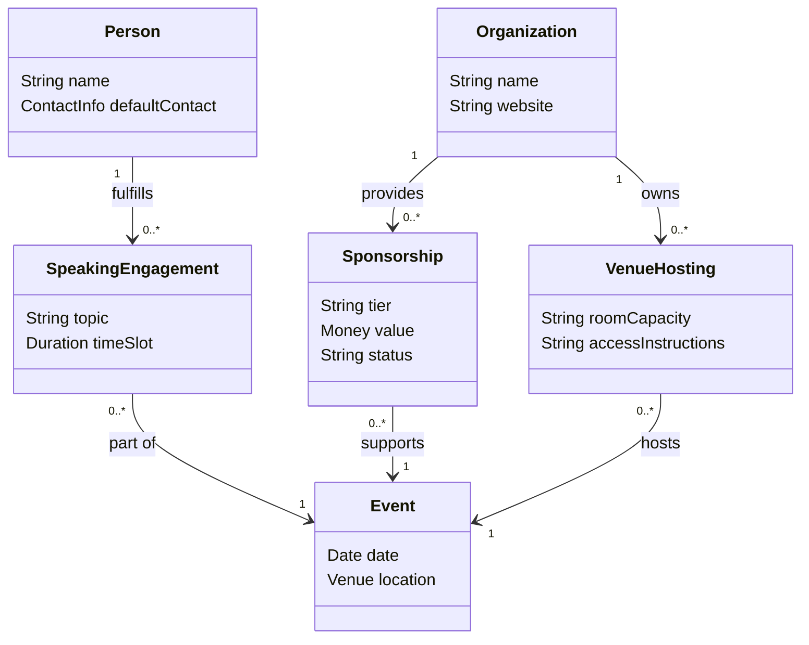
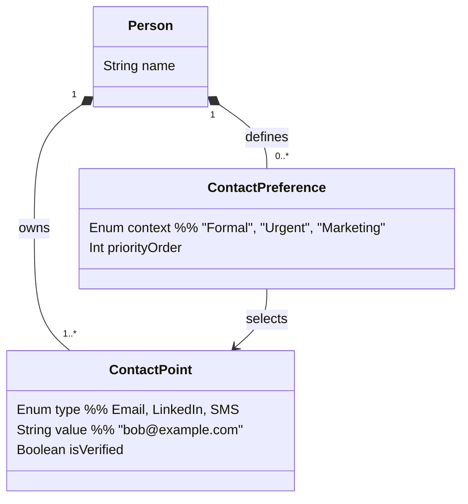
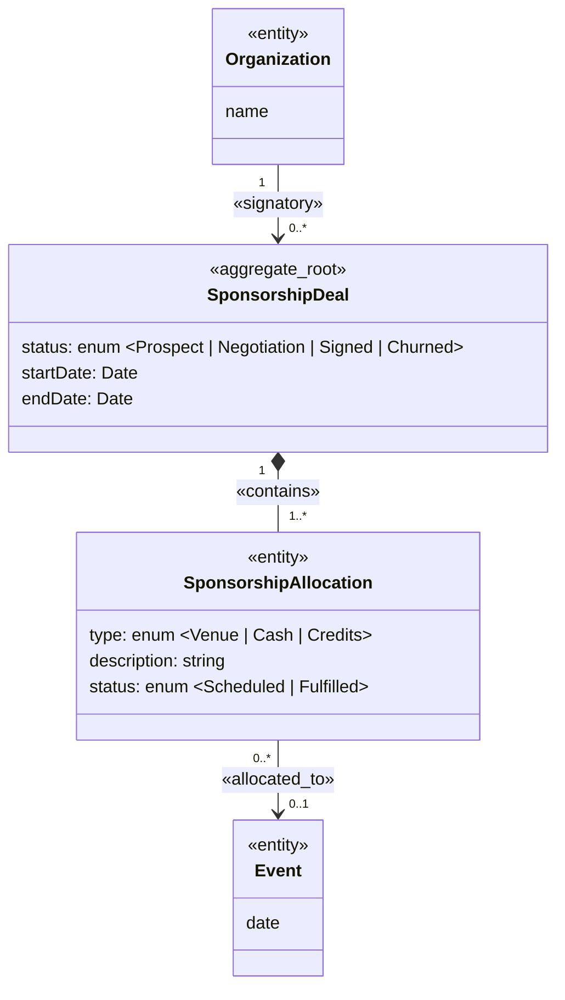
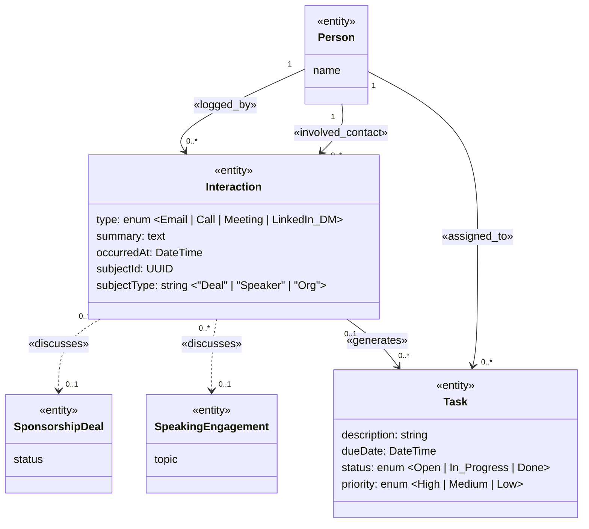
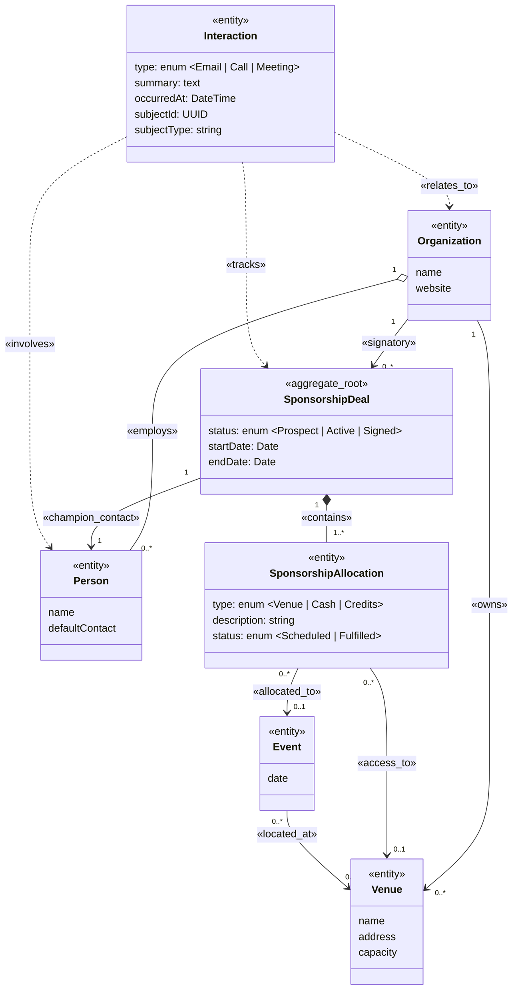
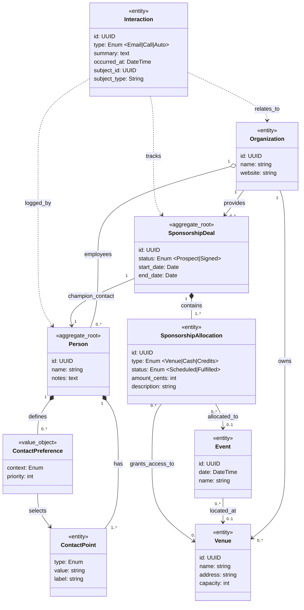
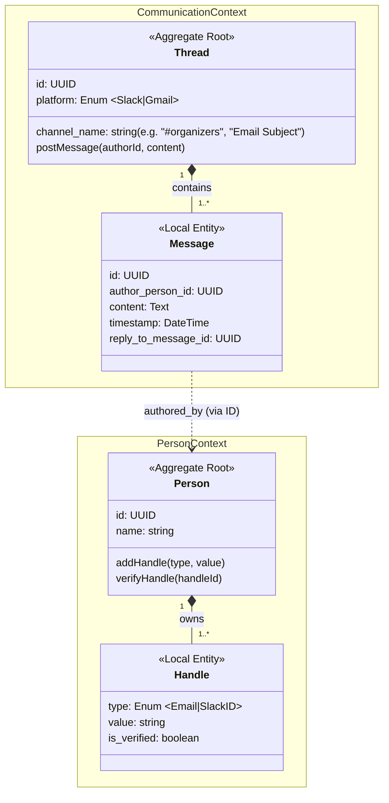
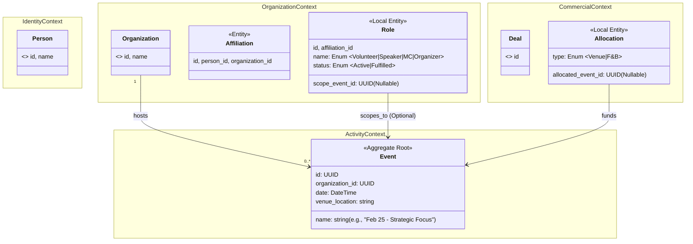

## V1

```mermaid
classDiagram
    %% Core Identities (Exist independently of any event)
    class Person {
        String name
        ContactInfo defaultContact
    }
    class Organization {
        String name
        String website
    }

    %% Core Activity (The thing happening in time)
    class Event {
        Date date
        Venue location
    }

    %% The "Linking" Entities (The Roles/Contracts)
    %% These hold the specific relationship data
    class Sponsorship {
        String tier
        Money value
        String status
    }
    class SpeakingEngagement {
        String topic
        Duration timeSlot
    }
    class VenueHosting {
        String roomCapacity
        String accessInstructions
    }

    %% Relationships
    Organization "1" --> "0..*" Sponsorship : provides
    Sponsorship "0..*" --> "1" Event : supports

    Person "1" --> "0..*" SpeakingEngagement : fulfills
    SpeakingEngagement "0..*" --> "1" Event : part of

    Organization "1" --> "0..*" VenueHosting : owns
    VenueHosting "0..*" --> "1" Event : hosts


```

## Contact

```mermaid
classDiagram
    class Person {
        String name
    }

    class ContactPoint {
        %% The actual data
        Enum type   %% Email, LinkedIn, SMS
        String value    %% "bob@example.com"
        Boolean isVerified
    }

    class ContactPreference {
        %% The Logic/Rules
        Enum context    %% "Formal", "Urgent", "Marketing"
        Int priorityOrder
    }

    %% Relationships
    Person "1" *-- "1..*" ContactPoint : owns
    Person "1" *-- "0..*" ContactPreference : defines
    
    %% The preference points to a specific contact point
    ContactPreference --> ContactPoint : selects


```

## Deal

```mermaid
classDiagram
    class Organization {
        <<entity>>
        name
    }

    class SponsorshipDeal {
        <<aggregate_root>>
        %% This tracks the PIPELINE
        status: enum ~Prospect | Negotiation | Signed | Churned~
        startDate: Date
        endDate: Date
    }

    class SponsorshipAllocation {
        <<entity>>
        %% This tracks the DELIVERABLE
        type: enum ~Venue | Cash | Credits~
        description: string
        status: enum ~Scheduled | Fulfilled~
    }

    class Event {
        <<entity>>
        date
    }

    %% Relationships
    Organization "1" --> "0..*" SponsorshipDeal : «signatory»
    
    %% The Deal holds the items
    SponsorshipDeal "1" *-- "1..*" SponsorshipAllocation : «contains»

    %% The Magic: 
    %% An allocation CAN point to an event (Pizza for March)
    %% OR it can be null (Credits for everyone all year)
    SponsorshipAllocation "0..*" --> "0..1" Event : «allocated_to»

```

## People

```mermaid
classDiagram
    %% --- EXISTING DOMAIN ---
    class Person {
        <<entity>>
        name
    }
    class SponsorshipDeal {
        <<entity>>
        status
    }
    class SpeakingEngagement {
        <<entity>>
        topic
    }

    %% --- NEW CRM ENTITIES ---
    class Interaction {
        <<entity>>
        %% What happened?
        type: enum ~Email | Call | Meeting | LinkedIn_DM~
        summary: text
        occurredAt: DateTime
        
        %% The "Subject" (Polymorphic)
        %% This ID can point to a Deal, a Speaker Slot, or an Org
        subjectId: UUID
        subjectType: string ~"Deal" | "Speaker" | "Org"~
    }

    class Task {
        <<entity>>
        %% What needs to happen?
        description: string
        dueDate: DateTime
        status: enum ~Open | In_Progress | Done~
        priority: enum ~High | Medium | Low~
    }

    %% --- RELATIONSHIPS ---

    %% 1. Who was involved?
    %% The Internal Organizer who logged it
    Person "1" --> "0..*" Interaction : «logged_by»
    
    %% The External Contact who was spoken to
    Person "1" --> "0..*" Interaction : «involved_contact»

    %% 2. What was it about? (The Polymorphic Link)
    Interaction "0..*" ..> "0..1" SponsorshipDeal : «discusses»
    Interaction "0..*" ..> "0..1" SpeakingEngagement : «discusses»

    %% 3. Next Steps
    %% An interaction can spawn a task ("Call them back")
    Interaction "0..1" --> "0..*" Task : «generates»
    
    %% A task is assigned to an organizer
    Person "1" --> "0..*" Task : «assigned_to»
```

## Map

```mermaid
classDiagram
    %% --- CORE ---
    class Organization {
        <<entity>>
        name
        website
    }
    class Person {
        <<entity>>
        name
        defaultContact
    }
    class Venue {
        <<entity>>
        name
        address
        capacity
    }
    class Event {
        <<entity>>
        date
    }

    %% --- COMMERCIAL (The Deal) ---
    class SponsorshipDeal {
        <<aggregate_root>>
        status: enum ~Prospect | Active | Signed~
        startDate: Date
        endDate: Date
    }
    class SponsorshipAllocation {
        <<entity>>
        type: enum ~Venue | Cash | Credits~
        description: string
        status: enum ~Scheduled | Fulfilled~
    }

    %% --- CRM (The Activity) ---
    class Interaction {
        <<entity>>
        type: enum ~Email | Call | Meeting~
        summary: text
        occurredAt: DateTime
        subjectId: UUID
        subjectType: string
    }

    %% --- RELATIONSHIPS ---
    %% Structural
    Organization "1" o-- "0..*" Person : «employs»
    Organization "1" --> "0..*" Venue : «owns»
    
    %% Commercial
    Organization "1" --> "0..*" SponsorshipDeal : «signatory»
    SponsorshipDeal "1" *-- "1..*" SponsorshipAllocation : «contains»
    SponsorshipDeal "1" --> "1" Person : «champion_contact»
    
    %% Logistics
    SponsorshipAllocation "0..*" --> "0..1" Event : «allocated_to»
    SponsorshipAllocation "0..*" --> "0..1" Venue : «access_to»
    Event "0..*" --> "0..1" Venue : «located_at»

    %% CRM (Polymorphic links shown as dependency)
    Interaction ..> SponsorshipDeal : «tracks»
    Interaction ..> Person : «involves»
    Interaction ..> Organization : «relates_to»


```

## V3

```mermaid
classDiagram
    %% --- CORE IDENTITIES ---
    class Organization {
        <<entity>>
        id: UUID
        name: string
        website: string
    }
    class Person {
        <<aggregate_root>>
        id: UUID
        name: string
        notes: text
    }
    class ContactPoint {
        <<entity>>
        type: Enum
        value: string
        label: string
    }
    class ContactPreference {
        <<value_object>>
        context: Enum
        priority: int
    }

    %% --- PHYSICAL ---
    class Venue {
        <<entity>>
        id: UUID
        name: string
        address: string
        capacity: int
    }
    class Event {
        <<entity>>
        id: UUID
        date: DateTime
        name: string
    }

    %% --- COMMERCIAL / PIPELINE ---
    class SponsorshipDeal {
        <<aggregate_root>>
        id: UUID
        status: Enum ~Prospect|Signed~
        start_date: Date
        end_date: Date
    }
    class SponsorshipAllocation {
        <<entity>>
        id: UUID
        type: Enum ~Venue|Cash|Credits~
        status: Enum ~Scheduled|Fulfilled~
        amount_cents: int
        description: string
    }

    %% --- CRM / ACTIVITY ---
    class Interaction {
        <<entity>>
        id: UUID
        type: Enum ~Email|Call|Auto~
        summary: text
        occurred_at: DateTime
        subject_id: UUID
        subject_type: String
    }

    %% --- RELATIONSHIPS ---
    
    %% Structural
    Organization "1" o-- "0..*" Person : employees
    Organization "1" --> "0..*" Venue : owns
    Person "1" *-- "1..*" ContactPoint : has
    Person "1" *-- "0..*" ContactPreference : defines
    ContactPreference --> ContactPoint : selects

    %% Event & Venue
    Event "0..*" --> "0..1" Venue : located_at

    %% Commercial Flow
    Organization "1" --> "0..*" SponsorshipDeal : provides
    SponsorshipDeal "1" --> "1" Person : champion_contact
    SponsorshipDeal "1" *-- "1..*" SponsorshipAllocation : contains
    
    %% Logistics / Allocation
    SponsorshipAllocation "0..*" --> "0..1" Event : allocated_to
    SponsorshipAllocation "0..*" --> "0..1" Venue : grants_access_to
    
    %% CRM Polymorphism
    Interaction ..> SponsorshipDeal : tracks
    Interaction ..> Organization : relates_to
    Interaction ..> Person : logged_by


```

## Person

```mermaid
classDiagram
    %% --- AGGREGATE ROOT 1: THE WHO ---
    namespace PersonContext {
        class Person {
            <<Aggregate Root>>
            id: UUID
            name: string
            addHandle(type, value)
            verifyHandle(handleId)
        }

        class Handle {
            <<Local Entity>>
            %% Lives inside Person
            type: Enum ~Email|SlackID~
            value: string
            is_verified: boolean
        }
    }

    %% --- AGGREGATE ROOT 2: THE CONVERSATION ---
    namespace CommunicationContext {
        class Thread {
            <<Aggregate Root>>
            id: UUID
            channel_name: string (e.g. "#organizers", "Email Subject")
            platform: Enum ~Slack|Gmail~
            postMessage(authorId, content)
        }

        class Message {
            <<Local Entity>>
            %% Lives inside Thread
            id: UUID
            author_person_id: UUID
            content: Text
            timestamp: DateTime
            reply_to_message_id: UUID
        }
    }

    %% --- RELATIONSHIPS ---
    %% Person owns their Handles
    Person "1" *-- "1..*" Handle : owns

    %% Thread owns its Messages
    Thread "1" *-- "1..*" Message : contains

    %% Cross-Aggregate Reference (By ID Only)
    Message ..> Person : authored_by (via ID)


```
## v4

```mermaid
classDiagram
    %% --- IDENTITY ---
    namespace IdentityContext {
        class Person { <<Aggregate Root>> id, name }
    }

    %% --- ORGANIZATION ---
    namespace OrganizationContext {
        class Organization { <<Aggregate Root>> id, name }
        class Affiliation {
            <<Entity>>
            %% The permanent link (Resume)
            id, person_id, organization_id
        }
        class Role {
            <<Local Entity>>
            %% The Hat they wear
            id, affiliation_id
            name: Enum ~Volunteer|Speaker|MC|Organizer~
            status: Enum ~Active|Fulfilled~
            %% THE FIX: Scoping the Role to an Event
            scope_event_id: UUID (Nullable)
        }
    }

    %% --- ACTIVITY (NEW) ---
    namespace ActivityContext {
        class Event {
            <<Aggregate Root>>
            id: UUID
            organization_id: UUID
            name: string (e.g., "Feb 25 - Strategic Focus")
            date: DateTime
            venue_location: string
        }
    }

    %% --- COMMERCIAL ---
    namespace CommercialContext {
        class Deal { <<Aggregate Root>> id }
        class Allocation {
            <<Local Entity>>
            %% Resources assigned to the event
            type: Enum ~Venue|F&B~
            allocated_event_id: UUID (Nullable)
        }
    }

    %% --- RELATIONSHIPS ---
    %% Event Ownership
    Organization "1" --> "0..*" Event : hosts

    %% The "Scoped Role" Link
    Role --> Event : scopes_to (Optional)

    %% Commercial Support
    Allocation --> Event : funds


```
