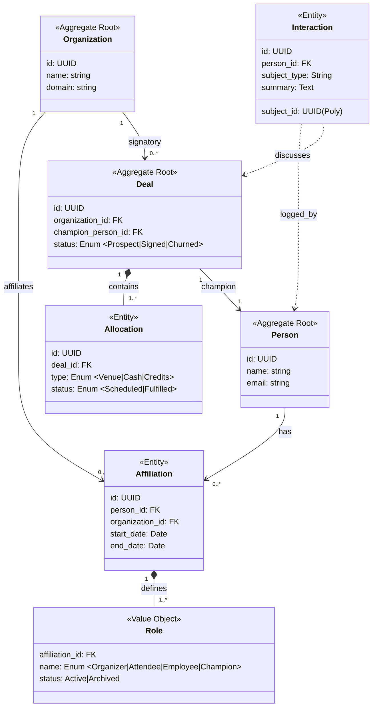

Application Architecture Update
You are correct. "SystemRole" was over-engineered. We will simplify.
We will adopt your hierarchy: Identity (Person) \rightarrow Link (Affiliation) \rightarrow Context (Role).
This model effectively handles the "Wesley Scenario" (Attendee \rightarrow Volunteer \rightarrow Organizer) by treating "ProductTank SF" as just another Organization that people can be affiliated with, exactly like "Cribl" or "Mixpanel."
Architecture Decisions:
 * Rename SponsorshipDeal to Deal: Cleaner, matches industry standard CRM language.
 * Rename SponsorshipAllocation to Allocation: Simplifies the deliverable tracking.
 * Adopt Affiliation pattern: A Person links to an Org.
 * Adopt Role pattern: An Affiliation has many Roles.
The Refined Domain Map

Scenario Validation: "The Wesley Path"
Here is how this schema handles your specific progression from Attendee to Organizer using the "ProductTank SF" Organization concept.
1. The Data:
 * Organization: "ProductTank SF"
 * Person: "Wesley Frederick"
 * Affiliation: Link between Wesley \leftrightarrow ProductTank SF
2. The Roles (Time-based evolution):
 * Role 1: Attendee (Status: Archived) - The starting point.<mark class="user-highlight" data-user-name="Wesley" data-created="2026-02-06 10:10">I am also an attendee. Some of these might not be archived</mark>
 * Role 2: Volunteer (Status: Archived) - The transition.
 * Role 3: Organizer (Status: Active) - Current state.
Scenario Validation: "The Glenn Block Reality"
Glenn requires two distinct affiliations to represent his dual context.
Affiliation A: The "Day Job"
 * Organization: Cribl
 * Person: Glenn Block
 * Role: Employee (VP/Director level implies budget authority).
 * This allows him to be the "Champion" on the Cribl Deal.
Affiliation B: The "Community History"
 * Organization: ProductTank SF
 * Person: Glenn Block
 * Role: Alumni / Advisor (The "former organizer" context implied in intro emails).
 * This explains why he sends intro emails for speakers like Vanessa.<mark class="user-highlight" data-user-name="Wesley" data-created="2026-02-06 10:11">Alumni? Vs archived organizer? Is advisor and alumni a specific called out tool?</mark>
Extraction Output (Simplified)
Based on this map, here are the core entities extracted from your source files:
Organizations:
 * ProductTank SF (The Community)
 * Cribl (The Venue Sponsor)
 * Mixpanel (The Financial Sponsor)
Deals:
 * Deal: Cribl / Feb 2026 Venue + F&B
   * Champion: Glenn Block (Affiliation: Cribl)
 * Deal: Mixpanel / April 2026 Sponsorship
   * Champion: Kara Matsune (Affiliation: Mixpanel)
Key People (with Active Roles):
 * Wesley Frederick \rightarrow Affiliation: PTSF \rightarrow Role: Organizer / MC
 * Vanessa Garber \rightarrow Affiliation: PTSF \rightarrow Role: Speaker (Feb 25)
 * Jerry Young \rightarrow Affiliation: PTSF \rightarrow Role: Organizer (AV Lead)
We are Oscar Mike
