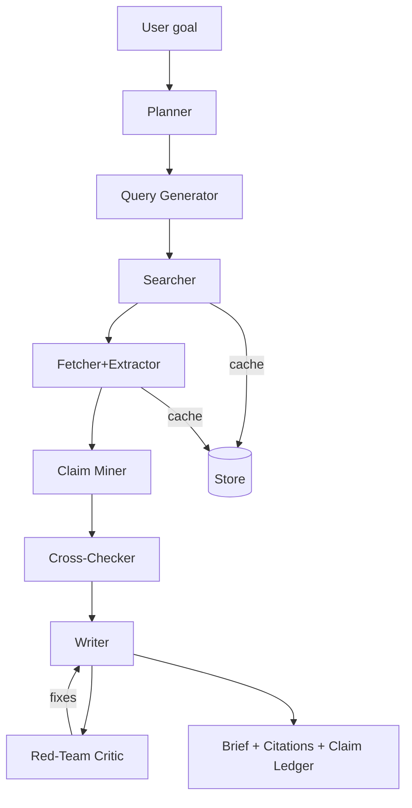

# What a good research agent does - ChatGPT version

- Plans the investigation (what to prove/disprove).
- Searches broadly, then narrows.
- Extracts facts into a **claim ledger** with **citations**.
- Ranks sources (primary > secondary; .gov/.edu/city PDFs > blogs).
- Cross-checks the 4–5 most load-bearing claims.
- Writes a tidy brief with inline citations + an appendix of sources.
- Keeps a cache so repeated queries get faster and cheaper.
- Is eval’d with repeatable tests (no vibes-only).

Below is a concrete, batteries-included blueprint in TypeScript (Node), plus prompts, scoring, and evals.

---
## 1) Minimal architecture (MVP)



### Why this shape works

- Separate **planning** from **search** (keeps queries purposeful).
- Keep a first-class **Claim Ledger** so you can test and re-run.
- Critic pass catches over-claims, missing citations, hedging.

---
## 2) Data contracts (keep these stable)

```typescript
// source.ts
export type Source = {
  id: string;             // hash(url + date)
  url: string;
  title?: string;
  publishedAt?: string;
  contentText: string;    // post-extraction (Readability/PDF)
  raw?: Buffer;           // optional (PDFs)
  type: "html"|"pdf"|"image"|"other";
  domain: string;         // e.g., "sfplanning.org"
  score: number;          // credibility * recency * directness
};

// claim.ts
export type Claim = {
  id: string;
  text: string;           // "Designated SF Landmark #305 (2022-09-22)"
  evidence: {sourceId: string; quote: string; locator?: string}[];
  status: "supported"|"disputed"|"insufficient";
  confidence: number;     // 0..1
  loadBearing: boolean;   // is this a key claim?
};

// report.ts
export type ResearchReport = {
  briefMarkdown: string; // final write-up with inline [1], [2]
  sources: Source[];
  claims: Claim[];
  openQuestions: string[];
  errors?: string[];
};
```

---
## 3) Source scoring (simple, effective)

```typescript
function scoreSource(s: Partial<Source>): number {
  const domainPrior =
    /(\.gov|\.edu)$/.test(s.domain) ? 1.0 :
    /sfplanning\.org|nps\.gov|cityofs(.+)\.org/.test(s.domain) ? 0.95 :
    /majornews\.com|wsj|nytimes|guardian/.test(s.domain) ? 0.8 :
    0.55;
  const recency = s.publishedAt ? Math.min(1, 0.6 + monthsAgo(s.publishedAt)*-0.02) : 0.7;
  const typeBonus = s.type === "pdf" ? 0.1 : 0;            // city PDFs often primary
  const directness = 0.6;                                  // bump when query terms appear in title/section
  return Math.max(0, Math.min(1, domainPrior*0.7 + recency*0.2 + typeBonus + directness*0.1));
}
```

Add a tiny duplicate detector (shingling or URL canonicalization) and per-domain rate limiting

---

## 4) Prompts (copy/paste)

### Planner

```text
You are a planning agent. Given a goal, produce:
1) Hypotheses to confirm/refute (3–6)
2) Disambiguation notes (what could be confusable)
3) Required evidence types (primary/secondary)
4) Stop conditions (when to stop researching)
Output JSON with {hypotheses[], disambig[], evidence[], stop[]}.
```

### Query Generator

```text
Generate 8–12 diverse web queries for the goal and hypotheses. 
Include domain filters when relevant. Add recency variants when facts may change.
Return JSON {queries:[{q, intent:"broad"|"narrow"|"primaryDoc"|"news", notes}], 
mustHave:["..."], avoid:["..."] }.
```

### Claim Miner (run per source)

```text
Extract factual claims from the SOURCE TEXT that directly answer the goal.
For each claim: provide a verbatim supporting quote and a precise locator (page #, section).
Return JSON {claims:[{text, quote, locator}]}.
Only output claims clearly supported by the source.
```

### Cross-Checker

```text
Given a set of claims with evidence across sources, 
(1) mark each as supported/disputed/insufficient,
(2) merge duplicates,
(3) assign confidence (0..1),
(4) flag the 4–6 most load-bearing claims.
Return JSON {claims:[...], openQuestions:[...]}.
```

### Writer

```text
Write a crisp brief (<=250 words) answering the goal.
Cite the 4–5 most load-bearing facts with bracketed numbers matching the Sources list.
Add a short "Why it matters" if relevant.
Do not include uncited assertions.
```

### Red-Team Critic

```text
Check for overclaiming, missing citations, date/version drift, single-source assertions.
Return actionable edits or "LGTM".
```

---
## 5) TypeScript skeleton (Node)

```typescript
// package.json: add deps: jsdom, @mozilla/readability, pdf-parse, cheerio, zod, p-limit, undici
import { JSDOM } from "jsdom";
import { Readability } from "@mozilla/readability";
import pdfParse from "pdf-parse";
import pLimit from "p-limit";
import crypto from "node:crypto";
import { z } from "zod";
import { Source, Claim, ResearchReport } from "./schema";

const limit = pLimit(5);

async function searchWeb(q: string): Promise<string[]> {
  // pluggable: start with DuckDuckGo HTML, SerpAPI, Tavily, Google CSE, etc.
  // return top result URLs
  return duckduckgo(q);
}

async function fetchAndExtract(url: string): Promise<Source> {
  const res = await fetch(url, { redirect: "follow" });
  const contentType = res.headers.get("content-type") ?? "";
  const buf = Buffer.from(await res.arrayBuffer());
  let text = "", type: Source["type"] = "other";
  if (contentType.includes("pdf") || url.endsWith(".pdf")) {
    const pdf = await pdfParse(buf);
    text = pdf.text;
    type = "pdf";
  } else if (contentType.includes("html")) {
    const dom = new JSDOM(buf.toString("utf-8"));
    const reader = new Readability(dom.window.document);
    const article = reader.parse();
    text = article?.textContent ?? dom.window.document.body.textContent ?? "";
    type = "html";
  }
  const id = crypto.createHash("sha1").update(url + text.slice(0,500)).digest("hex");
  return { id, url, domain: new URL(url).hostname, contentText: text, raw: buf, type, score: 0.5 };
}

async function runResearch(goal: string): Promise<ResearchReport> {
  const plan = await llmJson("planner", {goal});
  const qpack = await llmJson("queryGen", {goal, plan});
  const urlSets = await Promise.all(qpack.queries.map(({q}: any) => searchWeb(q)));
  const urls = unique(flatten(urlSets)).slice(0, 40);
  const sources = (await Promise.all(urls.map(u => limit(() => fetchAndExtract(u)))))
    .map(s => ({...s, score: scoreSource(s)}))
    .sort((a,b)=>b.score-a.score)
    .slice(0, 20);
  const mined = await Promise.all(sources.map(src =>
    llmJson("claimMiner", {goal, sourceText: truncate(src.contentText, 8000)})
      .then(r => ({src, claims: r.claims as Claim[]}))));
  const claims = await llmJson("crossChecker", {goal, mined});
  const draft = await llm("writer", {goal, claims, sources});
  const critic = await llm("critic", {goal, draft, claims, sources});
  const briefMarkdown = applyCritic(draft, critic);
  return { briefMarkdown, sources, claims: claims.claims, openQuestions: claims.openQuestions };
}
```

> Swap llm/llmJson with your preferred provider. Use zod to validate tool-responses and auto-retry on schema failures.
---
## 6) "Building at 15th & Kansas" as a test

Feed the agent the goal:

```text
Goal: "What is the history and significance of the brick building at 15th & Kansas in San Francisco?"
Constraints: "Prefer primary city PDFs; include designation date; cite 4–5 load-bearing facts."
```

### Expected behaviors
- Query variants like site:sfplanning.org landmark Takahashi, 15th Kansas San Francisco warehouse, G. Albert Lansburgh warehouse pdf, “landmark 305” San Francisco.
- Extract claims: architect, original year, additions (1968/1976), designation date, significance theme.
- Cross-check facts across at least 2 independent sources.
- Produce brief with inline citations.
Use this as your **golden test** going forward.

---

## 7) Evals (make it rigorous but light)

Create YAML tests your CI can run:

```yaml
- id: takahashi_landmark
  goal: "History and significance of the building at 15th & Kansas, SF"
  must_include:
    - regex: "Landmark\\s*#?305"
    - any: ["G. Albert Lansburgh", "Lansburgh"]
    - any: ["1968", "1976"]
    - regex: "San Francisco Planning|sfplanning\\.org"
  citations:
    min_count: 4
    domains:
      require_one_of: ["sfplanning.org", "sfgov.org", "nps.gov"]
  failure_points:
    - "uncited load-bearing fact"
    - "single-source overclaim"
    - "wrong date/version drift"
```

Hook this into your "agentic evals" harness; fail the build if constraints aren't met

---

## 8) Practical tips

- **Cache everything** (per-URL, per-LLM call). Use SQLite or Redis; hash keys by URL and prompt.
- **Respect robots** and backoff. Add p-limit and randomized delays.
- **PDF hygiene**: keep page numbers; store per-page text so you can show locator: "p. 14".
- **QDF knob**: time-sensitive topics → bias the Query Generator to “past 60–90 days.”
- **Hallucination guard**: Writer must only reference claims.status === "supported".
- **Memory**: Save (goal → report) so follow-ups can append deltas rather than restart.
---
## 9) Where to take it next
- Add **vision**: run OCR (Tesseract) on images; ask a vision model to extract text like signage (“TAKAHASHI”) and features (“trapezoidal lot”).
- Add **multi-hop**: let the Planner spawn sub-goals (e.g., “architect bio”, “ownership timeline”).
- Add **source diversity constraint**: require at least one government PDF and one independent news or academic source.
- Add **UI**: show the claim ledger with collapsible quotes; one-click to open sources at the right anchor.
---
If you want, I can drop this into a tiny starter repo (Node + pnpm) with the prompts wired up, a CLI like research "<goal>", and one golden test preloaded—so you can iterate fast.
